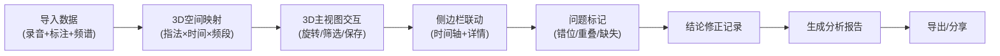

## 1. 产品概述

古琴声腔空间图Web3D可视化分析系统，为音乐科技研究员提供录音片段、指法标注与频谱特征的三维空间化呈现。解决指法错位、频段缺失等数据质量问题对研究结论的干扰，支持多维度筛选、视角保存与分析报告生成。

- 核心价值：将古琴声腔研究数据从二维表格升级为沉浸式3D空间分析，直观呈现声腔特征分布
- 目标用户：音乐科技研究员、古琴声学研究者

## 2. 核心功能

### 2.1 用户角色
| 角色 | 登录方式 | 核心权限 |
|------|----------|----------|
| 研究员 | 本地系统登录 | 3D视图操作、数据筛选、问题标记、视角保存、分析报告导出 |

### 2.2 功能模块
1. **3D主视图**：声腔空间图展示、旋转交互、多维度筛选、视角保存与恢复
2. **侧边栏**：时间轴联动控制、录音片段详情、指法标注展示、频谱特征显示
3. **问题标记系统**：指法错位待确认、片段重叠标注、频段缺失提示、责任分工指引
4. **分析报告**：3D特征图溯源、数据来源说明、结论变更追踪、完整分析导出

### 2.3 页面详情
| 页面名称 | 模块名称 | 功能描述 |
|---------|----------|----------|
| 主分析页 | 3D主视图 | Three.js渲染声腔空间点云，支持鼠标旋转缩放、按时间/指法/频段筛选、视角快照保存与加载 |
| 主分析页 | 侧边栏-时间轴 | 可视化时间轴，支持播放/暂停/跳转，与3D视图实时联动 |
| 主分析页 | 侧边栏-片段详情 | 展示选中录音片段的波形图、指法标注、频谱特征数据 |
| 主分析页 | 侧边栏-问题中心 | 指法错位标记为"待确认"、片段重叠提示、频段缺失标注及下一步处理人 |
| 主分析页 | 顶部工具栏 | 筛选条件切换、视角管理、数据导入、报告生成 |
| 分析报告页 | 报告内容 | 3D特征图生成逻辑说明、数据来源追溯、结论变更历史、建议下一步行动 |

## 3. 核心流程

研究员导入录音片段、指法标注和频谱特征数据，系统将数据映射到三维空间（指法维度、时间维度、频段维度）。用户在3D主视图中旋转查看、按条件筛选、保存关键视角。侧边栏同步显示时间轴和当前选中片段的详细信息。遇到指法错位标记为"待确认"，片段重叠和频段缺失标注并提示下一步核对人。所有结论变更均被记录，最终生成包含完整溯源的分析报告。

## 4. 用户界面设计

### 4.1 设计风格
- **主色调**：深墨色背景（#121218）搭配古琴朱红（#8B2323）作为主强调色，辅以石青（#1A5276）和米白（#F5F0E6）
- **按钮风格**：微圆角（6px）、细边框、悬停时有微妙的发光效果
- **字体**：标题使用「思源宋体」展现东方美学，正文使用「Inter」保证数字和技术内容的可读性
- **布局风格**：左右分栏，左侧70%为3D沉浸式视图，右侧30%为数据面板，半透明毛玻璃效果增强层次感
- **视觉元素**：融入古琴琴弦纹理、水墨晕染效果作为背景装饰

### 4.2 页面设计概述
| 页面名称 | 模块名称 | UI元素 |
|---------|----------|--------|
| 主分析页 | 3D主视图 | 深色空间背景、彩色点云（按指法类型着色）、坐标轴标识、视角控制小部件、筛选范围可视化 |
| 主分析页 | 顶部工具栏 | 半透明深色条、下拉筛选器、图标按钮组、面包屑导航 |
| 主分析页 | 侧边栏 | 卡片式布局、时间轴波形、数据表格、问题标签（红/黄/橙）、状态徽章 |
| 分析报告页 | 报告内容 | 白底黑字、层次分明的标题、数据图表、代码块式溯源信息 |

### 4.3 响应式
- Desktop-first设计，主应用场景为27寸以上研究工作站
- 侧边栏可折叠，小屏幕下切换为底部抽屉式面板
- 3D画布自适应窗口大小，触控设备支持双指缩放

### 4.4 3D场景设计
- **环境**：深色渐变背景，模拟科研实验室的沉浸感，轻微环境雾气增加空间纵深感
- **光照**：三点布光系统，主光暖白色（#FFF8E7）从右上方照射，辅光冷蓝色（#E6F3FF）从左下方补光，点光源标记关键数据点
- **相机**：PerspectiveCamera，初始位置(15, 12, 15)，看向原点，启用阻尼效果的OrbitControls
- **构图**：三维坐标轴清晰标注（指法轴-红色、时间轴-绿色、频段轴-蓝色），数据点云居中，底部投影平面展示2D热力图
- **交互**：点击数据点高亮并联动侧边栏，框选多个点进行批量操作，悬浮显示详细信息Tooltip
- **后处理**：Bloom发光效果突出选中数据点，SSAO增强空间层次感，轻微色彩校正
- **性能**：数据点使用BufferGeometry和InstancedMesh优化，限制最大显示点数为50000，支持LOD

## 5. 数据状态管理

### 5.1 筛选同步机制
3D主视图与侧边栏共享同一状态源：
- 时间范围筛选变更 → 3D视图更新可见点云 + 时间轴更新高亮区域
- 指法类型筛选变更 → 3D视图更新点云颜色/可见性 + 详情列表过滤
- 频段范围筛选变更 → 3D视图更新点云大小/透明度 + 频谱图更新显示范围
- 3D视图框选 → 侧边栏详情列表同步显示选中条目

### 5.2 结论变更追踪
每条研究结论关联：
- 原始数据版本号
- 所依据的录音片段ID列表
- 指法标注版本
- 频谱特征参数
- 变更时间、变更人、变更原因
