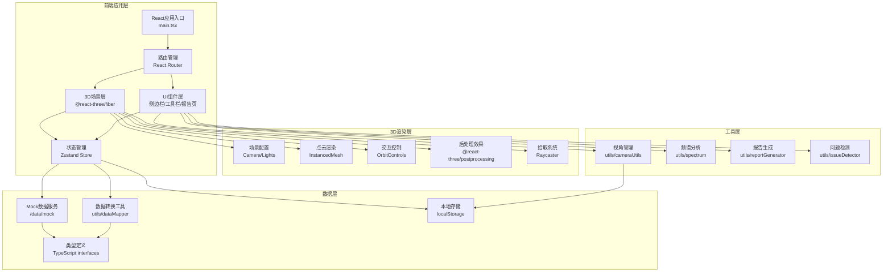

## 1. 架构设计



## 2. 技术描述

- **前端框架**：React@18 + TypeScript + Vite@5
- **样式方案**：TailwindCSS@3 + CSS变量主题系统
- **3D渲染**：three@0.160 + @react-three/fiber@8 + @react-three/drei@9 + @react-three/postprocessing@2
- **状态管理**：Zustand@4（轻量、支持选择器订阅，适合3D与UI频繁同步场景）
- **路由**：React Router@6
- **图标**：Lucide React
- **图表**：recharts（频谱图、波形图）
- **数据持久化**：localStorage（视角保存、结论记录）
- **后端**：无（纯前端应用，数据通过JSON导入/Mock）

## 3. 路由定义

| 路由 | 页面组件 | 用途 |
|------|----------|------|
| / | AnalysisPage | 主分析页：3D视图 + 侧边栏 + 工具栏 |
| /report | ReportPage | 分析报告页 |
| * | NotFoundPage | 404页面 |

## 4. 数据模型

### 4.1 核心数据接口

```typescript
// 录音片段
interface RecordingSegment {
  id: string;
  startTime: number;      // 起始时间(秒)
  endTime: number;        // 结束时间(秒)
  duration: number;
  audioUrl: string;
  waveformData: number[]; // 波形采样数据
  quality: 'good' | 'overlapped' | 'missing_band' | 'misaligned';
  issues: Issue[];
}

// 指法标注
interface FingerAnnotation {
  id: string;
  segmentId: string;
  time: number;           // 相对于片段起始的时间
  fingerType: string;     // 指法类型：散音/按音/泛音等
  fingerPosition: number; // 按音位置（徽位）
  rightHand: string;      // 右手指法
  leftHand: string;       // 左手指法
  confidence: number;     // 标注置信度 0-1
  isMisaligned: boolean;  // 是否指法错位
  verified: boolean;      // 是否已确认
}

// 频谱特征
interface SpectrumFeature {
  id: string;
  segmentId: string;
  time: number;
  frequencyBins: number[]; // 频段能量分布
  centroid: number;        // 频谱质心
  bandwidth: number;       // 频谱带宽
  rolloff: number;         // 频谱滚降点
  mfcc: number[];          // MFCC系数
  missingBands: number[];  // 缺失的频段索引
}

// 3D数据点（映射后的空间点）
interface SpacePoint3D {
  id: string;
  segmentId: string;
  annotationId: string;
  spectrumId: string;
  x: number;               // 指法维度 (0-10)
  y: number;               // 时间维度 (0-100)
  z: number;               // 频段维度 (0-20kHz映射)
  value: number;           // 能量值，控制点大小
  color: string;           // 按指法类型着色
  label: string;
}

// 问题标记
interface Issue {
  id: string;
  type: 'misalignment' | 'overlap' | 'missing_band';
  severity: 'low' | 'medium' | 'high';
  description: string;
  assignee: string;        // 下一步处理人
  status: 'pending' | 'confirmed' | 'resolved';
  createdAt: string;
  relatedSegmentIds: string[];
}

// 研究结论
interface ResearchConclusion {
  id: string;
  title: string;
  content: string;
  dataVersion: string;
  segmentIds: string[];
  annotationVersions: Record<string, number>;
  createdAt: string;
  updatedAt: string;
  changeHistory: ChangeRecord[];
}

// 变更记录
interface ChangeRecord {
  id: string;
  timestamp: string;
  author: string;
  changeType: 'create' | 'update' | 'verify' | 'reject';
  description: string;
  dataBefore?: any;
  dataAfter?: any;
}

// 保存的视角
interface SavedView {
  id: string;
  name: string;
  cameraPosition: [number, number, number];
  cameraTarget: [number, number, number];
  filters: FilterState;
  createdAt: string;
  thumbnail?: string;
}

// 筛选状态
interface FilterState {
  timeRange: [number, number];
  fingerTypes: string[];
  frequencyRange: [number, number];
  quality: ('good' | 'overlapped' | 'missing_band' | 'misaligned')[];
  searchKeyword: string;
}
```

### 4.2 状态管理 (Zustand Store)

```typescript
interface AppState {
  // 数据
  segments: RecordingSegment[];
  annotations: FingerAnnotation[];
  spectrums: SpectrumFeature[];
  spacePoints: SpacePoint3D[];
  issues: Issue[];
  conclusions: ResearchConclusion[];
  
  // UI状态
  selectedSegmentId: string | null;
  selectedPointIds: string[];
  currentTime: number;
  isPlaying: boolean;
  sidebarCollapsed: boolean;
  
  // 筛选
  filters: FilterState;
  savedViews: SavedView[];
  
  // Actions
  loadData: () => void;
  selectSegment: (id: string | null) => void;
  selectPoints: (ids: string[]) => void;
  setTime: (time: number) => void;
  togglePlay: () => void;
  setFilters: (filters: Partial<FilterState>) => void;
  saveView: (name: string) => void;
  loadView: (id: string) => void;
  deleteView: (id: string) => void;
  markIssue: (issue: Omit<Issue, 'id' | 'createdAt'>) => void;
  resolveIssue: (issueId: string) => void;
  addConclusion: (conclusion: Omit<ResearchConclusion, 'id' | 'createdAt' | 'updatedAt' | 'changeHistory'>) => void;
  updateConclusion: (id: string, changes: Partial<ResearchConclusion>) => void;
  toggleSidebar: () => void;
}
```

## 5. 目录结构

```
src/
├── components/
│   ├── toolbar/          # 顶部工具栏
│   │   ├── Toolbar.tsx
│   │   ├── FilterPanel.tsx
│   │   └── ViewManager.tsx
│   ├── sidebar/          # 侧边栏
│   │   ├── Sidebar.tsx
│   │   ├── Timeline.tsx
│   │   ├── SegmentDetail.tsx
│   │   ├── AnnotationList.tsx
│   │   ├── SpectrumChart.tsx
│   │   └── IssuePanel.tsx
│   ├── three/            # 3D相关组件
│   │   ├── Scene3D.tsx
│   │   ├── PointCloud.tsx
│   │   ├── AxesHelper.tsx
│   │   ├── GridFloor.tsx
│   │   └── SelectionBox.tsx
│   └── report/           # 报告组件
│       ├── ReportPage.tsx
│       ├── ReportSection.tsx
│       └── DataSourceCard.tsx
├── store/
│   └── useAppStore.ts    # Zustand状态管理
├── data/
│   ├── mock/             # Mock数据
│   │   ├── segments.ts
│   │   ├── annotations.ts
│   │   ├── spectrums.ts
│   │   └── issues.ts
│   └── seedData.ts       # 数据初始化
├── utils/
│   ├── dataMapper.ts     # 数据到3D空间映射
│   ├── cameraUtils.ts    # 视角管理工具
│   ├── spectrum.ts       # 频谱分析工具
│   ├── reportGenerator.ts # 报告生成
│   ├── issueDetector.ts  # 问题自动检测
│   └── colorScheme.ts    # 配色方案
├── types/
│   └── index.ts          # TypeScript类型定义
├── hooks/
│   ├── use3DPicker.ts    # 3D拾取钩子
│   ├── useTimelineSync.ts # 时间同步钩子
│   └── useFilterSync.ts  # 筛选同步钩子
├── App.tsx
├── main.tsx
└── index.css
```

## 6. 关键技术实现

### 6.1 3D空间映射算法
将多维数据映射到三维空间坐标：
- X轴：指法类型 → 按散音/按音/泛音等分类映射到离散位置
- Y轴：时间 → 线性映射到0-100区间
- Z轴：频段 → 对数映射（人耳听觉特性）到0-10区间
- 点大小：频谱能量值 → 0.1-0.8区间
- 点颜色：指法类型 → 预设配色方案

### 6.2 筛选同步机制
使用Zustand的选择器订阅，实现：
1. 3D组件订阅 `filters` 变化，更新点云可见性
2. 侧边栏订阅 `selectedSegmentId`，更新详情面板
3. 时间轴订阅 `currentTime`，3D视图高亮当前时间点
4. 双向同步：3D框选 → 更新 `selectedPointIds` → 侧边栏列表高亮

### 6.3 问题检测与标记
`issueDetector.ts` 自动检测：
- 指法错位：标注时间与音频特征峰值偏差 > 阈值
- 片段重叠：相邻片段时间轴有交集
- 频段缺失：频谱图中特定频段能量持续低于阈值

### 6.4 报告生成
`reportGenerator.ts` 生成包含：
- 3D特征图生成逻辑说明
- 数据来源追溯（每个结论关联的片段、标注版本）
- 结论变更历史记录
- 问题清单及处理建议
- 导出为Markdown格式
