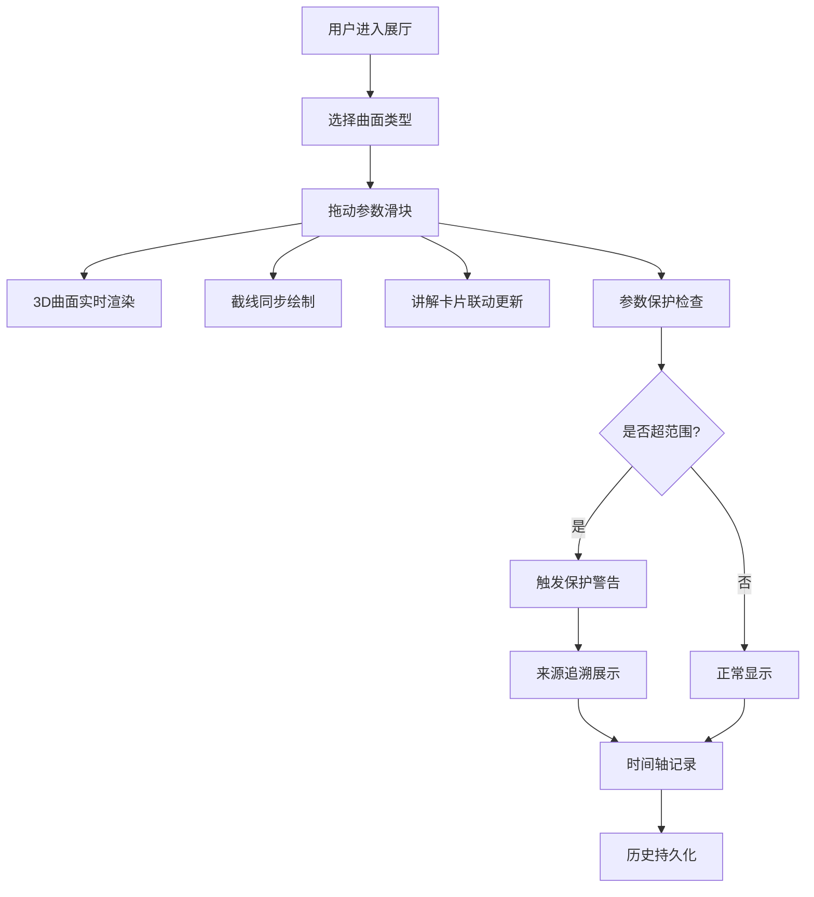

## 1. 产品概述

数学曲面展厅是一个 Web3D 交互式数学可视化应用，让用户通过拖动参数、切换预设、播放时间轴，直观感受不同参数下曲面形态和截线的变化。每次参数变更时，3D 曲面、截线、参数保护说明和讲解卡片四者联动更新，且每条参数判断可追溯到原始公式、颜色规则或展陈来源。

- 目标用户：数学馆策展人、数学教师、数学爱好者和学生
- 核心价值：用可视化替代表格，让参数保护判断可追溯、可复现，杜绝脏数据混入和重复结论

## 2. 核心功能

### 2.1 用户角色

| 角色 | 注册方式 | 核心权限 |
|------|----------|----------|
| 访客 | 无需注册 | 浏览展厅、拖动参数、查看截线和讲解 |
| 策展人 | 本地配置 | 编辑曲面定义、参数保护规则、导入脏样例测试 |

### 2.2 功能模块

1. **展厅主页**：3D 曲面画布、参数控制面板、截线面板、讲解卡片、来源追溯面板
2. **参数保护页**：保护规则列表、来源追溯详情、脏样例测试结果

### 2.3 页面详情

| 页面名称 | 模块名称 | 功能描述 |
|----------|----------|----------|
| 展厅主页 | 3D 曲面画布 | 基于 Three.js 实时渲染参数曲面，支持旋转/缩放/平移交互 |
| 展厅主页 | 参数控制面板 | 滑块拖动参数、预设切换、参数范围保护提示 |
| 展厅主页 | 截线面板 | 展示当前参数下 X/Y/Z 截面曲线，截线断裂时标红警告 |
| 展厅主页 | 讲解卡片 | 当前曲面公式、参数含义、保护说明，随参数联动更新 |
| 展厅主页 | 来源追溯面板 | 每条保护规则可展开查看原始公式、颜色规则或展陈截图来源 |
| 展厅主页 | 时间轴 | 播放/暂停参数动画，拖动时间轴回溯历史状态 |
| 参数保护页 | 保护规则列表 | 所有参数保护规则及其状态（正常/警告/爆炸） |
| 参数保护页 | 来源追溯详情 | 点击规则查看溯源链路：公式 → 判断 → 动作 |
| 参数保护页 | 脏样例测试 | 输入参数爆炸的脏数据，验证保护是否正确拦截 |

## 3. 核心流程

用户进入展厅 → 选择曲面类型 → 拖动参数滑块 → 3D 曲面实时更新 → 截线同步绘制 → 讲解卡片联动 → 参数超范围时保护触发 → 来源追溯展示判断依据 → 时间轴记录操作 → 历史持久化保存

## 4. 用户界面设计

### 4.1 设计风格

- 主色调：深色背景（近黑 `#0a0a0f`）+ 暖白前景（`#e8e6e1`），数学书卷质感
- 强调色：琥珀金 `#d4a853`（活跃参数/高亮）、珊瑚红 `#e05555`（警告/爆炸）、翡翠绿 `#2ebd6e`（安全）
- 按钮风格：圆角 6px，半透明磨砂背景，hover 时微光边框
- 字体：标题用 Cormorant Garamond（学术典雅），正文用 IBM Plex Mono（数学公式感）
- 布局：左侧 3D 画布占主区域，右侧面板堆叠参数控制 + 截线 + 讲解卡片
- 图标：使用 Lucide 图标库，线条风格

### 4.2 页面设计概览

| 页面名称 | 模块名称 | UI 元素 |
|----------|----------|---------|
| 展厅主页 | 3D 曲面画布 | 深色背景、网格辅助线、曲面渐变着色、轨道控制 |
| 展厅主页 | 参数控制面板 | 磨砂面板、范围滑块、预设按钮、数值输入框、保护状态指示灯 |
| 展厅主页 | 截线面板 | 2D Canvas 截线图、断裂处红色标记、坐标轴标注 |
| 展厅主页 | 讲解卡片 | 卡片式布局、公式渲染、来源标签 |
| 展厅主页 | 来源追溯面板 | 可折叠溯源链、公式/规则/截图三种来源类型标识 |
| 展厅主页 | 时间轴 | 底部水平条、播放/暂停按钮、拖动手柄、刻度标记 |
| 参数保护页 | 保护规则列表 | 表格布局、状态徽章、操作按钮 |
| 参数保护页 | 来源追溯详情 | 面包屑式溯源路径、原始数据预览 |
| 参数保护页 | 脏样例测试 | 输入区域、测试按钮、结果面板（通过/拦截/遗漏） |

### 4.3 响应式设计

- 桌面优先设计，3D 画布最小宽度 640px
- 平板适配：右侧面板改为底部抽屉
- 移动端：画布全屏，面板浮层切换

### 4.4 3D 场景指引

- 环境：深色环境光，微弱环境反射
- 灯光：主方向光暖白色 + 补光冷蓝，双色调照明增强曲面深度
- 相机：透视相机，默认 45° 俯视，轨道控制允许旋转/缩放
- 构图：曲面居中，自动适配包围盒
- 交互：拖动旋转、滚轮缩放、双击重置视角
- 后处理：微弱辉光（Bloom）使曲面边缘发光
- 性能预算：60fps 渲染，曲面网格顶点数 ≤ 10000

## 5. 数据持久化需求

- 所有操作历史（参数变更、保护触发、截线状态）持久化到 localStorage
- 重启服务或第二次打开后，自动恢复上次的曲面类型、参数值、时间轴位置
- 去重机制：同一参数值组合不生成重复历史记录
- 脏样例测试结果单独持久化，不与正常操作历史混淆
