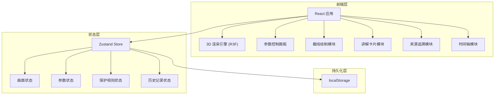

## 1. 架构设计



## 2. 技术说明

- 前端：React@18 + TypeScript + Tailwind CSS@3 + Vite
- 3D 渲染：three + @react-three/fiber + @react-three/drei + @react-three/postprocessing
- 状态管理：Zustand（含 persist 中间件实现 localStorage 持久化）
- 公式渲染：KaTeX
- 初始化工具：vite-init（react-ts 模板）
- 后端：无
- 数据库：无（纯前端，localStorage 持久化）

## 3. 路由定义

| 路由 | 用途 |
|------|------|
| / | 展厅主页：3D 曲面画布 + 参数控制 + 截线 + 讲解卡片 + 时间轴 |
| /protection | 参数保护页：保护规则 + 来源追溯 + 脏样例测试 |

## 4. 数据模型

### 4.1 核心数据结构

```typescript
interface SurfaceDefinition {
  id: string
  name: string
  formula: string
  formulaSource: string
  paramDefs: ParamDef[]
  computeVertex: (params: Record<string, number>, u: number, v: number) => [number, number, number]
  defaultParams: Record<string, number>
}

interface ParamDef {
  key: string
  label: string
  min: number
  max: number
  step: number
  source: TraceSource
}

interface TraceSource {
  type: 'formula' | 'color_rule' | 'exhibit_screenshot'
  label: string
  reference: string
  detail: string
}

interface ProtectionRule {
  id: string
  paramKey: string
  condition: 'range' | 'explosion' | 'discontinuity'
  threshold: number
  action: 'warn' | 'block' | 'clamp'
  source: TraceSource
  message: string
}

interface HistoryEntry {
  id: string
  timestamp: number
  surfaceId: string
  params: Record<string, number>
  protectionTriggers: string[]
  crossSectionStatus: 'normal' | 'broken' | 'misleading'
  paramHash: string
}

interface AppState {
  activeSurfaceId: string
  params: Record<string, number>
  timelinePosition: number
  history: HistoryEntry[]
  isPlaying: boolean
}
```

### 4.2 持久化策略

- Zustand persist 中间件自动同步到 localStorage
- key: `math-surface-hall-state`
- 历史记录去重：对参数组合计算 `paramHash`（JSON.stringify 后哈希），写入前比对最后一条记录
- 脏样例测试结果存储在独立 key: `math-surface-hall-dirty-tests`
- 启动时自动恢复状态，无重复结论

## 5. 曲面定义

内置曲面列表：

| 曲面 | 公式 | 可调参数 |
|------|------|----------|
| 椭球面 | x²/a² + y²/b² + z²/c² = 1 | a, b, c |
| 双曲面(单叶) | x²/a² + y²/b² - z²/c² = 1 | a, b, c |
| 抛物面 | z = x²/a² + y²/b² | a, b |
| 鞍面 | z = x²/a² - y²/b² | a, b |
| 正弦曲面 | z = A·sin(ωx)·cos(ωy) | A, ω |
| 莫比乌斯带 | 参数方程 | 宽度, 扭转次数 |
