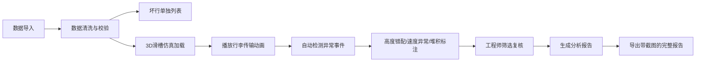

## 1. 产品概述

机场行李滑槽仿真系统，用于设备工程师分析和演示行李传输过程中的高度错配、速度异常和行李堆积问题。系统提供3D滑槽可视化、异常检测筛选、数据清洗和报告导出功能，确保会议和教学演示中能够清晰展示问题位置和原因。

- **核心目标**：解决手工查看多源数据易遗漏的问题，提供可视化链路追踪
- **目标用户**：机场设备工程师、运维人员、培训讲师
- **产品价值**：提升故障诊断效率，降低漏检率，支撑演示培训场景

## 2. 核心功能

### 2.1 用户角色
| 角色 | 登录方式 | 核心权限 |
|------|----------|----------|
| 设备工程师 | 本地访问 | 数据导入、仿真分析、异常筛选、报告导出 |
| 培训讲师 | 本地访问 | 演示模式、案例管理、标注编辑 |

### 2.2 功能模块
1. **数据导入与清洗页**：CSV/Excel导入、数据校验、坏行展示、字段映射
2. **3D滑槽仿真页**：滑槽模型可视化、行李动画播放、异常位置标注、速度控制
3. **分拣口监控页**：分拣口状态、堵包记录、高度错配实时标记
4. **异常分析页**：高度错配列表、速度过快筛选、行李堆积识别、复核标记
5. **报告导出页**：截图整合、异常汇总、自定义报告、一键导出

### 2.3 页面详情
| 页面名称 | 模块名称 | 功能描述 |
|---------|---------|---------|
| 数据导入与清洗页 | 数据上传区域 | 拖拽上传、格式校验、进度显示 |
| 数据导入与清洗页 | 坏行展示面板 | 空行、备注行、缺列行单独列表，支持导出 |
| 数据导入与清洗页 | 字段映射配置 | 分拣口、堵包记录、高度、速度字段自动匹配 |
| 3D滑槽仿真页 | 滑槽3D视图 | Three.js渲染，支持旋转缩放，关键节点坐标标注 |
| 3D滑槽仿真页 | 播放控制栏 | 播放/暂停、倍速、帧步进、时间轴拖拽 |
| 3D滑槽仿真页 | 异常标注层 | 高度错配位置高亮、速度箭头指示、数值标签 |
| 分拣口监控页 | 分拣口网格 | 各分拣口状态卡片，异常状态醒目标识 |
| 分拣口监控页 | 堵包记录时间线 | 按时间排序的堵包事件列表，关联对应滑槽段 |
| 异常分析页 | 异常筛选器 | 按类型(高度错配/速度过快/堆积)、时间、滑槽段筛选 |
| 异常分析页 | 异常详情面板 | 异常前后对比、影响范围、推荐处理方案 |
| 报告导出页 | 报告预览 | 整合3D截图、异常列表、统计数据的完整报告 |
| 报告导出页 | 导出配置 | 格式选择(PDF/PNG)、标注开关、自定义水印 |

## 3. 核心流程

用户导入行李分拣数据 → 系统自动清洗并标记坏行 → 3D滑槽加载并播放仿真 → 异常事件自动检测并标注 → 工程师筛选复核异常 → 导出包含截图和分析的完整报告

## 4. 用户界面设计

### 4.1 设计风格
- **主色调**：工业蓝(#165DFF) - 专业、可靠的机场设备风格
- **辅助色**：警示红(#F53F3F) - 高度错配；警告橙(#FF7D00) - 速度异常；信息绿(#00B42A) - 正常
- **按钮风格**：方角轻微圆角(4px)，工业感，强调功能明确性
- **字体**：思源黑体 - 清晰易读，适合技术数据展示
- **布局风格**：模块化面板布局，左侧导航+主内容区+右侧详情面板
- **图标风格**：线性图标，工业设备主题，避免卡通化

### 4.2 页面设计概览
| 页面名称 | 模块名称 | UI元素 |
|---------|---------|--------|
| 3D滑槽仿真页 | 3D视图区 | 全屏Three.js画布，网格背景，轴向指示，滑槽分段标注 |
| 3D滑槽仿真页 | 异常标注 | 红色闪烁边框+数值标签+箭头指向，不依赖颜色单独识别 |
| 异常分析页 | 异常卡片 | 高度错配红框，速度过快橙框，堆积黄框，类型标签明确 |
| 报告导出页 | 预览区域 | 分栏布局：左侧3D截图，右侧异常数据表格，底部汇总 |

### 4.3 响应式
- 桌面端优先(1920×1080)，适配机场监控大屏
- 支持1280px以上屏幕，三栏布局自适应
- 关键数据面板支持独立弹窗，便于投屏演示

### 4.4 3D场景指导
- **环境**：工业车间风格，中性灰色背景，柔和顶灯照明
- **光照设置**：主光源+环境光，确保滑槽金属质感和阴影清晰
- **相机设置**：初始45度俯视角度，支持轨道控制，预设几个关键视角
- **交互和动画**：行李沿路径移动动画，异常时暂停并放大视角
- **后处理效果**：轻微Bloom效果突出异常标注，轮廓线强调滑槽结构
