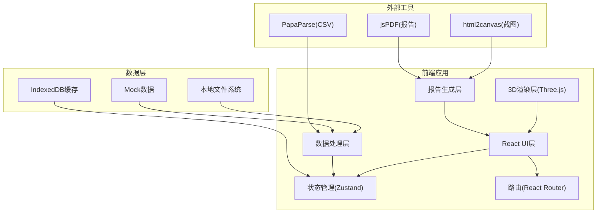

## 1. 架构设计



## 2. 技术描述

- **前端框架**: React@18 + TypeScript
- **构建工具**: Vite@5
- **样式方案**: TailwindCSS@3 + CSS Modules
- **3D渲染**: Three.js@0.160 + @react-three/fiber + @react-three/drei
- **状态管理**: Zustand@4
- **路由**: React Router@6
- **数据解析**: PapaParse(CSV), SheetJS(Excel)
- **报告导出**: html2canvas + jsPDF
- **图标**: Lucide React

## 3. 路由定义

| 路由 | 页面名称 | 用途 |
|------|---------|------|
| / | 首页/仪表盘 | 系统概览、快捷入口、案例推荐 |
| /import | 数据导入与清洗 | 上传数据文件、校验、坏行展示、字段映射 |
| /simulation | 3D滑槽仿真 | 滑槽3D可视化、动画播放、异常标注 |
| /sorting | 分拣口监控 | 分拣口状态、堵包记录时间线 |
| /anomalies | 异常分析 | 异常筛选、详情查看、复核标记 |
| /report | 报告导出 | 报告预览、配置、导出下载 |

## 4. 数据模型

### 4.1 核心数据类型

```typescript
// 行李数据
interface LuggageRecord {
  id: string;
  timestamp: number;
  chuteId: string;
  position: number;
  height: number;
  speed: number;
  sortingPortId?: string;
  status: 'normal' | 'height_mismatch' | 'speed_over' | 'stacked';
}

// 滑槽模型
interface ChuteModel {
  id: string;
  name: string;
  segments: ChuteSegment[];
  pathPoints: Vector3[];
  standardHeight: number;
  maxSpeed: number;
}

// 滑槽分段
interface ChuteSegment {
  id: string;
  startPosition: number;
  endPosition: number;
  type: 'straight' | 'curve' | 'slope';
  expectedHeight: number;
  sortingPortId?: string;
}

// 分拣口
interface SortingPort {
  id: string;
  name: string;
  chuteId: string;
  position: number;
  status: 'active' | 'blocked' | 'maintenance';
  blockRecords: BlockRecord[];
}

// 堵包记录
interface BlockRecord {
  id: string;
  sortingPortId: string;
  startTime: number;
  endTime?: number;
  luggageCount: number;
  reason?: string;
}

// 异常事件
interface AnomalyEvent {
  id: string;
  type: 'height_mismatch' | 'speed_over' | 'stacked';
  timestamp: number;
  chuteId: string;
  position: number;
  luggageIds: string[];
  severity: 'low' | 'medium' | 'high';
  reviewed: boolean;
  expectedValue: number;
  actualValue: number;
  description: string;
}

// 数据清洗结果
interface DataCleanResult {
  validRows: LuggageRecord[];
  badRows: BadRow[];
  totalRows: number;
  validCount: number;
}

// 坏行记录
interface BadRow {
  rowIndex: number;
  rawData: string;
  type: 'empty' | 'remark' | 'missing_column' | 'invalid_value';
  description: string;
}
```

### 4.2 状态管理结构

```typescript
interface AppState {
  // 数据状态
  luggageData: LuggageRecord[];
  chuteModels: ChuteModel[];
  sortingPorts: SortingPort[];
  anomalies: AnomalyEvent[];
  badRows: BadRow[];
  
  // 仿真状态
  simulationTime: number;
  isPlaying: boolean;
  playbackSpeed: number;
  selectedChuteId: string | null;
  selectedLuggageId: string | null;
  
  // UI状态
  activeTab: string;
  showLabels: boolean;
  anomalyFilters: {
    types: string[];
    reviewed?: boolean;
    chuteId?: string;
  };
}
```

## 5. 核心模块划分

### 5.1 数据处理模块
- `src/utils/dataParser.ts` - CSV/Excel解析
- `src/utils/dataCleaner.ts` - 数据清洗、坏行检测
- `src/utils/anomalyDetector.ts` - 异常检测算法

### 5.2 3D可视化模块
- `src/components/three/Chute3D.tsx` - 滑槽3D组件
- `src/components/three/Luggage3D.tsx` - 行李3D组件
- `src/components/three/AnomalyLabel.tsx` - 异常标注组件
- `src/hooks/useAnimation.ts` - 动画控制Hook

### 5.3 业务组件
- `src/components/DataImport/` - 数据导入组件
- `src/components/AnomalyList/` - 异常列表组件
- `src/components/ReportBuilder/` - 报告生成组件
- `src/components/SortingPorts/` - 分拣口监控组件

### 5.4 状态管理
- `src/store/useAppStore.ts` - 全局状态
- `src/store/useSimulationStore.ts` - 仿真状态
