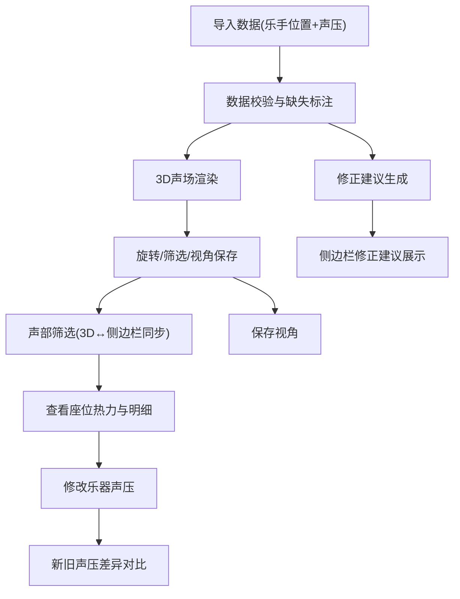

## 1. 产品概述

交响乐团座位声压可视化系统——为声学顾问提供三维声场覆盖分析工具，帮助指挥和顾问直观看到不同声部声压如何覆盖观众席，支持声部筛选、视角保存、数据修正追踪，确保排位调整后的声场决策有据可依。

- 目标用户：声学顾问、乐团指挥
- 核心价值：将抽象的声学数据转化为可交互的3D声场视图，支撑排位调整决策

## 2. 核心功能

### 2.1 用户角色

| 角色 | 使用方式 | 核心权限 |
|------|----------|----------|
| 声学顾问 | 直接操作 | 编辑乐器声压、查看修正建议、导出视角截图 |
| 乐团指挥 | 查看为主 | 旋转3D视图、筛选声部、对比声压变更 |

### 2.2 功能模块

1. **主视图页**：3D声场可视化、乐团/观众席布局、声压覆盖热力叠加、旋转交互
2. **侧边栏**：座位热力图、声部切换面板、数据明细表、修正建议

### 2.3 页面详情

| 页面名称 | 模块名称 | 功能描述 |
|----------|----------|----------|
| 主视图页 | 3D声场画布 | Three.js渲染厅堂与座位，叠加声压热力色阶，支持OrbitControls旋转缩放 |
| 主视图页 | 视角管理 | 保存/恢复当前相机位置与朝向，命名视角列表 |
| 主视图页 | 声部筛选 | 勾选/取消声部（弦乐、木管、铜管、打击乐），3D场景实时更新对应声部可见性 |
| 侧边栏 | 座位热力图 | 2D俯视座位热力，按声压值着色，点击座位查看具体声压数据 |
| 侧边栏 | 声部切换面板 | 声部列表，切换高亮，与3D视图双向同步 |
| 侧边栏 | 数据明细表 | 选中座位/乐手的声压数据、备注、缺失字段标记 |
| 侧边栏 | 修正建议 | 材料参数缺失提示、座位筛选异常修正、声部遮挡量化结论 |
| 侧边栏 | 变更对比 | 修改乐器声压后保留旧值与新值的差异记录，支持逐条查看 |

## 3. 核心流程

1. 声学顾问导入乐团排位数据（含备注）和乐器声压数据（可能缺字段）
2. 系统自动标注缺失字段，生成修正建议列表
3. 顾问在3D视图中旋转查看各声部声压覆盖观众席的情况
4. 顾问通过侧边栏筛选声部，3D视图同步高亮/隐藏
5. 顾问修改某乐器声压值，系统保留旧值，展示新旧差异
6. 顾问保存关键视角，便于向指挥汇报

## 4. 用户界面设计

### 4.1 设计风格

- 主色调：深空蓝(#0A1628) + 琥珀金(#D4A843)点缀
- 辅助色：钢灰(#3A4A5C)、暖白(#F5F0E8)
- 声压色阶：蓝(低)→绿(中)→黄(较高)→红(高)
- 按钮风格：圆角微凸，深色背景+金色边框
- 字体：Playfair Display(标题) + DM Sans(正文)
- 布局：左侧3D主视图(~70%) + 右侧侧边栏(~30%)

### 4.2 页面设计概览

| 页面名称 | 模块名称 | UI元素 |
|----------|----------|--------|
| 主视图页 | 3D声场画布 | 深色背景、声压热力叠加层、半透明厅堂轮廓、乐手标记点(按声部着色) |
| 主视图页 | 视角管理 | 浮动按钮组(保存/加载视角)，下拉列表展示已存视角 |
| 主视图页 | 声部筛选 | 3D视图左上角声部图例，可点击切换可见性 |
| 侧边栏 | 座位热力图 | 2D网格座位图，色阶与3D一致，hover显示数值 |
| 侧边栏 | 声部切换面板 | 声部标签列表，激活态金色高亮，与3D同步 |
| 侧边栏 | 数据明细表 | 紧凑表格，缺失字段红色标记，备注图标提示 |
| 侧边栏 | 修正建议 | 黄色警告卡片列表，可操作(一键填默认值/标记已处理) |
| 侧边栏 | 变更对比 | 双列对比表，旧值删除线+新值高亮 |

### 4.3 响应式

- 桌面优先设计，最小宽度1280px
- 3D视图与侧边栏可拖拽调整比例
- 侧边栏可折叠为抽屉模式

### 4.4 3D场景指引

- 环境：深色剧院氛围，微弱环境光模拟音乐厅
- 灯光：顶部区域光+聚光灯打向舞台，环境光强度低
- 相机：默认俯视45°透视，OrbitControls自由旋转，限制翻滚角度
- 焦点：舞台与观众席区域，声压热力为视觉焦点
- 交互：点击乐手/座位显示详情，滚轮缩放，拖拽旋转
- 后处理：可选Bloom效果增强声压热点
- 性能：乐手+座位总数约200-500个实例，保持60fps

## 5. 数据容错与修正规则

### 5.1 缺失字段处理

| 字段 | 缺失时行为 | 修正建议 |
|------|-----------|----------|
| 乐器声压值 | 标记为"数据缺失"，使用声部平均值估算，热力图以虚线边框区分 | 建议补充该乐器实测声压，提供声部参考范围 |
| 乐手位置 | 跳过该乐手的3D标记点，在明细表中标注 | 建议确认排位或使用默认声部位置 |
| 厅堂模型 | 提供默认矩形厅堂，提示"厅堂模型待替换" | 建议上传实际厅堂CAD/模型文件 |
| 材料吸声系数 | 使用默认值0.5，标注为估算 | 建议补充材料参数，列出自定义入口 |
| 备注 | 正常显示，不影响计算 | 无需修正 |

### 5.2 声部遮挡分析

- 不使用模糊表述（如"可能存在遮挡"）
- 量化输出：遮挡面积占比、被遮挡座位数及编号、遮挡声部来源
- 3D视图以半透明遮挡锥体可视化遮挡区域

### 5.3 声压变更追踪

- 每次修改乐器声压，旧值不删除，记录变更时间戳
- 变更对比区展示：乐器名 → 旧值 → 新值 → 差值 → 影响座位数
- 3D视图中可切换"变更前/变更后"叠加对比
