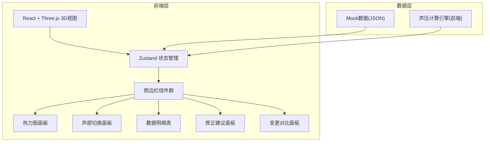
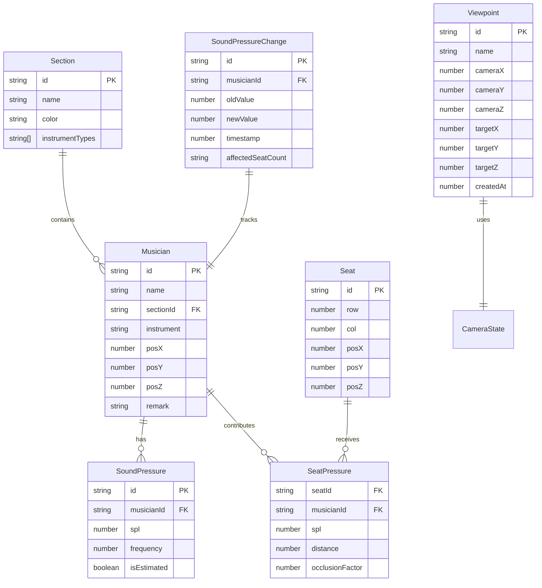
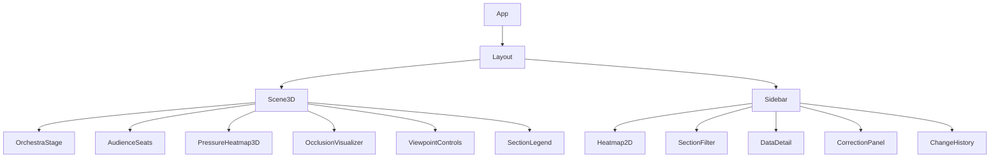

## 1. 架构设计



纯前端架构，无后端依赖，数据通过JSON文件加载，声压计算在前端完成。

## 2. 技术说明

- 前端：React@18 + TypeScript + TailwindCSS@3 + Vite
- 3D渲染：three + @react-three/fiber + @react-three/drei + @react-three/postprocessing
- 状态管理：zustand
- 初始化工具：vite-init
- 后端：无
- 数据库：无（使用Mock JSON数据）

## 3. 路由定义

| 路由 | 用途 |
|------|------|
| / | 主页面，3D声场视图+侧边栏 |

## 4. 数据模型

### 4.1 数据模型定义



### 4.2 Mock数据结构

```typescript
interface Musician {
  id: string;
  name: string;
  sectionId: string;
  instrument: string;
  position: { x: number; y: number; z: number } | null;
  remark?: string;
}

interface Section {
  id: string;
  name: string;
  color: string;
  instrumentTypes: string[];
}

interface InstrumentSPL {
  musicianId: string;
  spl: number | null;
  frequency: number;
  isEstimated: boolean;
}

interface Seat {
  id: string;
  row: number;
  col: number;
  position: { x: number; y: number; z: number };
}

interface SeatPressure {
  seatId: string;
  totalSPL: number;
  contributions: {
    musicianId: string;
    spl: number;
    distance: number;
    occlusionFactor: number;
  }[];
}

interface Viewpoint {
  id: string;
  name: string;
  cameraPosition: [number, number, number];
  cameraTarget: [number, number, number];
  createdAt: number;
}

interface SoundPressureChange {
  id: string;
  musicianId: string;
  musicianName: string;
  instrument: string;
  oldValue: number | null;
  newValue: number;
  timestamp: number;
  affectedSeatIds: string[];
}
```

## 5. 组件架构



### 核心组件职责

| 组件 | 职责 |
|------|------|
| Scene3D | Three.js画布容器，管理场景生命周期 |
| OrchestraStage | 渲染舞台平面与乐手标记点 |
| AudienceSeats | 渲染观众席座位网格 |
| PressureHeatmap3D | 3D声压热力叠加层(InstancedMesh色阶) |
| OcclusionVisualizer | 声部遮挡锥体可视化 |
| ViewpointControls | 视角保存/加载浮动控件 |
| SectionLegend | 声部图例与可见性切换 |
| Heatmap2D | 2D俯视座位热力图 |
| SectionFilter | 声部筛选面板(与3D同步) |
| DataDetail | 选中项数据明细表 |
| CorrectionPanel | 修正建议卡片列表 |
| ChangeHistory | 声压变更对比记录 |

## 6. 声压计算逻辑

采用简化点源声压衰减模型：

```
SPL_at_seat = SPL_source - 20 * log10(distance / reference_distance) - occlusion_loss
```

- `SPL_source`：乐器声压级(dB)
- `distance`：乐手到座位的欧几里得距离(m)
- `reference_distance`：参考距离(1m)
- `occlusion_loss`：遮挡衰减(dB)，基于声部间遮挡关系计算

总声压叠加采用能量法：
```
SPL_total = 10 * log10(Σ 10^(SPL_i / 10))
```

## 7. 关键技术决策

| 决策 | 选择 | 理由 |
|------|------|------|
| 3D框架 | @react-three/fiber | 与React生态深度集成，声明式3D开发 |
| 声压渲染 | InstancedMesh + 自定义Shader | 大量座位点的高性能渲染 |
| 状态同步 | Zustand单store | 3D与侧边栏共享状态，保证同步 |
| 数据容错 | 运行时校验+占位 | 声学顾问数据不完美，需容忍缺失 |
| 视角保存 | localStorage | 纯前端持久化，无需后端 |
| 热力色阶 | 自定义ColorMap | 蓝绿黄红四段色阶，声学领域常见 |
