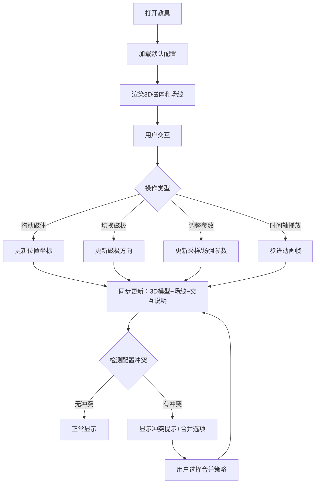

# 物理磁场线教具 - 产品需求文档 (PRD)

## 1. 产品概述
本产品是面向物理教学的3D交互式磁场线可视化教具，旨在解决磁极方向与课堂备注不一致、场线可视化不稳定等教学痛点。
- 核心目标：提供稳定、可交互的3D磁场线演示工具，支持参数调整与实时反馈
- 目标用户：中学物理教师、教研人员、学生
- 核心价值：通过直观的3D可视化帮助理解磁场概念，减少教学准备时间

## 2. 核心功能

### 2.1 用户角色
| 角色 | 注册方式 | 核心权限 |
|------|----------|----------|
| 物理教师 | 无需注册 | 使用全部演示功能、调整参数、查看冲突报告 |
| 教研人员 | 无需注册 | 高级参数调整、导出配置、合并冲突检测 |

### 2.2 功能模块
1. **主界面**：3D磁场可视化区域、控制面板、交互说明区
2. **参数控制区**：磁体位置、磁极方向、采样密度、场强限制
3. **冲突检测区**：显示磁体位置与磁极方向维护冲突、合并提示
4. **问题报告区**：非技术友好的问题说明与解决方案建议

### 2.3 页面详情
| 页面名称 | 模块名称 | 功能描述 |
|----------|----------|----------|
| 主界面 | 3D可视化区 | 实时渲染3D磁体和磁场线，支持拖拽旋转视角 |
| 主界面 | 磁体控制模块 | 拖动磁体位置、切换N/S极方向、磁极反向按钮 |
| 主界面 | 场线参数模块 | 调整采样密度滑块、场强上限阈值设置 |
| 主界面 | 冲突提示区 | 显示位置与方向配置冲突、合并建议、历史记录 |
| 主界面 | 问题报告区 | 人话版问题解释（如"磁极反向为什么没过"） |
| 主界面 | 交互状态栏 | 显示当前拖拽状态、重置/暂停按钮状态 |

## 3. 核心流程

## 4. 用户界面设计

### 4.1 设计风格
- 主色调：深蓝色系（#1e3a5f）代表科学与严谨，搭配科技感青色（#00d4ff）作为交互高亮
- 按钮风格：微立体圆角按钮，悬停有轻微上浮动画
- 字体：标题使用 Orbitron（科技感），正文使用 Noto Sans SC（清晰易读）
- 布局风格：左侧控制面板 + 中央3D场景 + 右侧信息面板的三栏布局
- 图标风格：线性简约图标，使用 Font Awesome 科学类图标

### 4.2 页面设计概览
| 页面名称 | 模块名称 | UI元素 |
|----------|----------|--------|
| 主界面 | 3D场景区 | 暗色背景、环境光照明、磁体金属质感、场线发光效果、鼠标悬停高亮 |
| 主界面 | 控制面板 | 卡片式分组、滑块控件、切换开关、数值输入框、实时数值显示 |
| 主界面 | 冲突提示区 | 黄色警告卡片、红色错误卡片、对比视图、"选择保留"按钮 |
| 主界面 | 问题报告区 | 白色背景卡片、大号图标、通俗语言解释、"查看详情"展开按钮 |

### 4.3 响应式
- 桌面端优先（1200px+）：完整三栏布局
- 平板端（768-1199px）：上下布局，控制面板折叠为可展开侧边栏
- 移动端（<768px）：单列布局，3D场景占满屏幕，控件改为底部抽屉

### 4.4 3D场景指引
- 环境：暗色渐变背景 + 微妙网格地板，营造实验室氛围
- 光照：三点布光（主光+补光+轮廓光），突出磁体金属质感
- 相机：PerspectiveCamera，初始距离适中，支持OrbitControls拖拽旋转
- 交互：磁体可拖拽移动，hover显示磁极标签，点击选中高亮
- 动画：场线有缓慢流动动画，参数变更时平滑过渡而非突变
- 性能：场线采样密度动态调整，低端设备自动降级渲染质量
