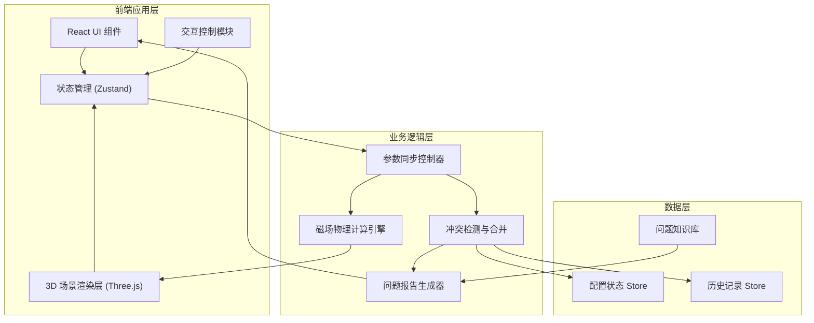

# 物理磁场线教具 - 技术架构文档

## 1. 架构设计



## 2. 技术描述
- **前端框架**: React@18 + TypeScript
- **构建工具**: Vite@5
- **样式方案**: TailwindCSS@3
- **3D引擎**: Three.js + @react-three/fiber + @react-three/drei
- **状态管理**: Zustand（轻量级，适合教学工具场景）
- **动画库**: Framer Motion（UI动画） + Three.js 原生动画
- **图标**: Lucide React

## 3. 核心模块定义

### 3.1 目录结构
```
src/
├── components/
│   ├── ControlPanel/       # 左侧控制面板
│   ├── Scene3D/           # 3D场景组件
│   ├── InfoPanel/         # 右侧信息面板
│   ├── ConflictAlert/     # 冲突提示组件
│   └── ReportCard/        # 问题报告卡片
├── store/
│   ├── useConfigStore.ts  # 配置状态管理
│   └── useHistoryStore.ts # 历史记录管理
├── engine/
│   ├── magneticField.ts   # 磁场物理计算
│   └── fieldLines.ts      # 场线生成算法
├── utils/
│   ├── conflictDetector.ts # 冲突检测逻辑
│   └── reportGenerator.ts  # 问题报告生成
└── types/
    └── index.ts           # TypeScript 类型定义
```

### 3.2 核心类型定义

```typescript
// 磁体配置
interface MagnetConfig {
  id: string;
  position: { x: number; y: number; z: number };
  poleDirection: 'N' | 'S';
  rotation: { x: number; y: number; z: number };
  strength: number;
  lastModifiedBy: 'position-editor' | 'pole-editor' | 'user';
  lastModifiedAt: number;
}

// 场线参数
interface FieldLineParams {
  sampleDensity: number;      // 采样密度
  maxFieldStrength: number;   // 场强上限
  lineCount: number;          // 场线数量
  maxLength: number;          // 场线最大长度
}

// 冲突记录
interface ConfigConflict {
  id: string;
  type: 'position-vs-pole' | 'density-vs-performance' | 'strength-vs-stability';
  magnetId?: string;
  description: string;
  sideA: { source: string; value: any; timestamp: number };
  sideB: { source: string; value: any; timestamp: number };
  resolved: boolean;
  resolution?: 'keep-A' | 'keep-B' | 'merge';
}

// 问题报告
interface IssueReport {
  id: string;
  type: 'pole-reverse-failed' | 'sample-too-dense' | 'field-explosion';
  title: string;
  plainTextExplanation: string;
  technicalDetails: string;
  solution: string;
  relatedRecords: string[];
}
```

### 3.3 状态同步机制
```typescript
// 参数变更后的同步更新流程
const updateMagnetConfig = (magnetId: string, updates: Partial<MagnetConfig>) => {
  // 1. 更新状态
  const oldConfig = getMagnetConfig(magnetId);
  const newConfig = { ...oldConfig, ...updates };
  
  // 2. 检测冲突
  const conflicts = detectConflicts(oldConfig, newConfig);
  if (conflicts.length > 0) {
    addConflicts(conflicts);
  }
  
  // 3. 触发同步更新
  updateMagnetInScene(newConfig);           // 更新3D模型
  regenerateFieldLines(newConfig);          // 重绘场线
  updateInteractionInstructions(newConfig); // 更新拖拽说明
  updateResetPauseState();                  // 更新重置/暂停按钮
  
  // 4. 记录历史
  addToHistory({
    action: 'update-magnet',
    oldConfig,
    newConfig,
    timestamp: Date.now()
  });
};
```

## 4. 磁场物理计算核心

```typescript
// 毕奥-萨伐尔定律简化实现（磁偶极子模型）
const calculateMagneticField = (
  point: Vector3,
  magnets: MagnetConfig[]
): Vector3 => {
  let totalField = new Vector3(0, 0, 0);
  
  for (const magnet of magnets) {
    const dipoleMoment = getDipoleMoment(magnet);
    const r = point.clone().sub(magnet.position);
    const rMag = r.length();
    
    if (rMag < 0.1) continue; // 避免奇点
    
    // B = (μ₀/4π) * [3(m·r̂)r̂ - m] / r³
    const rNorm = r.clone().normalize();
    const mDotR = dipoleMoment.dot(rNorm);
    const term1 = rNorm.clone().multiplyScalar(3 * mDotR);
    const term2 = dipoleMoment.clone();
    const field = term1.sub(term2).divideScalar(Math.pow(rMag, 3));
    
    totalField.add(field);
  }
  
  return totalField;
};

// 场线追踪算法
const traceFieldLine = (
  startPoint: Vector3,
  magnets: MagnetConfig[],
  params: FieldLineParams
): Vector3[] => {
  const points: Vector3[] = [startPoint.clone()];
  let current = startPoint.clone();
  
  for (let i = 0; i < params.maxLength; i++) {
    const field = calculateMagneticField(current, magnets);
    const fieldMag = field.length();
    
    // 场强爆炸检测
    if (fieldMag > params.maxFieldStrength * 10) {
      recordIssue({
        type: 'field-explosion',
        point: current.clone(),
        fieldStrength: fieldMag,
        step: i
      });
      break;
    }
    
    if (fieldMag < 0.001) break;
    
    const step = field.normalize().multiplyScalar(0.05);
    current = current.add(step);
    points.push(current.clone());
    
    // 采样密度控制
    if (i % Math.ceil(10 / params.sampleDensity) === 0) {
      checkPerformance();
    }
  }
  
  return points;
};
```

## 5. 冲突检测逻辑

```typescript
const detectConflicts = (
  oldConfig: MagnetConfig,
  newConfig: MagnetConfig
): ConfigConflict[] => {
  const conflicts: ConfigConflict[] = [];
  
  // 检测位置与磁极方向编辑者冲突
  if (oldConfig.lastModifiedBy !== newConfig.lastModifiedBy &&
      oldConfig.lastModifiedBy !== undefined) {
    
    // 位置被A修改，方向被B修改
    if (oldConfig.lastModifiedBy === 'position-editor' && 
        newConfig.lastModifiedBy === 'pole-editor') {
      conflicts.push({
        id: generateId(),
        type: 'position-vs-pole',
        magnetId: newConfig.id,
        description: '磁体位置和磁极方向由不同人员编辑，可能存在配置不一致',
        sideA: {
          source: '磁体位置维护者',
          value: oldConfig.position,
          timestamp: oldConfig.lastModifiedAt
        },
        sideB: {
          source: '磁极方向维护者',
          value: newConfig.poleDirection,
          timestamp: newConfig.lastModifiedAt
        },
        resolved: false
      });
    }
  }
  
  return conflicts;
};
```

## 6. 非技术友好报告生成

```typescript
const generatePlainTextReport = (issue: IssueReport): string => {
  const templates: Record<string, string> = {
    'pole-reverse-failed': `
【问题】磁极反向为什么没生效？

简单说：就像你把磁铁翻了个面，但系统"忘了"更新场线的走向。

【为啥会这样】
1. 只点了"反向"按钮，但场线没重新计算
2. 或者3D模型翻了，但磁场计算还用的老数据
3. 就像你把遥控器反过来按，但电视没反应——遥控器变了，电视没收到信号

【怎么解决】
按一下旁边的"🔄 重新生成场线"按钮就好。
如果还不行，刷新页面试试——这相当于把电视重启一下。
    `,
    'sample-too-dense': `
【问题】采样过密是什么意思？

简单说：就像你用显微镜看地图，看得太细了，电脑算不过来。

【为啥会这样】
你把"采样密度"拉太高了。本来只需要画100条线，现在要画1000条。
就像老师让你画10个点，你硬要画100个——不是不行，就是手会酸，时间会久。

【怎么解决】
把采样密度滑块往左拉一点，降到中间位置就好。
教学演示用默认值就够清楚了，不用追求极致精细。
    `,
    'field-explosion': `
【问题】场强"爆炸"是什么？

简单说：就像你把两块磁铁N极对N极硬挤在一起，中间的磁场太强了，超出了系统能显示的范围。

【为啥会这样】
1. 两个磁体贴太近了
2. 或者磁场强度设得太高
3. 就像往气球里吹气太多——不是真的爆炸，是数值太大超出显示范围了

【怎么解决】
把磁体拉开一点距离，或者把"磁场强度"调低一些。
真实物理世界里，磁场太强也会出问题的哦！
    `
  };
  
  return templates[issue.type] || '未知问题，请联系技术支持。';
};
```
