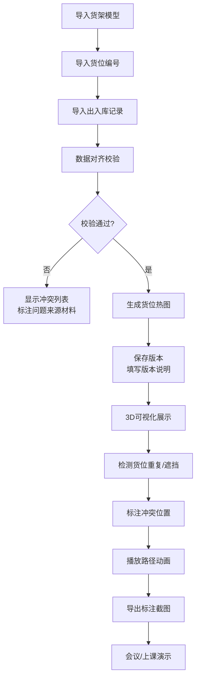

## 1. 产品概述

立体仓储货位热图分析系统，专为仓储规划师设计，解决货位规划中的核心痛点：版本覆盖、货位重复、高度遮挡、数据对齐问题。系统提供带清晰标注的3D货架可视化、版本历史追溯、货位冲突检测和出入库路径回放，让规划师能用截图清晰沟通，而不只是漂亮模型。

- 核心用户：仓储规划师、物流运营人员
- 核心价值：让货位规划的冲突和问题"看得见、说得清、可追溯"

## 2. 核心功能

### 2.1 用户角色

| 角色 | 注册方式 | 核心权限 |
|------|----------|----------|
| 仓储规划师 | 本地直接使用 | 导入货架模型、管理热图版本、检测货位冲突、播放出入库路径、导出标注截图 |

### 2.2 功能模块

1. **3D货架可视化页面**：立体货架渲染、货位编号标注、高度遮挡提示、热图叠加显示
2. **版本历史管理页面**：热图版本列表、版本对比、版本说明、恢复历史版本
3. **货位冲突检测页面**：重复货位高亮、冲突材料追溯、出入库记录对齐、问题定位
4. **路径播放页面**：出入库路径动画、路径节点标注、时间轴控制、截图导出

### 2.3 页面详情

| 页面名称 | 模块名称 | 功能描述 |
|----------|----------|----------|
| 3D货架可视化 | 货架渲染 | 多层立体货架3D展示，支持旋转、缩放、平移 |
| 3D货架可视化 | 货位标注 | 每个货位显示编号、SKU、热度值，鼠标悬停显示详情 |
| 3D货架可视化 | 热图叠加 | 按出入库频次显示热图，支持切换热度维度 |
| 3D货架可视化 | 遮挡提示 | 被遮挡货位用虚线边框+编号悬浮标注 |
| 版本历史管理 | 版本列表 | 时间轴展示所有热图版本，显示创建人、备注 |
| 版本历史管理 | 版本对比 | 双栏对比两个版本的差异，高亮变化的货位 |
| 版本历史管理 | 版本保护 | 重要版本可锁定，防止被覆盖 |
| 货位冲突检测 | 重复检测 | 扫描所有货位，标记重复分配的货位 |
| 货位冲突检测 | 材料追溯 | 点击冲突货位，显示哪份导入材料导致冲突 |
| 货位冲突检测 | 记录对齐 | 货架模型、货位编号、出入库记录三方数据校验 |
| 路径播放 | 路径动画 | 按时间顺序播放出入库路径，显示移动方向 |
| 路径播放 | 节点标注 | 路径上的关键节点标注时间、操作人、货物信息 |
| 路径播放 | 播放控制 | 暂停、快进、倍速、跳转指定时间点 |

## 3. 核心流程

仓储规划师从导入数据开始，系统自动校验数据一致性。发现冲突时直接标注是哪份材料的问题，避免"处理失败"这类模糊提示。生成的热图自动保存版本，重要版本可锁定防止覆盖。3D视图中所有货位都有清晰编号标注，遮挡的货位用特殊样式提示。路径播放时每个节点都有文字标注，不全靠颜色区分。

## 4. 用户界面设计

### 4.1 设计风格

- **主色调**：工业蓝 (#165DFF) 作为主色，代表专业和可靠；橙红色 (#FF4D4F) 标记冲突和警告；暖橙色 (#FA8C16) 标记高热度货位
- **辅助色**：深灰背景 (#1F2937) 配合浅色文字，适合长时间查看3D场景
- **按钮风格**：直角+细边框，工业风格，悬停时有轻微发光效果
- **字体**：标题使用 "JetBrains Mono" 等宽字体，体现工程感；正文使用 "Noto Sans SC" 保证中文可读性
- **布局风格**：左侧工具面板+中央3D场景+右侧信息面板，三栏布局，信息密度高但不拥挤
- **标注风格**：货位编号用白色半透明背景+黑色边框，永远可见，不依赖颜色区分

### 4.2 页面设计概述

| 页面名称 | 模块名称 | UI元素 |
|----------|----------|--------|
| 3D货架可视化 | 货架渲染 | 深灰背景，货架金属质感，货位按热度渐变着色，每个货位有编号标签 |
| 3D货架可视化 | 遮挡提示 | 被遮挡货位显示虚线边框，编号标签悬浮在货架外侧 |
| 版本历史管理 | 版本列表 | 卡片式列表，每个卡片显示版本号、时间、备注、锁定状态 |
| 版本历史管理 | 版本对比 | 左右分栏，中间用连接线显示差异货位 |
| 货位冲突检测 | 冲突列表 | 表格展示冲突货位、冲突类型、来源材料、建议处理方式 |
| 货位冲突检测 | 材料追溯 | 时间线展示数据导入顺序，高亮问题材料 |
| 路径播放 | 路径动画 | 亮蓝色路径线，移动的货物图标，节点处弹出信息框 |
| 路径播放 | 播放控制 | 底部时间轴，标记关键事件点，支持拖拽跳转 |

### 4.3 响应性

- Desktop-first 设计，主场景区域自适应窗口大小
- 侧边面板可折叠，为3D场景留出更多空间
- 标注文字大小随缩放自动调整，保证可读性
- 导出截图功能自动适配高清分辨率

### 4.4 3D场景指导

- **环境**：深色工业风背景，轻微网格地面，营造仓储空间感
- **光照**：顶部主光源+货架边缘补光，突出货位边界，避免过度阴影
- **相机**：默认45度俯视角度，可自由旋转，自动保持货架在视野中心
- **交互**：鼠标悬停货位高亮并显示详情，点击选中并在右侧面板显示完整信息
- **动画**：货位热度变化有平滑过渡动画，路径播放有自然的缓动效果
- **后处理**：轻微泛光效果突出高热度货位，保持整体清晰不花哨
- **性能**：单个货架最多1000个货位，使用实例化渲染保证60fps
