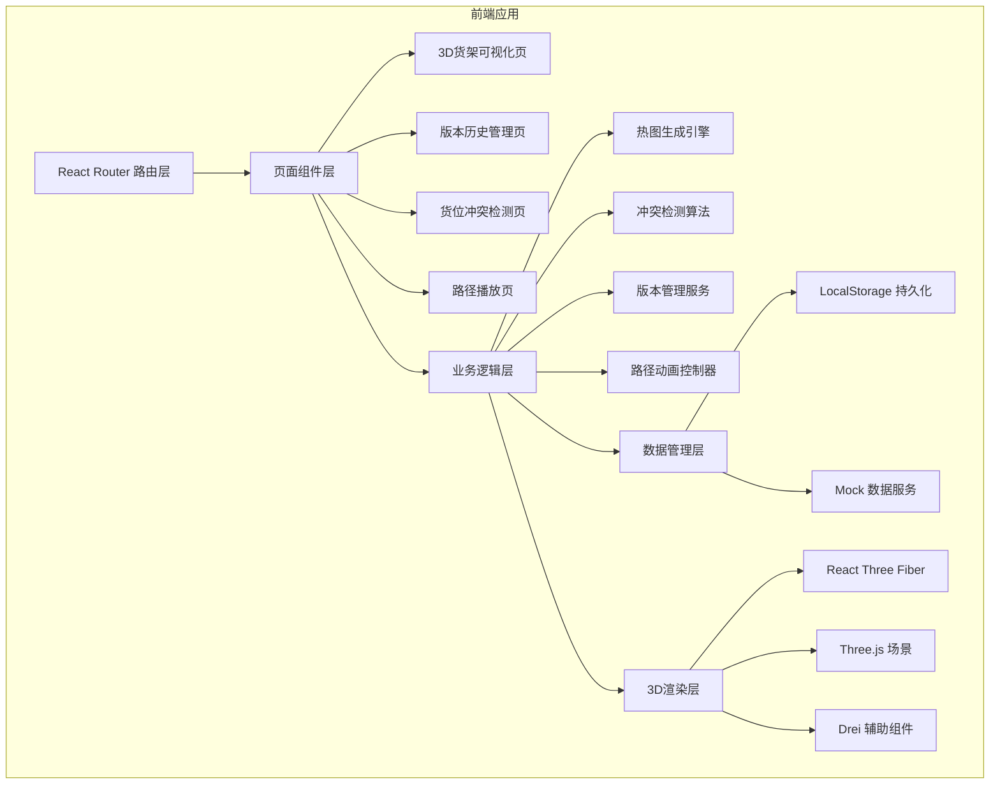
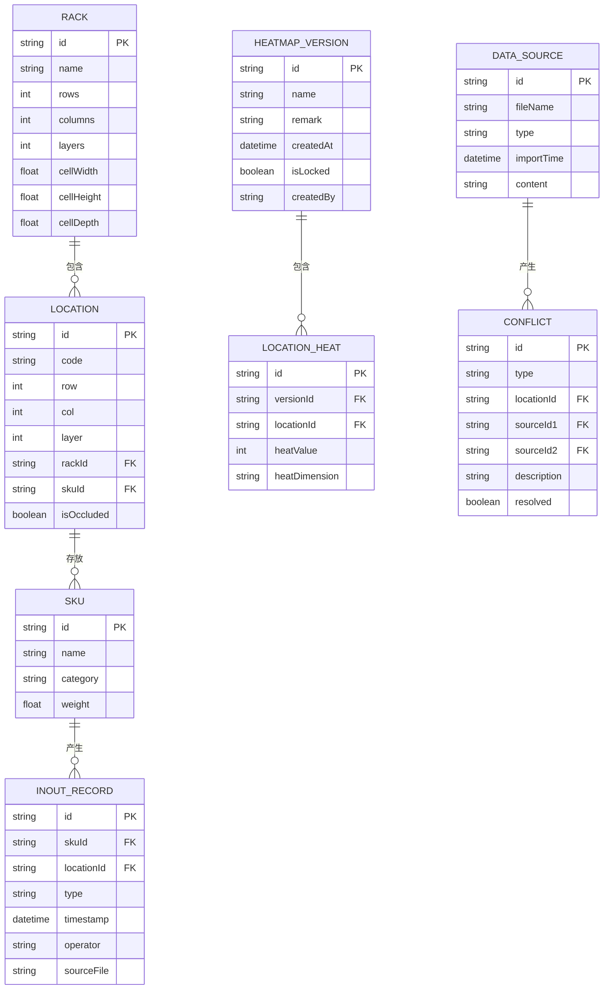

## 1. 架构设计



## 2. 技术描述

- **前端框架**：React@18 + TypeScript + Vite@5
- **样式方案**：TailwindCSS@3 + CSS Variables 主题系统
- **3D渲染**：Three@0.160 + @react-three/fiber@8 + @react-three/drei@9 + @react-three/postprocessing@2
- **状态管理**：Zustand@4（轻量级，适合本地数据管理）
- **路由**：React Router@6
- **图标**：Lucide React（简洁工业风格）
- **后端**：无后端，纯前端应用，数据存储在 LocalStorage
- **数据**：内置完整 Mock 数据，可直接演示所有功能

## 3. 路由定义

| 路由 | 页面 | 功能 |
|------|------|------|
| / | 3D货架可视化 | 默认首页，展示立体货架和热图 |
| /versions | 版本历史管理 | 热图版本列表、对比、锁定、恢复 |
| /conflicts | 货位冲突检测 | 重复货位检测、材料追溯、数据对齐 |
| /playback | 路径播放 | 出入库路径动画、节点标注、时间轴控制 |

## 4. 数据模型

### 4.1 数据模型定义



### 4.2 核心数据结构（TypeScript）

```typescript
// 货架模型
interface Rack {
  id: string;
  name: string;
  rows: number;
  columns: number;
  layers: number;
  cellWidth: number;
  cellHeight: number;
  cellDepth: number;
}

// 货位
interface Location {
  id: string;
  code: string;
  row: number;
  col: number;
  layer: number;
  rackId: string;
  skuId?: string;
  isOccluded: boolean;
}

// 出入库记录
interface InOutRecord {
  id: string;
  skuId: string;
  locationId: string;
  type: 'in' | 'out';
  timestamp: Date;
  operator: string;
  sourceFile: string;
}

// 热图版本
interface HeatmapVersion {
  id: string;
  name: string;
  remark: string;
  createdAt: Date;
  isLocked: boolean;
  createdBy: string;
  locationHeats: LocationHeat[];
}

// 货位热度
interface LocationHeat {
  locationId: string;
  heatValue: number;
  heatDimension: 'frequency' | 'turnover' | 'weight';
}

// 冲突记录
interface Conflict {
  id: string;
  type: 'duplicate' | 'occlusion' | 'mismatch';
  locationId: string;
  sourceIds: string[];
  description: string;
  resolved: boolean;
}

// 路径节点
interface PathNode {
  id: string;
  recordId: string;
  locationId: string;
  position: [number, number, number];
  timestamp: Date;
  info: {
    skuName: string;
    operator: string;
    action: string;
  };
}
```

## 5. 核心模块设计

### 5.1 3D货架渲染模块

- 使用 InstancedMesh 渲染大量货位，保证性能
- 每个货位独立计算热度颜色，支持平滑过渡
- 货位编号使用 Billboard 精灵，始终面向相机
- 遮挡检测：基于相机位置计算每个货位的可见性，被遮挡的货位显示虚线边框和悬浮标签

### 5.2 热图版本管理模块

- 每次生成热图自动创建新版本，不覆盖旧版本
- 版本锁定功能：锁定后无法删除或覆盖
- 版本对比：计算两个版本的热度差异，用不同颜色标注变化
- 版本数据存储在 LocalStorage，支持导出/导入

### 5.3 冲突检测模块

- 货位重复检测：扫描所有货位分配记录，发现同一货位被分配给多个SKU
- 数据对齐校验：检查货架模型、货位编号、出入库记录三方数据的一致性
- 材料追溯：每个冲突记录关联到具体的数据源文件，显示是哪份导入材料导致问题
- 高度遮挡分析：基于货架布局和货位尺寸，计算可能被遮挡的货位

### 5.4 路径播放模块

- 基于出入库记录按时间顺序生成路径
- 使用 CatmullRomCurve3 生成平滑路径
- 路径节点标注：每个关键点显示信息标签
- 播放控制：支持暂停、快进（1x/2x/4x/8x）、拖拽时间轴跳转
- 截图导出：使用 html2canvas 导出带标注的高清截图

## 6. Mock 数据设计

内置完整的演示数据，包含：
- 1个立体货架（4排 × 8列 × 5层 = 160个货位）
- 50种SKU商品，覆盖不同品类
- 200条出入库记录，时间跨度30天
- 5个热图历史版本，包含锁定版本
- 8个模拟冲突（3个货位重复、3个数据不匹配、2个高度遮挡）
- 1条完整的出入库路径（20个节点）
