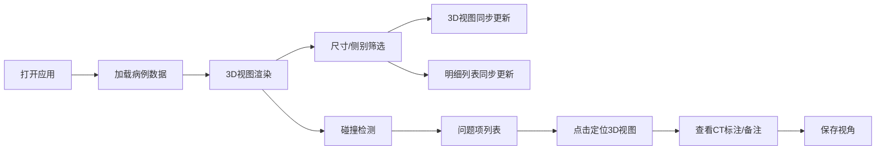

## 1. 产品概述
骨科植入物匹配台是面向医疗器械工程师和骨科医生的Web3D术前规划工具，解决二维影像与植入物尺寸表对账困难的问题。通过3D可视化配准，直观展示骨骼模型、CT标注、植入物的空间关系，辅助判断尺寸越界、左右侧混淆、禁区碰撞等风险。

- 目标用户：骨科医生、医疗器械工程师、术前规划专员
- 核心价值：将抽象的尺寸数据转化为直观的3D空间关系，降低对账失误率，留存决策依据

## 2. 核心功能

### 2.1 用户角色
| 角色 | 登录方式 | 核心权限 |
|------|----------|----------|
| 医生/工程师 | 本地应用直接使用 | 3D浏览、筛选、保存视角、查看碰撞检测报告 |

### 2.2 功能模块
1. **3D主视图区**：骨骼模型渲染、植入物配准、CT标注叠加、交互控制
2. **侧边筛选栏**：尺寸筛选器、左右侧切换、碰撞检测结果列表
3. **明细记录区**：CT标注详情、医生备注、植入物规格、来源追溯
4. **视角管理**：保存/加载当前视角、预设视角快捷切换

### 2.3 页面详情
| 页面名称 | 模块名称 | 功能描述 |
|-----------|-------------|---------------------|
| 匹配台主页 | 3D主视图 | 可旋转/缩放/平移的3D场景，显示骨骼、植入物、CT标注、禁区碰撞区域 |
| 匹配台主页 | 尺寸筛选器 | 按植入物尺寸范围筛选，实时同步3D视图和明细列表 |
| 匹配台主页 | 碰撞检测面板 | 列出所有尺寸越界、左右侧混淆、禁区碰撞的问题项，点击定位到3D视图 |
| 匹配台主页 | 明细记录区 | 显示当前选中记录的CT标注、医生备注、植入物规格、数据来源 |
| 匹配台主页 | 视角工具栏 | 保存视角、加载视角、重置视图、切换渲染模式 |

## 3. 核心流程

用户打开应用 → 加载预设病例数据 → 3D视图显示骨骼与植入物配准 → 通过侧边栏筛选尺寸/左右侧 → 3D视图与明细同步更新 → 查看碰撞检测报告 → 点击问题项定位到3D视图 → 查看CT标注和医生备注 → 保存当前视角留档

## 4. 用户界面设计

### 4.1 设计风格
- **主色调**：医疗蓝 (#165DFF) 作为主色，深灰 (#1D2129) 背景，突出3D场景
- **警示色**：尺寸越界用橙色 (#FF7D00)，左右侧混淆用紫色 (#722ED1)，禁区碰撞用红色 (#F53F3F)
- **成功色**：匹配正常用绿色 (#00B42A)
- **字体**：显示屏用 Space Grotesk，正文用 Inter，等宽数据用 JetBrains Mono
- **布局**：左侧3D主视图（70%宽度），右侧筛选+明细面板（30%宽度），顶部工具栏
- **视觉风格**：工业级医疗界面，深色主题，高对比度，数据可视化清晰，避免过度装饰

### 4.2 页面设计概述
| 页面名称 | 模块名称 | UI元素 |
|-----------|-------------|-------------|
| 匹配台主页 | 3D主视图 | Three.js场景、轨道控制器、骨骼半透明渲染、植入物实体渲染、CT标注点云、碰撞区域高亮、视角gizmo |
| 匹配台主页 | 筛选面板 | 尺寸范围滑块、侧别切换按钮（左/右/双侧）、问题类型筛选标签 |
| 匹配台主页 | 碰撞检测面板 | 问题卡片列表，每个卡片含类型图标、严重程度、描述文字、定位按钮 |
| 匹配台主页 | 明细记录区 | 数据表格，含CT编号、标注位置、医生备注、植入物型号、数据来源字段 |
| 匹配台主页 | 工具栏 | 保存视角按钮、视角下拉选择、重置按钮、渲染模式切换（实体/线框/X-ray） |

### 4.3 响应式
- 桌面端为主，最小支持1280px宽度
- 右侧面板可折叠，给3D视图更多空间
- 触控设备支持双指缩放旋转

### 4.4 3D场景指引
- **环境**：深色背景，柔和环境光 + 方向光，营造手术室无影灯效果
- **光照**：主光源从左上45度照射，辅助光从右下补光，环境光强度0.3
- **相机**：PerspectiveCamera，初始位置(5, 3, 8)，看向原点，fov 50度
- **交互**：OrbitControls，支持阻尼效果，旋转、缩放、平移
- **渲染**：骨骼模型使用半透明MeshStandardMaterial，植入物使用金属质感材质，CT标注使用Points点云，碰撞区域使用发光效果
- **动画**：选中植入物时轻微浮动动画，碰撞检测时闪烁警示，视图切换时平滑过渡
- **后处理**：Bloom效果用于高亮碰撞区域，轻微色调映射
