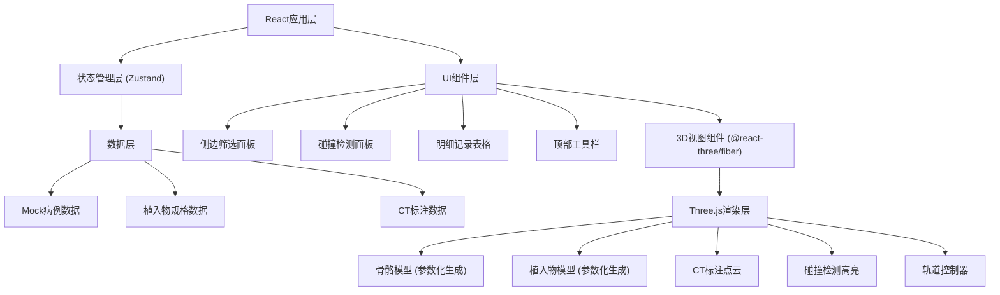
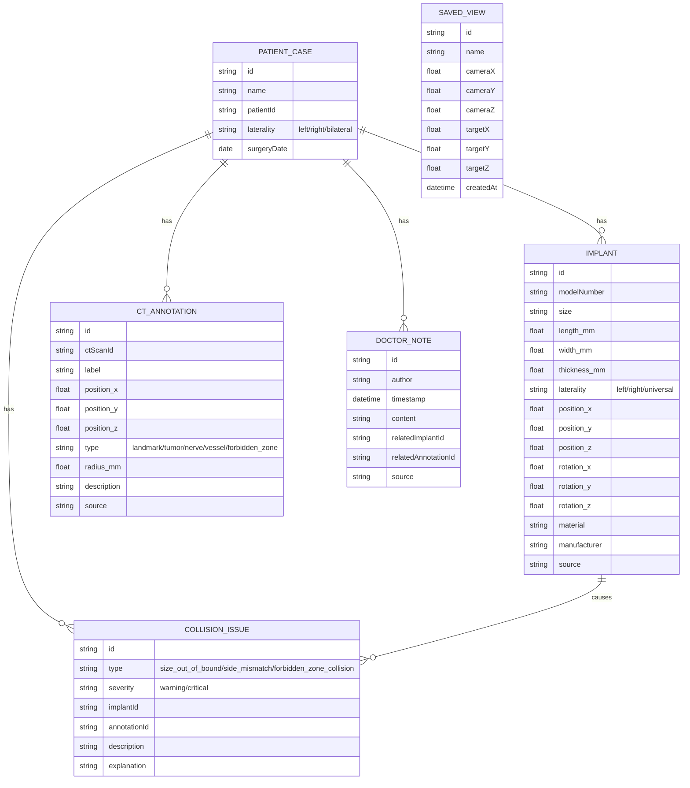

## 1. 架构设计



## 2. 技术描述

- **前端框架**：React@18 + TypeScript
- **构建工具**：Vite@5
- **3D引擎**：Three@0.160 + @react-three/fiber@8 + @react-three/drei@9
- **状态管理**：Zustand@4（轻量级，适合跨组件同步筛选状态）
- **样式方案**：TailwindCSS@3 + CSS变量
- **UI组件**：自定义组件 + Radix UI primitives（滑块、下拉菜单）
- **图标**：Lucide React
- **后端**：无后端，纯前端Mock数据
- **数据持久化**：LocalStorage存储保存的视角

## 3. 路由定义

| Route | 用途 |
|-------|------|
| / | 匹配台主页，包含3D视图+侧边面板 |

## 4. 数据模型

### 4.1 数据模型定义



### 4.2 状态管理结构 (Zustand Store)

```typescript
interface AppState {
  // 筛选状态
  filters: {
    sizeRange: [number, number];
    laterality: 'all' | 'left' | 'right';
    issueTypes: string[];
  };
  
  // 当前选中
  selectedImplantId: string | null;
  selectedIssueId: string | null;
  selectedAnnotationId: string | null;
  
  // 数据
  caseData: PatientCase;
  implants: Implant[];
  annotations: CTAnnotation[];
  notes: DoctorNote[];
  issues: CollisionIssue[];
  savedViews: SavedView[];
  
  // 3D视图状态
  renderMode: 'solid' | 'wireframe' | 'xray';
  showBones: boolean;
  showImplants: boolean;
  showAnnotations: boolean;
  
  // Actions
  setFilters: (filters: Partial<AppState['filters']>) => void;
  selectImplant: (id: string | null) => void;
  selectIssue: (id: string | null) => void;
  saveCurrentView: (name: string, camera: CameraState) => void;
  loadView: (viewId: string) => CameraState | null;
  setRenderMode: (mode: AppState['renderMode']) => void;
  toggleLayer: (layer: 'bones' | 'implants' | 'annotations') => void;
  
  // 筛选后的数据
  getFilteredImplants: () => Implant[];
  getFilteredIssues: () => CollisionIssue[];
}
```

### 4.3 碰撞检测逻辑

1. **尺寸越界检测**：比较植入物尺寸与骨骼可容纳区域的阈值
2. **左右侧混淆检测**：比较植入物侧别与病例侧别是否匹配
3. **禁区碰撞检测**：计算植入物包围盒与禁区标注的距离，小于阈值则判定碰撞

### 4.4 3D模型生成策略

由于没有实际的STL文件，使用Three.js参数化几何体生成演示模型：
- **股骨/胫骨**：使用LatheGeometry生成管状骨骼轮廓，添加关节球头
- **植入物（钢板/螺钉）**：使用BoxGeometry、CylinderGeometry组合，按尺寸参数缩放
- **CT标注**：使用Points点云，不同类型用不同颜色和大小
- **禁区**：使用半透明SphereGeometry或BoxGeometry，带发光材质

## 5. 核心组件结构

```
src/
├── App.tsx
├── main.tsx
├── store/
│   └── useAppStore.ts
├── components/
│   ├── Viewport3D/
│   │   ├── index.tsx
│   │   ├── BoneModel.tsx
│   │   ├── ImplantModel.tsx
│   │   ├── AnnotationPoints.tsx
│   │   ├── CollisionHighlight.tsx
│   │   └── SceneLighting.tsx
│   ├── Sidebar/
│   │   ├── index.tsx
│   │   ├── FilterPanel.tsx
│   │   ├── CollisionPanel.tsx
│   │   └── DetailsTable.tsx
│   └── Toolbar/
│       ├── index.tsx
│       ├── ViewSelector.tsx
│       └── RenderModeToggle.tsx
├── data/
│   ├── mockCase.ts
│   ├── mockImplants.ts
│   ├── mockAnnotations.ts
│   └── mockIssues.ts
├── types/
│   └── index.ts
└── utils/
    ├── collision.ts
    └── viewPersistence.ts
```

## 6. 关键技术点

1. **跨组件筛选同步**：使用Zustand单一数据源，筛选条件变化时，3D视图和侧边列表同时订阅状态更新
2. **点击定位**：点击问题项时，通过状态更新相机位置，使用lerp平滑过渡到目标视角
3. **碰撞可视化**：使用后处理Bloom效果高亮碰撞区域，材质颜色根据问题类型区分
4. **视角持久化**：将相机位置和目标点序列化存入LocalStorage，支持命名保存和加载
5. **参数化模型**：所有3D模型基于数据参数生成，便于筛选时动态调整可见性和高亮状态
