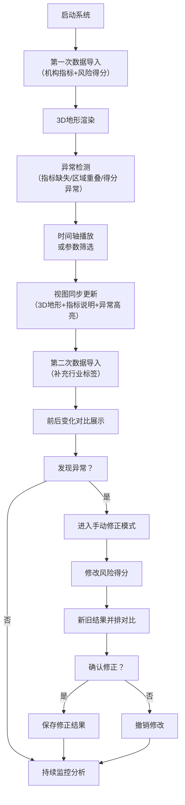

# 金融风险地形图 - 产品需求文档

## 1. 产品概述

金融风险地形图是一个3D可视化系统，帮助风险管理部直观展示和分析机构风险分布。系统通过三维地形呈现区域风险分布，支持时间轴播放、参数筛选、异常检测等核心功能，解决区域重叠、得分异常等复杂场景下的风险溯源问题。

## 2. 核心功能

### 2.1 用户角色

| 角色 | 注册方式 | 核心权限 |
|------|---------|---------|
| 风险管理专员 | 系统内置 | 查看3D地形、时间轴播放、指标筛选、异常检测、手动修正风险得分 |

### 2.2 功能模块

1. **主界面（3D地形视图）**：3D风险地形图、时间轴、控制面板、指标筛选
2. **数据导入模块**：分批次导入机构指标、风险得分、行业标签
3. **异常检测模块**：指标缺失、区域重叠、得分异常的边界样例检测和高亮
4. **手动修正模块**：风险得分修正入口、新旧结果并排对比

### 2.3 页面详情

| 页面名称 | 模块名称 | 功能描述 |
|---------|---------|---------|
| 主界面 | 3D地形视图 | 鼠标拖拽旋转视角、滚轮缩放、hover显示详情 |
| 主界面 | 时间轴控制器 | 播放/暂停、上一帧/下一帧、时间点跳转 |
| 主界面 | 指标筛选面板 | 机构类型、风险等级、行业标签筛选 |
| 主界面 | 异常高亮 | 红色高亮异常区域、悬浮显示异常原因 |
| 数据导入 | 批次导入 | 第一次导入机构指标和风险得分，第二次补行业标签 |
| 数据导入 | 变化对比 | 显示两次导入前后的数据变化 |
| 手动修正 | 修正入口 | 选中机构后手动修改风险得分 |
| 手动修正 | 对比视图 | 修正前后的3D地形和数据并排对比展示 |

## 3. 核心流程

## 4. 用户界面设计

### 4.1 设计风格

**设计方向：专业金融科技风（冷色调、数据可视化导向）**

- **主色调**：深蓝 #0a1628（背景）、科技蓝 #1e3a5f（面板）、亮蓝 #00d4ff（高亮）
- **辅助色**：风险红 #ff4757（异常）、警告黄 #ffa502（预警）、正常绿 #2ed573（正常）
- **按钮风格**：扁平化圆角，悬停时有发光效果
- **字体**：主标题使用 JetBrains Mono（等宽科技感），正文使用 IBM Plex Sans（易读）
- **布局风格**：三栏布局（左侧指标筛选、中间3D视图、右侧详情面板），深色主题
- **视觉元素**：网格线、发光边框、粒子效果、渐变叠加

### 4.2 页面设计概览

| 页面名称 | 模块名称 | UI元素 |
|---------|---------|---------|
| 主界面 | 3D地形视图 | 3D网格地形、高度映射风险值、颜色编码、异常区域红色发光 |
| 主界面 | 时间轴 | 底部横向时间条、播放控制按钮、关键帧标记 |
| 主界面 | 左侧面板 | 可折叠筛选器、复选框组、滑块控件、图例 |
| 主界面 | 右侧面板 | 选中机构详情、异常列表、统计数据卡片 |
| 数据导入 | 导入界面 | 拖拽上传区域、批次选择、进度条、预览表格 |
| 手动修正 | 对比视图 | 左右分屏、同步视角控制、差异高亮 |

### 4.3 响应式

- 桌面端优先设计（1920x1080及以上）
- 平板端自适应布局，面板可收起
- 触屏设备支持手势缩放和旋转

### 4.4 3D场景指引

- **环境**：深色空间背景，带轻微网格地板，营造科技感
- **光照**：主光源 + 环境光 + 异常区域自发光效果
- **相机**：透视相机，初始视角45度俯角，支持轨道控制
- **地形**：程序化生成网格地形，高度对应风险得分，颜色映射风险等级
- **交互**：鼠标拖拽旋转、滚轮缩放、点击选中、hover显示信息
- **动画**：时间轴播放时地形平滑过渡、异常区域脉冲效果
- **后处理**：Bloom发光效果、轻微景深、抗锯齿
