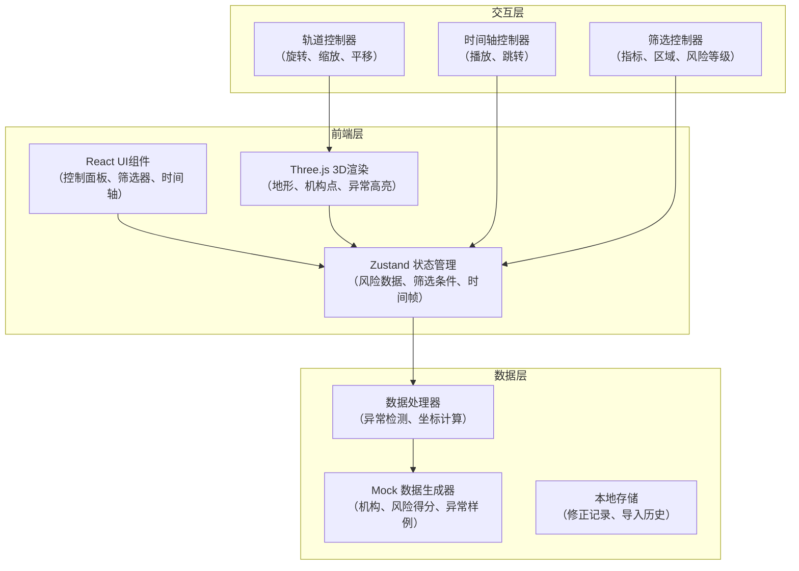
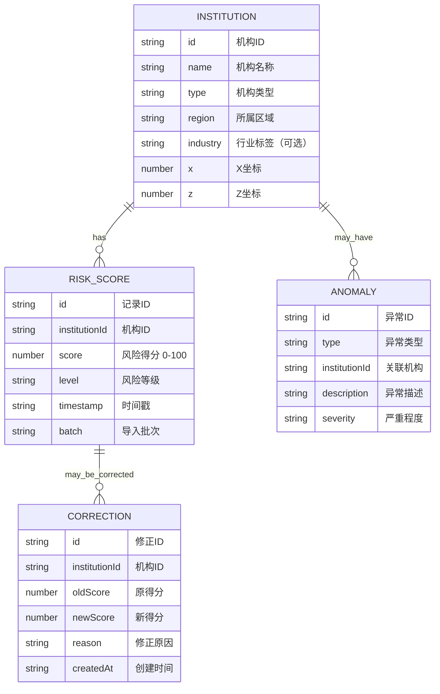

# 金融风险地形图 - 技术架构文档

## 1. 架构设计



## 2. 技术描述

- **前端框架**: React@18 + TypeScript + Vite
- **3D渲染**: Three.js + @react-three/fiber + @react-three/drei
- **状态管理**: Zustand
- **样式方案**: TailwindCSS@3
- **UI组件**: 自定义组件 + Lucide React 图标
- **数据方案**: 内置Mock数据（模拟机构、风险得分、异常边界样例）
- **构建工具**: Vite

## 3. 路由定义

| 路由 | 用途 |
|------|------|
| / | 主界面 - 3D风险地形视图 |
| /import | 数据导入页面 |
| /compare | 手动修正对比视图 |

## 4. 数据模型

### 4.1 数据模型定义



### 4.2 TypeScript 类型定义

```typescript
// 机构类型
interface Institution {
  id: string;
  name: string;
  type: 'bank' | 'insurance' | 'securities' | 'fund' | 'trust';
  region: string;
  industry?: string;
  x: number;
  z: number;
}

// 风险得分
interface RiskScore {
  id: string;
  institutionId: string;
  score: number;
  level: 'low' | 'medium' | 'high' | 'critical';
  timestamp: string;
  batch: 1 | 2;
}

// 异常类型
type AnomalyType = 'missing_metric' | 'region_overlap' | 'score_abnormal';

interface Anomaly {
  id: string;
  type: AnomalyType;
  institutionId: string;
  description: string;
  severity: 'warning' | 'error';
  relatedInstitutions?: string[];
}

// 修正记录
interface Correction {
  id: string;
  institutionId: string;
  oldScore: number;
  newScore: number;
  reason: string;
  createdAt: string;
}

// 筛选条件
interface FilterState {
  institutionTypes: string[];
  regions: string[];
  industries: string[];
  riskLevels: string[];
  scoreRange: [number, number];
}

// 时间帧
interface TimeFrame {
  timestamp: string;
  label: string;
}
```

## 5. 核心组件结构

```
src/
├── components/
│   ├── layout/
│   │   ├── Sidebar.tsx        # 左侧筛选面板
│   │   ├── InfoPanel.tsx      # 右侧详情面板
│   │   └── Timeline.tsx       # 底部时间轴
│   ├── three/
│   │   ├── RiskTerrain.tsx    # 3D地形组件
│   │   ├── InstitutionPoint.tsx # 机构标记点
│   │   ├── AnomalyHighlight.tsx # 异常高亮
│   │   └── Scene.tsx          # 3D场景容器
│   ├── ui/
│   │   ├── FilterGroup.tsx    # 筛选组件
│   │   ├── StatsCard.tsx      # 统计卡片
│   │   └── AnomalyList.tsx    # 异常列表
│   └── modals/
│       ├── ImportModal.tsx    # 数据导入弹窗
│       └── CorrectionModal.tsx # 手动修正弹窗
├── store/
│   ├── useRiskStore.ts        # 风险数据状态
│   └── useUistore.ts          # UI状态
├── data/
│   ├── mockInstitutions.ts    # 模拟机构数据
│   ├── mockRiskScores.ts      # 模拟风险得分
│   └── mockAnomalies.ts       # 模拟异常数据
├── utils/
│   ├── anomalyDetector.ts     # 异常检测算法
│   ├── colorMapping.ts        # 颜色映射
│   └── terrainGenerator.ts    # 地形生成
├── pages/
│   ├── Index.tsx              # 主页面
│   ├── Import.tsx             # 导入页面
│   └── Compare.tsx            # 对比页面
└── App.tsx
```

## 6. 异常检测逻辑

### 6.1 指标缺失检测
- 检查机构是否缺少必要指标
- 风险得分为null或超出范围(0-100)
- 坐标数据缺失

### 6.2 区域重叠检测
- 计算机构间欧氏距离
- 距离小于阈值判定为重叠
- 标记重叠的机构组

### 6.3 得分异常检测
- 基于时间序列分析
- 得分突变超过标准差3倍
- 与同区域/同类型机构得分偏离过大
