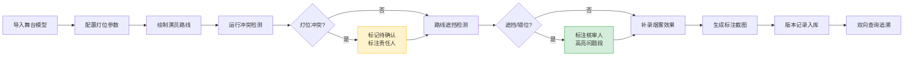

## 1. 产品概述

舞台灯光预演器是一款面向演出灯光师的专业工具，用于在舞台模型改动后快速验证灯光方案，检测灯位冲突、路线遮挡和段落错位问题。支持烟雾效果补录与版本追踪，便于会议沟通与教学演示。

- 核心价值：让灯光师从反复计算中解放，截图即可清晰说明问题所在
- 目标用户：演出灯光师、舞台设计师、戏剧教师
- 核心流程：舞台模型 → 灯位参数 → 演员路线 → 冲突检测 → 烟雾补录 → 结果追溯

## 2. 核心功能

### 2.1 用户角色

| 角色 | 注册方式 | 核心权限 |
|------|----------|----------|
| 灯光师 | 无需注册，本地工具 | 导入模型、配置灯位、运行检测、导出截图 |
| 教师 | 无需注册，本地工具 | 使用样例数据、演示检测流程 |

### 2.2 功能模块

1. **主场景页**：3D舞台视窗、灯光渲染、路线显示
2. **灯位管理页**：灯位参数配置、冲突检测结果列表
3. **路线管理页**：演员路线绘制、遮挡检测、段落错位分析
4. **版本追溯页**：修改历史记录、结论对比、双向查询

### 2.3 页面详情

| 页面名称 | 模块名称 | 功能描述 |
|----------|----------|----------|
| 主场景页 | 3D视窗 | 可旋转/缩放的舞台模型，聚光灯/面光灯真实渲染，演员路线动画播放 |
| 主场景页 | 标注系统 | 灯位编号标签、冲突区域虚线框、遮挡线段高亮、联动箭头指示 |
| 主场景页 | 截图工具 | 一键导出带标注的高清截图，自动附带检测结论水印 |
| 灯位管理页 | 参数面板 | 光束角、色温、亮度、照射目标、位置坐标完整配置 |
| 灯位管理页 | 冲突检测 | 光束重叠检测、灯位物理碰撞、照射盲区分析，结果走"待确认"分支 |
| 路线管理页 | 路线绘制 | 点击舞台添加路径点，设置段落时间、演员编号 |
| 路线管理页 | 遮挡分析 | 计算路线上灯光遮挡情况，标注"下一步找舞台监督核" |
| 版本追溯页 | 修改历史 | 记录每次模型/参数改动，用不同颜色标记被推翻的结论 |
| 版本追溯页 | 双向查询 | 从舞台模型节点查到最终结论，从结论反查关联灯位参数 |
| 全局 | 烟雾效果 | 后期补录烟雾浓度、分布区域，重新渲染灯光穿透力效果 |

## 3. 核心流程

## 4. 用户界面设计

### 4.1 设计风格
- **主色调**：深空灰 `#1a1a2e` 作为舞台暗房底色，琥珀橙 `#e94560` 标注冲突，青绿 `#0f3460` 标注待确认，米黄 `#f5d042` 标注路线
- **辅色**：白色标注线、半透明黑色信息面板
- **字体**：显示字体用 `Space Mono`（等宽技术感），正文字体用 `Inter`
- **布局**：三栏布局 — 左侧参数面板、中间3D视窗、右侧检测结果
- **交互**：点击3D对象显示详细参数，悬停显示临时标注

### 4.2 页面设计概述

| 页面名称 | 模块名称 | UI元素 |
|----------|----------|--------|
| 主场景页 | 3D视窗 | 深色舞台背景、地面网格、聚光灯锥体带编号标签、演员为胶囊体沿路线移动 |
| 主场景页 | 标注层 | 冲突区域红色虚线立方体、路线遮挡段黄色加粗、联动关系用白色带箭头虚线连接灯与演员 |
| 灯位管理页 | 列表 | 卡片式灯位列表，每张卡片显示灯位编号、类型、状态徽章（正常/待确认/冲突） |
| 版本追溯页 | 时间线 | 垂直时间线，每次改动用节点标记，节点颜色代表结论状态，点击展开改动对比 |

### 4.3 响应式
- 桌面端为主，三栏固定布局
- 平板端折叠为左右两栏，检测结果改为底部抽屉
- 移动端仅保留3D视窗，参数与结果通过浮动按钮调用

### 4.4 3D场景指引
- **环境**：纯黑背景 + 微弱环境光，模拟剧场暗房
- **灯光**：每盏灯独立计算，使用 `SpotLight` 带阴影，显示光锥线框
- **相机**：默认45度俯视，支持轨道控制器，保存多个预设视角（正面、侧视、顶视）
- **标注**：使用 `HTMLSprite` 将DOM标签悬浮在3D对象上方，始终面向相机
- **动画**：演员沿路线匀速移动，灯光随演员位置实时调整照射点
- **后处理**：轻微泛光效果模拟灯光溢出，可选烟雾体积光渲染
