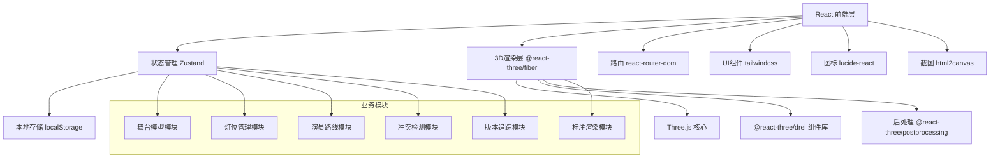

## 1. 架构设计



## 2. 技术描述

- **前端框架**：React@18 + TypeScript + Vite
- **3D引擎**：Three@0.160 + @react-three/fiber@8 + @react-three/drei@9
- **后处理**：@react-three/postprocessing@2
- **状态管理**：Zustand@4
- **路由**：react-router-dom@6
- **样式**：tailwindcss@3
- **图标**：lucide-react@0.312
- **截图**：html2canvas@1.4
- **本地存储**：localStorage（版本历史存储）
- **后端**：无，纯前端应用，数据全部本地存储

## 3. 路由定义

| 路由 | 页面 | 用途 |
|------|------|------|
| `/` | 主场景页 | 3D舞台视窗、灯光渲染、标注显示、动画播放 |
| `/lights` | 灯位管理页 | 灯位列表、参数配置、冲突检测结果 |
| `/routes` | 路线管理页 | 演员路线绘制、遮挡分析、段落错位 |
| `/history` | 版本追溯页 | 修改历史、双向查询、结论对比 |

## 4. 数据模型

### 4.1 核心数据结构

```typescript
// 舞台模型
interface StageModel {
  id: string;
  name: string;
  width: number;
  depth: number;
  height: number;
  obstacles: Obstacle[];  // 舞台布景/遮挡物
  createdAt: number;
}

interface Obstacle {
  id: string;
  name: string;
  position: [number, number, number];
  size: [number, number, number];
  type: 'wall' | 'prop' | 'scenery';
}

// 灯位参数
interface Light {
  id: string;
  name: string;
  type: 'spot' | 'fresnel' | 'par' | 'led';
  position: [number, number, number];
  target: [number, number, number];
  angle: number;      // 光束角（度）
  intensity: number;  // 亮度 0-2
  color: string;      // 色温/颜色
  penumbra: number;   // 边缘柔和度 0-1
  status: 'normal' | 'pending' | 'conflict';
}

// 演员路线
interface ActorRoute {
  id: string;
  actorName: string;
  color: string;
  points: RoutePoint[];
  duration: number;   // 总时长（秒）
}

interface RoutePoint {
  id: string;
  position: [number, number, number];
  time: number;       // 到达时间点
  paragraph?: string; // 所属段落
}

// 检测结果
interface DetectionResult {
  id: string;
  type: 'light_conflict' | 'route_occlusion' | 'paragraph_mismatch';
  severity: 'warning' | 'error';
  status: 'pending' | 'confirmed' | 'resolved';
  description: string;
  assignee?: string;  // 下一步核审人
  relatedLightIds?: string[];
  relatedRouteIds?: string[];
  position?: [number, number, number];
  createdAt: number;
}

// 版本记录
interface VersionRecord {
  id: string;
  timestamp: number;
  description: string;
  modifiedFields: string[];
  previousState: Snapshot;
  currentState: Snapshot;
  conclusionsOverturned: string[];  // 被推翻的结论ID
}

interface Snapshot {
  stage: StageModel;
  lights: Light[];
  routes: ActorRoute[];
  results: DetectionResult[];
}

// 烟雾效果配置
interface SmokeConfig {
  enabled: boolean;
  density: number;     // 0-1
  color: string;
  height: number;      // 烟雾层高度
}
```

### 4.2 状态管理结构

```typescript
interface AppState {
  // 数据
  stage: StageModel;
  lights: Light[];
  routes: ActorRoute[];
  results: DetectionResult[];
  versions: VersionRecord[];
  smoke: SmokeConfig;
  
  // UI状态
  selectedLightId: string | null;
  selectedRouteId: string | null;
  selectedResultId: string | null;
  isPlaying: boolean;
  currentTime: number;
  showLabels: boolean;
  showLightCones: boolean;
  viewMode: 'perspective' | 'front' | 'side' | 'top';
  
  // 操作
  setSelectedLight: (id: string | null) => void;
  updateLight: (id: string, updates: Partial<Light>) => void;
  addLight: (light: Light) => void;
  deleteLight: (id: string) => void;
  runConflictDetection: () => DetectionResult[];
  runOcclusionDetection: () => DetectionResult[];
  saveVersion: (description: string) => void;
  exportScreenshot: () => void;
  queryByModelNode: (nodeId: string) => DetectionResult[];
  queryByResult: (resultId: string) => Light[];
}
```

## 5. 核心算法

### 5.1 灯位冲突检测
1. **光束重叠检测**：计算两束光锥体的空间交集，重叠体积 > 阈值则标记冲突
2. **物理碰撞检测**：灯具位置与舞台结构/其他灯具的AABB碰撞
3. **照射盲区分析**：对演员路线采样点计算光照覆盖率，< 70% 标记盲区

### 5.2 路线遮挡检测
1. 沿路线等距采样 N 个点
2. 对每个采样点，射线检测从灯具到采样点是否被障碍物遮挡
3. 遮挡比例 > 30% 的线段高亮显示

### 5.3 双向查询
- **正向查询**：模型节点ID → 关联的灯位 → 影响的检测结论
- **反向查询**：结论ID → 关联的灯位参数 → 关联的舞台模型节点

## 6. 项目结构

```
src/
├── components/
│   ├── stage/          # 3D舞台组件
│   │   ├── Stage3D.tsx
│   │   ├── StageLight.tsx
│   │   ├── LightCone.tsx
│   │   ├── ActorRoute.tsx
│   │   ├── Obstacle.tsx
│   │   └── AnnotationLabel.tsx
│   ├── panels/         # 侧边面板
│   │   ├── LightPanel.tsx
│   │   ├── RoutePanel.tsx
│   │   ├── ResultPanel.tsx
│   │   └── Toolbar.tsx
│   ├── common/         # 通用组件
│   │   ├── StatusBadge.tsx
│   │   ├── NumberInput.tsx
│   │   └── ColorPicker.tsx
│   └── layout/
│       └── AppLayout.tsx
├── pages/
│   ├── StagePage.tsx
│   ├── LightsPage.tsx
│   ├── RoutesPage.tsx
│   └── HistoryPage.tsx
├── store/
│   └── useStageStore.ts
├── utils/
│   ├── collision.ts    # 冲突检测算法
│   ├── occlusion.ts    # 遮挡检测算法
│   ├── query.ts        # 双向查询
│   ├── snapshot.ts     # 版本快照
│   └── math.ts         # 数学工具
├── types/
│   └── index.ts        # 类型定义
├── data/
│   └── samples.ts      # 样例数据
├── App.tsx
├── main.tsx
└── index.css
```
