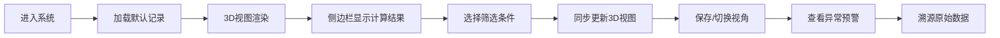

## 1. 产品概述
船舶稳性装载模型Web3D可视化系统，为航运安全员提供3D装载视图和稳性计算分析。
- 解决重心偏移、压载缺失等异常情况难以直观判断的问题
- 目标用户：航运安全员、船舶操作员、稳性工程师

## 2. 核心功能

### 2.1 用户角色
| 角色 | 注册方式 | 核心权限 |
|------|----------|----------|
| 航运安全员 | 无需注册 | 查看3D模型、筛选记录、保存视角、查看明细 |

### 2.2 功能模块
1. **主视图页面**: 3D船舶装载模型、旋转交互、视角控制、筛选功能
2. **侧边栏面板**: 重心计算、倾角提示、记录明细、数据溯源

### 2.3 页面详情
| 页面名称 | 模块名称 | 功能描述 |
|----------|----------|----------|
| 主视图页面 | 3D场景 | Three.js渲染船舶、货物、压载水模型，支持旋转缩放 |
| 主视图页面 | 视角控制 | 保存/恢复当前视角、重置视角、自动旋转 |
| 主视图页面 | 筛选器 | 按记录ID、状态筛选，与侧边栏同步 |
| 侧边栏面板 | 重心计算 | 显示重心坐标、偏移量、稳性计算结果 |
| 侧边栏面板 | 倾角提示 | 显示横倾角、纵倾角、危险预警 |
| 侧边栏面板 | 记录明细 | 列出所有装载记录，点击切换3D视图 |
| 侧边栏面板 | 数据溯源 | 每条判断关联原始数据来源（船舶模型、压载水、稳性报告） |

## 3. 核心流程
用户进入系统后，默认显示正常装载记录的3D视图。可通过侧边栏选择不同记录（正常/压载缺失），3D视图同步更新。可旋转查看船舶装载情况，保存常用视角。当存在异常时，倾角提示区域高亮预警。

## 4. 用户界面设计

### 4.1 设计风格
- 主色调：深海蓝 (#0A2463)，科技感专业风格
- 辅助色：预警橙 (#E63946)、成功绿 (#2ECC71)、信息蓝 (#3E92CC)
- 按钮风格：圆角矩形，微阴影，悬停动效
- 字体：JetBrains Mono（等宽数据显示）+ Noto Sans SC（中文）
- 布局：左右分栏，左侧3D主视图（70%），右侧侧边栏（30%）
- 图标：线性简洁图标，数据看板风格

### 4.2 页面设计概览
| 页面名称 | 模块名称 | UI元素 |
|----------|----------|--------|
| 主视图 | 3D场景 | 深色背景、环境光、线框辅助网格、船舶金属质感 |
| 主视图 | 工具栏 | 悬浮式圆角按钮组、视角选择下拉、状态指示灯 |
| 侧边栏 | 数据面板 | 卡片式布局、数据高亮、进度条显示偏移量 |
| 侧边栏 | 记录列表 | 斑马纹表格、状态标签、选中高亮 |
| 侧边栏 | 溯源面板 | 折叠式展开、来源链接、原始数据预览 |

### 4.3 响应式
桌面端优先，大屏适配（1920×1080+），侧边栏可折叠。

### 4.4 3D场景指导
- 环境：深蓝色渐变背景，模拟深海环境
- 光照：主方向光 + 环境光 + 边缘光，突出船舶轮廓
- 相机：PerspectiveCamera，初始距离20，仰角30度
- 交互：OrbitControls，阻尼效果，限制最大俯仰视角度
- 材质：船体使用金属材质(MeshStandardMaterial)，货物使用半透明区分类型
- 动画：记录切换时平滑过渡，异常部分闪烁提示
