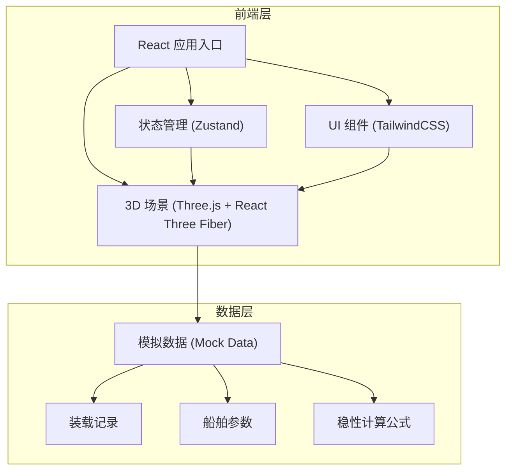
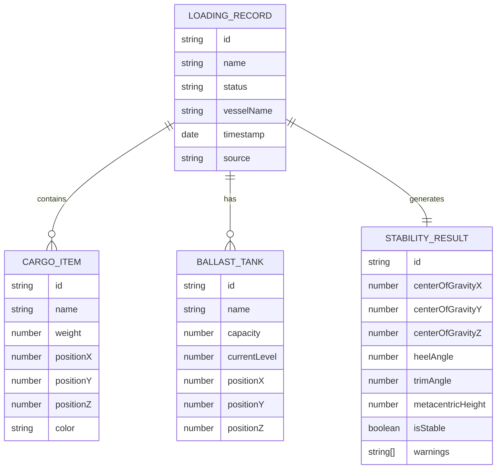

## 1. 架构设计



## 2. 技术描述
- 前端：React@18 + TypeScript + TailwindCSS@3 + Vite
- 3D引擎：Three.js + @react-three/fiber + @react-three/drei
- 状态管理：Zustand（轻量级，跨组件同步筛选状态）
- 图标：Lucide React
- 后端：无，使用Mock数据
- 数据库：无，数据内置在前端

## 3. 路由定义
| 路由 | 目的 |
|------|------|
| / | 主页面（3D视图 + 侧边栏） |

## 4. 数据模型

### 4.1 数据模型定义



### 4.2 核心数据结构（TypeScript）

```typescript
// 装载记录
interface LoadingRecord {
  id: string;
  name: string;
  status: 'normal' | 'warning' | 'danger';
  vesselName: string;
  timestamp: Date;
  source: {
    vesselModel: string;
    ballastReport: string;
    stabilityReport: string;
  };
  cargo: CargoItem[];
  ballast: BallastTank[];
  stability: StabilityResult;
}

// 货物项
interface CargoItem {
  id: string;
  name: string;
  weight: number;
  position: { x: number; y: number; z: number };
  dimensions: { width: number; height: number; depth: number };
  color: string;
}

// 压载水舱
interface BallastTank {
  id: string;
  name: string;
  capacity: number;
  currentLevel: number;
  position: { x: number; y: number; z: number };
  dimensions: { width: number; height: number; depth: number };
}

// 稳性计算结果
interface StabilityResult {
  centerOfGravity: { x: number; y: number; z: number };
  heelAngle: number;
  trimAngle: number;
  metacentricHeight: number;
  isStable: boolean;
  warnings: string[];
}

// 视角状态
interface ViewState {
  id: string;
  name: string;
  cameraPosition: { x: number; y: number; z: number };
  target: { x: number; y: number; z: number };
}
```

## 5. 核心组件结构

```
src/
├── components/
│   ├── Viewport3D/
│   │   ├── index.tsx          # 3D视口主组件
│   │   ├── Ship.tsx           # 船舶模型
│   │   ├── Cargo.tsx          # 货物渲染
│   │   ├── Ballast.tsx        # 压载水渲染
│   │   └── SceneControls.tsx  # 场景控制
│   ├── Sidebar/
│   │   ├── index.tsx          # 侧边栏主组件
│   │   ├── StabilityPanel.tsx # 稳性计算面板
│   │   ├── RecordList.tsx     # 记录列表
│   │   └── SourcePanel.tsx    # 数据溯源面板
│   └── Toolbar/
│       ├── index.tsx          # 工具栏
│       ├── ViewSelector.tsx   # 视角选择器
│       └── Filter.tsx         # 筛选器
├── store/
│   └── useAppStore.ts         # 全局状态管理
├── data/
│   └── mockRecords.ts         # 模拟数据
├── utils/
│   └── stability.ts           # 稳性计算工具
└── App.tsx
```

## 6. 状态同步机制

使用 Zustand 全局状态管理：
- `selectedRecordId`: 当前选中的记录ID（3D视图和侧边栏同步）
- `filterStatus`: 筛选状态（正常/警告/危险）
- `savedViews`: 保存的视角列表
- 当筛选条件改变时，3D视图和记录列表同时更新
