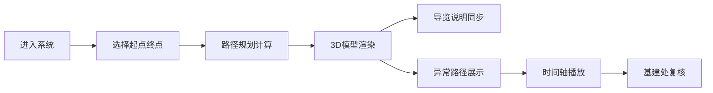

## 1. 产品概述
校园地下空间导览系统，解决高校地下连廊、管井和设备房改造后人员迷路问题，实现3D模型与导览说明、路径规划的联动展示。

- 核心目标：让新生、维修队准确导航，基建处高效复核
- 核心价值：减少迷路成本，提升运维效率

## 2. 核心功能

### 2.1 用户角色
| 角色 | 注册方式 | 核心权限 |
|------|----------|----------|
| 普通用户 | 无需注册 | 查看导览、路径规划 |
| 基建管理员 | 账号登录 | 数据管理、异常复核 |
| 维修人员 | 账号登录 | 工单查看、路径导航 |

### 2.2 功能模块
1. **3D模型展示**：地下空间3D可视化，支持拖动旋转缩放
2. **导览说明**：实时联动展示
3. **路径规划**：起点终点规划，实时路径显示
4. **数据管理**：导入楼宇数据，异常数据清洗
5. **异常筛选**：门禁失效、通道封闭、楼层错配筛选
6. **时间轴播放**：按时间轴展示历史变化
7. **工单定位**：维修工单位置标记

### 2.3 页面详情
| 页面名称 | 模块名称 | 功能描述 |
|-----------|----------|--------------|
| 主页面 | 3D视窗 | 拖动旋转缩放，实时渲染地下空间模型 |
| 主页面 | 控制面板 | 参数切换、筛选条件设置 |
| 主页面 | 导览面板 | 3D导览说明，与模型联动 |
| 主页面 | 路径面板 | 路径规划结果，步骤说明 |
| 主页面 | 异常面板 | 坏行数据单独展示门禁失效、通道封闭等 |
| 主页面 | 时间轴 | 播放控制，时间点切换 |
| 数据管理 | 数据导入 | 支持Excel/CSV导入 |
| 数据管理 | 数据清洗 | 空行、备注、缺列处理 |

## 3. 核心流程

用户进入系统 → 选择起点终点 → 系统计算最优路径 → 3D模型实时渲染路径 → 导览说明同步更新 → 查看异常路径筛选 → 时间轴播放历史变化

## 4. 用户界面设计

### 4.1 设计风格
- 主色调：深蓝色系，代表专业、可靠
- 辅助色：橙色强调关键信息，红色警示异常
- 按钮风格：扁平化设计，圆角设计
- 字体：思源黑体，清晰易读
- 布局风格：左侧控制面板，中央3D视窗，右侧信息面板
- 图标风格：线性图标，简洁现代

### 4.2 页面设计概览
| 页面名称 | 模块名称 | UI元素 |
|-----------|----------|----------|
| 主页面 | 3D视窗 | 全屏渲染，鼠标交互，路径高亮 |
| 主页面 | 控制面板 | 卡片式布局，筛选控件，参数滑块 |
| 主页面 | 信息面板 | 分栏展示，联动更新，异常标红 |

### 4.3 响应式
桌面端为主，支持平板适配，触控优化

### 4.4 3D场景指引
- 环境：中性灰色调，专业感
- 光照：柔和环境光 + 方向光，突出结构
- 相机：轨道控制器，自由视角
- 交互：鼠标拖动旋转，滚轮缩放
- 动画：路径高亮动画，平滑过渡
