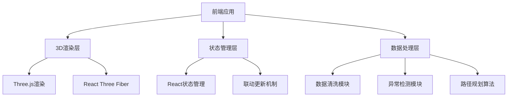
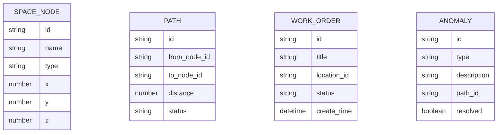

## 1. 架构设计



## 2. 技术描述

- 前端: React@18 + TypeScript + Vite
- 3D渲染: Three.js + @react-three/fiber + @react-three/drei
- 样式: TailwindCSS@3
- 状态管理: React Context + useReducer
- 数据处理: 本地Mock数据 + PapaParse (CSV解析
- 路径规划: A*寻路算法

## 3. 路由定义

| 路由 | 用途 |
|-------|------|
| / | 主页面 - 3D导览主界面 |
| /admin | 数据管理页面 |

## 4. 数据模型

### 4.1 数据模型定义



### 4.2 数据结构定义

```typescript
interface SpaceNode {
  id: string;
  name: string;
  type: 'corridor' | 'room' | 'equipment' | 'pipe_well';
  x: number;
  y: number;
  z: number;
  floor: number;
  description?: string;
}

interface Path {
  id: string;
  from: string;
  to: string;
  distance: number;
  status: 'open' | 'closed' | 'access_issue';
  access_control?: boolean;
}

interface WorkOrder {
  id: string;
  title: string;
  locationId: string;
  status: 'pending' | 'in_progress' | 'completed';
  createTime: Date;
}

interface Anomaly {
  id: string;
  type: 'access_failed' | 'path_closed' | 'floor_mismatch' | 'bad_row';
  description: string;
  pathId?: string;
  resolved: boolean;
}
```
