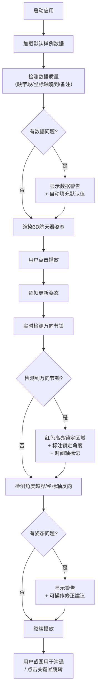

## 1. 产品概述

航天器姿态可视化教学工具，专为航天科普老师设计，解决课堂演示中"数据不完美"导致的姿态显示前后不一致问题。核心价值是：让万向节锁等关键概念看得见、说得清、可操作修正。

- 目标用户：航天科普老师、航天爱好者学生
- 解决问题：脏数据（缺字段、坐标轴晚到）、万向节锁模糊、截图沟通不便
- 核心价值：清晰标注 + 容错处理 + 可操作修正建议

## 2. 核心功能

### 2.1 用户角色

| 角色 | 注册方式 | 核心权限 |
|------|----------|----------|
| 科普老师 | 无需注册，本地运行 | 加载数据、播放动画、截图演示、导出修正建议 |
| 学生 | 无需注册，本地运行 | 查看演示、理解万向节锁概念 |

### 2.2 功能模块

1. **主可视化页面**：3D航天器姿态展示、万向节锁实时检测标注
2. **数据控制面板**：加载样例数据、手动调整姿态参数、数据质量警告
3. **时间轴播放控制**：逐帧播放、速度调节、时间戳标注、关键帧标记
4. **问题诊断面板**：万向节锁位置标记、角度越界警告、坐标轴反向检测、修正建议
5. **标注系统**：坐标轴标签、姿态角度数值、万向节锁区域高亮、文字注释

### 2.3 页面详情

| 页面名称 | 模块名称 | 功能描述 |
|----------|----------|----------|
| 主可视化页面 | 3D场景渲染 | Three.js渲染航天器模型，显示三个万向节轴，实时姿态更新 |
| 主可视化页面 | 万向节锁检测 | 实时检测万向节锁状态，红色高亮锁定区域，显示锁定角度值 |
| 主可视化页面 | 标注系统 | 每个坐标轴旁显示角度数值，时间戳显示在右下角，关键帧标记 |
| 数据控制面板 | 数据加载 | 选择样例数据文件，支持JSON格式，显示数据质量警告（缺字段、晚到） |
| 数据控制面板 | 手动控制 | 滑动条调整俯仰/偏航/滚转角，实时更新3D姿态 |
| 数据控制面板 | 备注显示 | 显示航天器模型中的备注信息，不影响渲染 |
| 时间轴播放控制 | 播放控制 | 播放/暂停/上一帧/下一帧，速度调节（0.25x~4x） |
| 时间轴播放控制 | 关键帧标记 | 万向节锁发生时刻用红色标记在时间轴上，可点击跳转 |
| 问题诊断面板 | 错误检测 | 角度越界（>360°或<-360°）红色警告，坐标轴反向黄色警告 |
| 问题诊断面板 | 修正建议 | 针对每个问题提供可操作的修正步骤，可复制 |
| 问题诊断面板 | 截图友好 | 所有标注清晰可见，不依赖颜色区分，有文字说明 |

## 3. 核心流程

## 4. 用户界面设计

### 4.1 设计风格

**航天科技硬核风格** - 符合航天科普场景

- **主色调**：深空蓝 (#0a1628) 作为背景，配合冷白色 (#e8f4ff) 文字
- **强调色**：
  - 万向节锁警告：警示红 (#ff4d4f)
  - 角度越界警告：琥珀橙 (#faad14)
  - 坐标轴反向警告：明黄 (#fadb14)
  - 正常状态：航天蓝 (#1890ff)
  - 修正建议：成功绿 (#52c41a)
- **按钮风格**：圆角2px，细边框，悬停时有轻微发光效果，科技感
- **字体**：
  - 标题：Orbitron（航天科技感等宽字体）
  - 正文：JetBrains Mono（等宽字体，便于数值对齐阅读）
  - 数值显示：Roboto Mono（清晰的数字显示）
- **布局风格**：
  - 左侧：3D场景（占70%宽度）
  - 右侧：控制面板堆叠（数据控制 + 播放控制 + 诊断面板）
  - 底部：时间轴（全屏宽度）
- **图标风格**：简洁线性图标，不使用emoji，保持专业感

### 4.2 页面设计概览

| 页面名称 | 模块名称 | UI元素 |
|----------|----------|--------|
| 主可视化页面 | 3D场景 | 深空背景 + 星空粒子效果 + 航天器模型 + 三个彩色万向节轴（红X、绿Y、蓝Z） + 角度数值标签 |
| 主可视化页面 | 万向节锁标注 | 红色半透明球包裹锁定区域 + 虚线连接到文字说明框 + 锁定角度数值 |
| 数据控制面板 | 数据加载 | 文件选择按钮 + 数据质量指示灯（绿/黄/红） + 警告列表 |
| 数据控制面板 | 姿态滑块 | 三个滑块（俯仰/偏航/滚转）+ 数值输入框 + 单位（°） |
| 时间轴播放控制 | 播放按钮 | 简洁图标按钮 + 速度选择下拉框 |
| 时间轴播放控制 | 时间轴 | 灰色轨道 + 白色进度条 + 红色关键帧标记点 + 时间戳刻度 |
| 问题诊断面板 | 警告列表 | 卡片式设计，每个问题一个卡片，带图标 + 问题描述 + 修正步骤按钮 |
| 问题诊断面板 | 修正建议 | 展开式面板，步骤编号 + 具体操作 + 复制按钮 |

### 4.3 响应式

- Desktop-first设计，主要在桌面端使用（课堂演示）
- 最小支持宽度：1280px
- 右侧面板可折叠，便于全屏展示3D场景
- 所有文字标注不小于14px，确保投影清晰可见

### 4.4 3D场景指南

- **环境/氛围**：深空背景，带稀疏星点，无HDRI，保持简洁不喧宾夺主
- **光照设置**：
  - 主光源：方向光，冷白色，从右上方照射
  - 补光：环境光，低强度，确保暗部可见
  - 坐标轴发光材质，自发光，确保在任何角度都清晰可见
- **相机设置**：
  - 透视相机，初始距离能完整看到航天器和三个坐标轴
  - 支持轨道控制：旋转、缩放、平移
  - 双击重置视角
- **构图和焦点元素**：
  - 航天器位于画面中心
  - 三个万向节轴从航天器中心向外延伸，长度适中
  - 角度标签位于轴末端，始终面向相机
- **交互和动画**：
  - 姿态变化平滑过渡，无跳变
  - 万向节锁发生时，锁定轴闪烁3次，然后持续高亮
  - 鼠标悬停在航天器上显示当前姿态参数
- **后期处理效果**：
  - 轻微 bloom 效果，使坐标轴发光更明显
  - 无其他花哨效果，保持专业感
- **资源来源和性能预算**：
  - 航天器模型：使用Three.js基础几何体组合（无需外部模型）
  - 目标帧率：60fps
  - 单帧渲染时间 < 16ms
