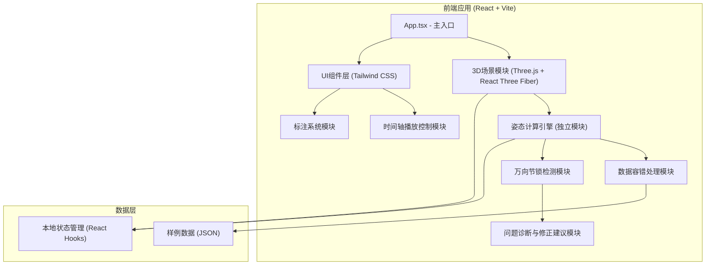
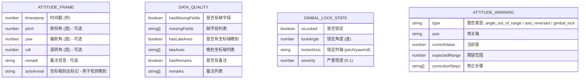

## 1. 架构设计



## 2. 技术描述

- **前端框架**: React@18 + TypeScript + Vite
- **3D渲染**: three@0.160 + @react-three/fiber@8.15 + @react-three/drei@9.92 + @react-three/postprocessing@2.15
- **样式**: tailwindcss@3.4
- **状态管理**: React Hooks (useState, useReducer, useRef)，无需额外状态管理库
- **数据格式**: JSON，本地文件加载，无需后端
- **构建工具**: Vite@5.0
- **初始化方式**: `npm create vite@latest . -- --template react-ts`

## 3. 目录结构

```
.
├── src/
│   ├── components/
│   │   ├── Scene3D/              # 3D场景组件
│   │   │   ├── index.tsx         # 主场景组件
│   │   │   ├── Spacecraft.tsx    # 航天器模型
│   │   │   ├── GimbalAxes.tsx    # 万向节轴组件
│   │   │   ├── GimbalLockMarker.tsx # 万向节锁标记
│   │   │   └── Starfield.tsx     # 星空背景
│   │   ├── ControlPanel/         # 控制面板
│   │   │   ├── index.tsx
│   │   │   ├── DataLoader.tsx    # 数据加载器
│   │   │   ├── AttitudeSliders.tsx # 姿态滑块
│   │   │   └── DataQualityIndicator.tsx # 数据质量指示器
│   │   ├── Timeline/             # 时间轴组件
│   │   │   ├── index.tsx
│   │   │   ├── PlaybackControls.tsx
│   │   │   └── KeyframeMarkers.tsx
│   │   ├── DiagnosticPanel/      # 诊断面板
│   │   │   ├── index.tsx
│   │   │   ├── WarningCard.tsx
│   │   │   └── CorrectionSuggestion.tsx
│   │   └── Annotations/          # 标注系统
│   │       ├── AngleLabel.tsx
│   │       ├── Timestamp.tsx
│   │       └── AnnotationText.tsx
│   ├── engine/                   # 核心计算引擎
│   │   ├── attitudeCalculator.ts # 姿态计算（欧拉角→四元数→旋转矩阵）
│   │   ├── gimbalLockDetector.ts # 万向节锁检测算法
│   │   ├── dataValidator.ts      # 数据验证与容错
│   │   └── correctionEngine.ts   # 修正建议生成
│   ├── types/                    # TypeScript类型定义
│   │   └── index.ts
│   ├── data/                     # 样例数据
│   │   ├── sample-normal.json    # 正常姿态数据
│   │   ├── sample-gimbal-lock.json # 含万向节锁的数据
│   │   ├── sample-dirty.json     # 脏数据（缺字段、晚到）
│   │   └── sample-axis-reverse.json # 坐标轴反向数据
│   ├── hooks/                    # 自定义Hooks
│   │   ├── useAttitudeControl.ts
│   │   ├── usePlaybackControl.ts
│   │   └── useDataLoader.ts
│   ├── utils/                    # 工具函数
│   │   ├── math.ts               # 数学工具（角度转换、归一化）
│   │   └── constants.ts          # 常量定义
│   ├── App.tsx
│   ├── main.tsx
│   └── index.css
├── public/
├── package.json
├── tsconfig.json
├── vite.config.ts
├── tailwind.config.js
└── README.md                     # 使用说明文档
```

## 4. 路由定义

| 路由 | 用途 |
|------|------|
| / | 主页面，包含3D场景、控制面板、时间轴、诊断面板 |

本应用为单页应用，无需多路由。

## 5. 数据模型

### 5.1 数据模型定义



### 5.2 TypeScript 类型定义

```typescript
// src/types/index.ts

export interface AttitudeFrame {
  timestamp: number;
  pitch?: number;
  yaw?: number;
  roll?: number;
  remark?: string;
  axisArrival?: {
    pitch?: boolean;
    yaw?: boolean;
    roll?: boolean;
  };
}

export interface DataQuality {
  hasMissingFields: boolean;
  missingFields: Array<'pitch' | 'yaw' | 'roll'>;
  hasLateAxes: boolean;
  lateAxes: Array<'pitch' | 'yaw' | 'roll'>;
  hasRemarks: boolean;
  remarks: string[];
}

export interface GimbalLockState {
  isLocked: boolean;
  lockAngle: number;
  lockedAxis: 'pitch' | 'yaw' | 'roll';
  severity: number;
}

export type WarningType = 'angle_out_of_range' | 'axis_reversed' | 'gimbal_lock' | 'missing_data';

export interface AttitudeWarning {
  id: string;
  type: WarningType;
  axis?: 'pitch' | 'yaw' | 'roll';
  currentValue?: number;
  expectedRange?: [number, number];
  message: string;
  correctionSteps: string[];
}

export interface PlaybackState {
  isPlaying: boolean;
  currentFrame: number;
  totalFrames: number;
  speed: number;
  currentTime: number;
}

export interface SpacecraftModel {
  name: string;
  dimensions: {
    length: number;
    width: number;
    height: number;
  };
  remark?: string;
}
```

## 6. 核心算法说明

### 6.1 万向节锁检测算法

万向节锁发生在欧拉角表示中，当中间轴（通常是俯仰角pitch）接近±90°时，第一轴和第三轴的旋转会重合，导致失去一个自由度。

检测逻辑（在 `src/engine/gimbalLockDetector.ts` 中实现）：

```
输入：pitch角度（度）
阈值：85° ~ 95° 和 -95° ~ -85° 为警戒区域
输出：GimbalLockState

1. 取pitch的绝对值
2. 如果 |pitch| > 85° 且 |pitch| < 95°：
   - isLocked = true
   - severity = (|pitch| - 85) / 10 （0~1）
   - lockedAxis = 'pitch'
   - lockAngle = pitch
3. 否则：
   - isLocked = false
   - severity = 0
```

### 6.2 数据容错处理

在 `src/engine/dataValidator.ts` 中实现：

1. **缺字段处理**：使用前一帧数据或默认值（0）填充，标记警告
2. **坐标轴晚到处理**：标记延迟，使用预测值填充，待数据到达后修正
3. **备注处理**：提取备注显示，不影响姿态计算

### 6.3 修正建议生成

在 `src/engine/correctionEngine.ts` 中实现：

| 问题类型 | 修正步骤 |
|----------|----------|
| 万向节锁 | 1. 将俯仰角从锁定区域（±85°~±95°）移出<br>2. 考虑使用四元数代替欧拉角表示<br>3. 重新计算轨迹避免穿过奇异点 |
| 角度越界 | 1. 使用 `angle % 360` 归一化到 [-180°, 180°]<br>2. 检查数据采集设备的量程设置<br>3. 对连续帧进行平滑处理 |
| 坐标轴反向 | 1. 对该轴角度取负值<br>2. 检查传感器安装方向<br>3. 在校准矩阵中添加符号修正 |
| 数据缺失 | 1. 使用线性插值填充缺失帧<br>2. 检查数据传输链路<br>3. 增加数据采样频率 |
