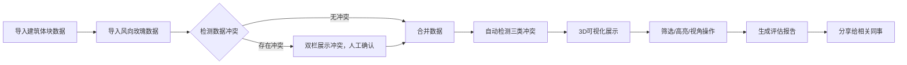
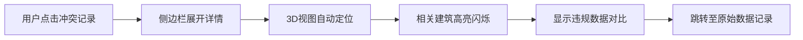

## 1. 产品概述

城市风廊建筑评估系统是面向规划设计院的专业Web3D评估工具，解决城市风廊规划中建筑体块重叠、风向缺口、退界线违规等人工检查效率低、易遗漏的问题。系统通过Three.js三维可视化技术，将建筑体块、风廊路径、风向数据融合呈现，支持冲突自动检测、方案对比、视角保存和报告导出，大幅提升风廊评估的准确性和协作效率。

- 核心问题：体块重叠遗漏导致返工、风向缺口难以定位、多源数据合并冲突不透明
- 目标用户：规划师、建筑设计师、风环境工程师、项目管理人员
- 核心价值：将不可见的风环境问题可视化、可量化、可追溯

---

## 2. 核心功能

### 2.1 用户角色

| 角色 | 注册方式 | 核心权限 |
|------|----------|----------|
| 规划师 | 院内账号登录 | 导入建筑体块数据、执行风廊评估、保存视角、导出报告 |
| 风环境工程师 | 院内账号登录 | 导入风向玫瑰数据、配置风廊规则、审核评估结果 |
| 项目管理员 | 院内账号登录 | 方案对比管理、报告分发、权限配置 |

### 2.2 功能模块

1. **3D主视图模块**：建筑体块三维展示、风廊路径高亮、视角控制（旋转/缩放/平移）、视角保存与恢复、筛选联动
2. **侧边栏模块**：明细记录列表、风廊高亮切换、方案对比面板、冲突详情定位
3. **数据合并模块**：建筑体块与风向玫瑰数据导入、冲突检测与展示、人工确认机制
4. **冲突检测模块**：体块重叠检测、风向缺口检测、退界线违规检测、问题溯源定位
5. **报告导出模块**：风廊评估报告生成、一键分享、报告口径说明

### 2.3 页面详情

| 页面名称 | 模块名称 | 功能描述 |
|----------|----------|----------|
| 主评估页面 | 3D主视图 | Three.js渲染建筑体块，支持OrbitControls旋转缩放，点击建筑体块显示详情，视角可保存为书签 |
| 主评估页面 | 筛选工具栏 | 按建筑高度、建设状态、所属地块筛选，筛选结果3D视图与侧边栏同步 |
| 主评估页面 | 左侧边栏-风廊高亮 | 风廊路径列表，点击切换高亮显示，可调整透明度和颜色 |
| 主评估页面 | 左侧边栏-方案对比 | 多方案切换对比，支持差异高亮显示 |
| 主评估页面 | 右侧边栏-明细记录 | 建筑体块/风廊节点明细表格，点击定位到3D视图对应位置 |
| 主评估页面 | 右侧边栏-冲突面板 | 冲突分类展示（重叠/缺口/退界），点击跳转到具体记录和3D位置 |
| 数据导入弹窗 | 合并冲突展示 | 双栏对比建筑体块与风向玫瑰数据冲突，标注冲突类型，需人工确认后合并 |
| 报告预览弹窗 | 报告导出 | 自动生成含风廊高亮口径说明的评估报告，支持PDF导出和链接分享 |

---

## 3. 核心流程

### 3.1 风廊评估主流程

### 3.2 冲突定位流程

---

## 4. 用户界面设计

### 4.1 设计风格

- **设计基调**：专业严谨的科技工业风，深色主题适配长时间3D操作，减少视觉疲劳
- **主色调**：深空蓝 `#0a1628` 背景，科技青 `#00d4ff` 作为主交互色
- **强调色**：警告橙 `#ff8a3d`（轻度冲突）、危险红 `#ff4757`（严重冲突）、通过绿 `#2ed573`（合规）
- **字体**：标题使用 `JetBrains Mono` 等宽字体彰显专业感，正文使用 `Inter` 确保可读性
- **按钮风格**：扁平化直角按钮，悬停时有发光边框效果，点击有微缩反馈
- **布局风格**：三栏式专业布局，顶部工具栏 + 左侧功能面板 + 中央3D视图 + 右侧数据面板
- **图标风格**：线性图标，统一2px描边，与整体工业风一致

### 4.2 页面设计概述

| 页面名称 | 模块名称 | UI元素 |
|----------|----------|----------|
| 主评估页面 | 顶部工具栏 | 导入按钮、保存视角下拉、方案切换、筛选条件、报告导出按钮，渐变分隔线 |
| 主评估页面 | 左侧边栏 | 可折叠面板，风廊高亮列表带颜色标签，方案对比采用Tab切换，悬停时微动画 |
| 主评估页面 | 中央3D视图 | 全屏深色画布，底部显示视角控制提示，右下角显示指南针和比例尺 |
| 主评估页面 | 右侧边栏 | 明细表格斑马纹，冲突记录按严重程度彩色标注，点击行高亮联动3D |
| 冲突弹窗 | 冲突详情 | 左右对比布局，左侧原始数据，右侧违规参数，底部操作按钮 |
| 报告弹窗 | 报告预览 | 类PDF排版，包含风廊高亮口径说明章节，可滚动预览 |

### 4.3 3D场景指引

- **环境与氛围**：程序化天空盒，渐变从地平线深靛蓝到天顶藏蓝，配合雾化效果营造空间纵深感
- **光照设置**：HemisphereLight模拟环境光（天空色`#87ceeb`，地面色`#2d3748`），DirectionalLight模拟太阳光（角度45°，强度1.2，开启阴影）
- **相机设置**：PerspectiveCamera，初始位置(80, 60, 80)，fov=50，开启Damping惯性阻尼，最小距离20，最大距离300
- **构图与焦点元素**：建筑体块为主体，风廊路径采用半透明发光管道，地面网格线辅助空间定位
- **交互与动画**：建筑选中时边缘高亮描边 + 轻微上浮动画，冲突建筑脉冲闪烁，风廊高亮时有呼吸灯效果
- **后处理效果**：Bloom泛光（风廊和冲突高亮）、FXAA抗锯齿、轻微Vignette暗角增强沉浸感
- **性能预算**：建筑体块使用InstancedMesh批量渲染，单体不超过1000个三角面，总面数控制在50万以内

### 4.4 响应式

- 桌面端（≥1440px）：完整三栏布局，侧边栏宽度各280px，3D视图自适应
- 平板端（768px-1439px）：侧边栏可收起为图标栏，3D视图为主区域
- 移动端（<768px）：单栏布局，底部Tab切换3D视图与数据面板，触控优化手势操作
