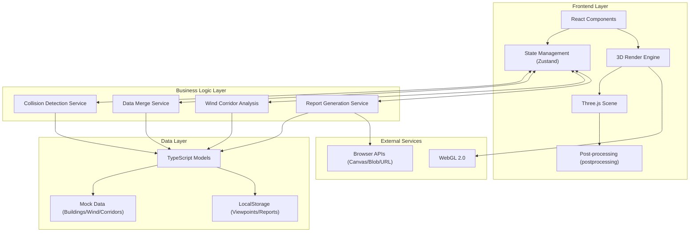
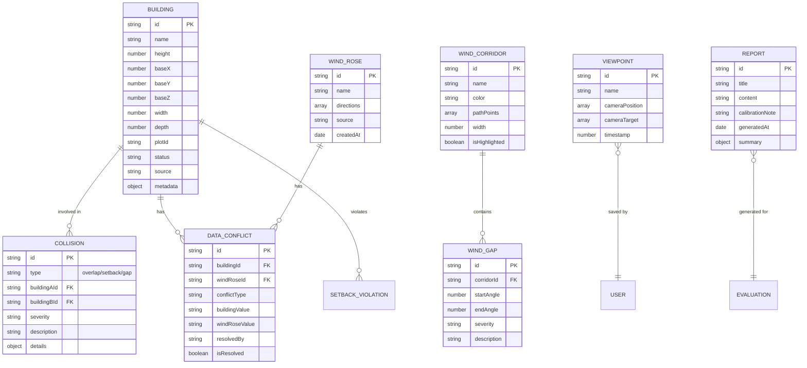

## 1. 架构设计



## 2. 技术描述

- **Frontend**: React@18 + TypeScript@5 + Vite@5
- **3D Engine**: three@0.160, @react-three/fiber@8, @react-three/drei@9, @react-three/postprocessing@2
- **State Management**: zustand@4
- **Styling**: tailwindcss@3
- **Icons**: lucide-react@0.294
- **PDF Generation**: jspdf@2 + html2canvas@1
- **Backend**: None（纯前端应用，数据存储于LocalStorage）
- **Database**: LocalStorage + 内存Mock数据

## 3. 路由定义

| Route | Purpose |
|-------|---------|
| / | 主评估页面（默认路由，包含3D视图+侧边栏+工具栏） |

## 4. 数据模型

### 4.1 数据模型定义



### 4.2 TypeScript 类型定义

```typescript
// 建筑体块
interface Building {
  id: string;
  name: string;
  height: number;
  position: [number, number, number];
  dimensions: [number, number, number];
  plotId: string;
  status: 'proposed' | 'existing' | 'under-construction';
  source: string;
  conflicts: string[];
}

// 风向玫瑰数据
interface WindRose {
  id: string;
  name: string;
  directions: WindDirection[];
  source: string;
  createdAt: Date;
}

interface WindDirection {
  angle: number;
  speed: number;
  frequency: number;
}

// 风廊路径
interface WindCorridor {
  id: string;
  name: string;
  color: string;
  path: [number, number, number][];
  width: number;
  highlighted: boolean;
}

// 冲突类型
type ConflictType = 'overlap' | 'wind_gap' | 'setback' | 'data_merge';

interface Conflict {
  id: string;
  type: ConflictType;
  severity: 'warning' | 'error' | 'critical';
  buildingIds: string[];
  description: string;
  details: Record<string, any>;
  resolved: boolean;
}

// 数据合并冲突
interface DataMergeConflict {
  id: string;
  buildingId: string;
  fieldName: string;
  buildingValue: any;
  windRoseValue: any;
  resolved: boolean;
  resolution: 'use-building' | 'use-wind' | 'custom';
}

// 视角
interface Viewpoint {
  id: string;
  name: string;
  position: [number, number, number];
  target: [number, number, number];
  timestamp: number;
}

// 筛选条件
interface Filters {
  heightRange: [number, number];
  status: Building['status'][];
  plotIds: string[];
  showConflictsOnly: boolean;
}

// 全局状态
interface AppState {
  buildings: Building[];
  windRoses: WindRose[];
  corridors: WindCorridor[];
  conflicts: Conflict[];
  mergeConflicts: DataMergeConflict[];
  selectedBuildingId: string | null;
  selectedConflictId: string | null;
  activeCorridorIds: string[];
  filters: Filters;
  viewpoints: Viewpoint[];
  currentViewpoint: Viewpoint | null;
  isDataMerged: boolean;
}
```

## 5. 核心算法说明

### 5.1 体块重叠检测算法

```typescript
// AABB碰撞检测扩展，考虑建筑底部平面投影
function detectBuildingOverlaps(buildings: Building[]): Conflict[] {
  const conflicts: Conflict[] = [];
  
  for (let i = 0; i < buildings.length; i++) {
    for (let j = i + 1; j < buildings.length; j++) {
      const a = buildings[i];
      const b = buildings[j];
      
      // 检查2D投影是否重叠（XZ平面）
      const overlapX = Math.abs(a.position[0] - b.position[0]) < (a.dimensions[0] + b.dimensions[0]) / 2;
      const overlapZ = Math.abs(a.position[2] - b.position[2]) < (a.dimensions[2] + b.dimensions[2]) / 2;
      
      if (overlapX && overlapZ) {
        // 计算重叠面积和严重程度
        const overlapArea = calculateOverlapArea(a, b);
        conflicts.push({
          id: `overlap-${a.id}-${b.id}`,
          type: 'overlap',
          severity: overlapArea > 50 ? 'critical' : 'error',
          buildingIds: [a.id, b.id],
          description: `建筑 ${a.name} 与 ${b.name} 体块重叠`,
          details: { overlapArea, a, b },
          resolved: false
        });
      }
    }
  }
  
  return conflicts;
}
```

### 5.2 风向缺口检测算法

```typescript
function detectWindGaps(buildings: Building[], corridors: WindCorridor[], windRose: WindRose): Conflict[] {
  const conflicts: Conflict[] = [];
  
  for (const corridor of corridors) {
    // 分析风廊路径上的建筑阻挡
    const blockingBuildings = findBlockingBuildings(corridor, buildings);
    
    for (const building of blockingBuildings) {
      const gapAngle = calculateWindGap(building, corridor, windRose);
      
      if (gapAngle > 30) { // 缺口超过30度视为问题
        conflicts.push({
          id: `gap-${corridor.id}-${building.id}`,
          type: 'wind_gap',
          severity: gapAngle > 60 ? 'critical' : gapAngle > 45 ? 'error' : 'warning',
          buildingIds: [building.id],
          description: `${building.name} 造成风廊 ${corridor.name} 风向缺口 ${gapAngle.toFixed(1)}°`,
          details: { gapAngle, corridorId: corridor.id },
          resolved: false
        });
      }
    }
  }
  
  return conflicts;
}
```

### 5.3 退界线检测算法

```typescript
function detectSetbackViolations(buildings: Building[], setbackDistance: number = 5): Conflict[] {
  const conflicts: Conflict[] = [];
  const roadEdges = getRoadEdges(); // 预定义道路边线
  
  for (const building of buildings) {
    for (const edge of roadEdges) {
      const distance = calculateDistanceToEdge(building, edge);
      
      if (distance < setbackDistance) {
        conflicts.push({
          id: `setback-${building.id}`,
          type: 'setback',
          severity: distance < 2 ? 'critical' : 'error',
          buildingIds: [building.id],
          description: `${building.name} 退界不足，距道路仅 ${distance.toFixed(1)}m（要求≥${setbackDistance}m）`,
          details: { distance, required: setbackDistance, edge },
          resolved: false
        });
      }
    }
  }
  
  return conflicts;
}
```

## 6. 项目结构

```
src/
├── components/
│   ├── layout/
│   │   ├── TopToolbar.tsx      # 顶部工具栏
│   │   ├── LeftSidebar.tsx     # 左侧边栏（风廊+方案）
│   │   └── RightSidebar.tsx    # 右侧边栏（明细+冲突）
│   ├── three/
│   │   ├── Scene3D.tsx         # 3D主场景
│   │   ├── BuildingMesh.tsx    # 建筑体块组件
│   │   ├── CorridorPath.tsx    # 风廊路径组件
│   │   ├── GroundGrid.tsx      # 地面网格
│   │   └── Compass.tsx         # 指南针
│   ├── panels/
│   │   ├── CorridorPanel.tsx   # 风廊高亮面板
│   │   ├── ComparePanel.tsx    # 方案对比面板
│   │   ├── DetailTable.tsx     # 明细记录表
│   │   ├── ConflictPanel.tsx   # 冲突面板
│   │   └── FilterBar.tsx       # 筛选栏
│   ├── modals/
│   │   ├── DataMergeModal.tsx  # 数据合并弹窗
│   │   ├── ViewpointModal.tsx  # 视角管理弹窗
│   │   └── ReportModal.tsx     # 报告导出弹窗
│   └── ui/
│       ├── Button.tsx
│       ├── Badge.tsx
│       └── Tabs.tsx
├── hooks/
│   ├── useCollisionDetection.ts
│   ├── useDataMerge.ts
│   ├── useViewpoint.ts
│   └── useReport.ts
├── store/
│   └── useAppStore.ts          # Zustand全局状态
├── types/
│   └── index.ts                # TypeScript类型定义
├── data/
│   ├── buildings.ts            # Mock建筑数据
│   ├── windRose.ts             # Mock风向数据
│   ├── corridors.ts            # Mock风廊数据
│   └── roads.ts                # Mock道路数据
├── utils/
│   ├── collision.ts            # 碰撞检测算法
│   ├── geometry.ts             # 几何计算工具
│   └── export.ts               # 导出工具
├── pages/
│   └── EvaluationPage.tsx      # 主评估页面
├── App.tsx
├── main.tsx
└── index.css
```
