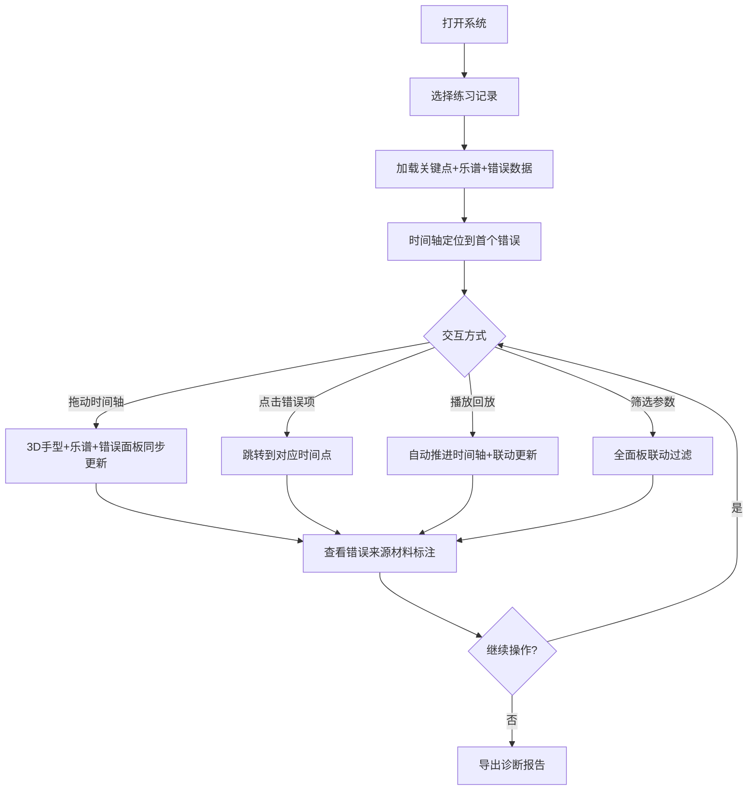

## 1. 产品概述

钢琴手型3D回放系统——为钢琴教师提供手指关键点、乐谱小节、视频时间的三维对齐诊断工具。核心解决：关键点丢失与小节错位时，能精确指出问题出在哪份材料，而非仅报告"处理失败"。

- 目标用户：钢琴教师、钢琴教学机构
- 核心价值：将分散的手指关键点数据、乐谱小节标注、视频时间线统一对齐，让教师一眼看清手型问题出处

## 2. 核心功能

### 2.1 用户角色

| 角色 | 注册方式 | 核心权限 |
|------|----------|----------|
| 钢琴教师 | 邀请码注册 | 查看3D回放、筛选错误、导出诊断报告 |

### 2.2 功能模块

1. **回放主页面**：3D手型模型 + 乐谱小节条 + 时间轴 + 错误诊断面板 + 练习历史
2. **练习详情页**：某次练习的完整回放与错误定位

### 2.3 页面详情

| 页面名称 | 模块名称 | 功能描述 |
|----------|----------|----------|
| 回放主页面 | 3D手型模型 | 展示手指21个关键点的3D手型，支持旋转/缩放，关键点丢失时高亮红色闪烁 |
| 回放主页面 | 乐谱小节条 | 横向展示乐谱小节编号，当前小节高亮，错位小节标注醒目警告色 |
| 回放主页面 | 时间轴回放 | 可拖动/播放的时间轴，与3D手型和乐谱小节联动同步 |
| 回放主页面 | 错误诊断面板 | 列出所有错误标签（关键点丢失/小节错位），点击跳转到对应时间点，标注来源材料 |
| 回放主页面 | 练习历史 | 按日期列出历史练习记录，筛选后联动更新3D、时间轴、错误面板 |
| 回放主页面 | 参数筛选栏 | 按学生/曲目/错误类型筛选，筛选后全面板联动更新 |

## 3. 核心流程

用户打开系统 → 选择/筛选练习记录 → 时间轴自动定位到首个错误点 → 3D手型显示该时刻手型（丢失关键点红色闪烁）→ 乐谱小节条对齐到当前小节（错位小节橙色警告）→ 用户拖动时间轴或点击错误项 → 3D手型+乐谱+错误面板同步更新 → 用户可导出诊断报告

## 4. 用户界面设计

### 4.1 设计风格

- **风格定位**：工业实用主义——朴素、专业、信息密度高，但错误信息极其醒目
- **主色调**：深灰底（#1a1a2e）+ 冷白文字（#e8e8e8），营造专业诊断氛围
- **强调色**：错误红（#ff4757，关键点丢失）、警告橙（#ff8c00，小节错位）、正常绿（#2ed573）
- **按钮风格**：扁平圆角，hover时微发光
- **字体**：JetBrains Mono（数据/代码）+ Noto Sans SC（中文正文）
- **布局风格**：三栏式——左侧3D手型+乐谱，中间时间轴，右侧错误面板+历史

### 4.2 页面设计概览

| 页面名称 | 模块名称 | UI元素 |
|----------|----------|--------|
| 回放主页面 | 3D手型模型 | 深色背景3D画布，手指骨骼线白色，关键点球体绿色，丢失关键点红色脉冲动画 |
| 回放主页面 | 乐谱小节条 | 横向小节编号条，当前小节绿色底色，错位小节橙色底+虚线边框+⚠图标 |
| 回放主页面 | 时间轴回放 | 深色进度条，播放/暂停按钮，时间标记点（错误时间点红点标记），可拖动滑块 |
| 回放主页面 | 错误诊断面板 | 卡片列表，每张卡片：错误类型图标+来源材料标签+时间戳+描述，关键点丢失卡片红边框，小节错位卡片橙边框 |
| 回放主页面 | 练习历史 | 紧凑列表，日期+曲目+错误数badge，选中项高亮 |
| 回放主页面 | 参数筛选栏 | 顶部窄条，下拉选择器+错误类型复选框，筛选后全局联动 |

### 4.3 响应式设计

- 桌面端优先（1920×1080为基准）
- 三栏布局在1440px以下折叠为两栏（3D+时间轴占主区，错误面板折叠为底部抽屉）
- 1024px以下单栏堆叠

### 4.4 3D场景指引

- **环境**：深色简约环境，无HDRI，纯色背景（#0d0d1a），减少视觉干扰
- **光照**：柔和环境光（0.4强度）+ 顶部方向光（0.8强度），避免手型阴影过重
- **相机**：斜45度俯视，OrbitControls支持旋转/缩放/平移，限制最近1单位最远10单位
- **手型渲染**：球体关键点+圆柱骨骼连线，关键点半径0.02，骨骼半径0.008
- **交互**：鼠标hover关键点显示编号和坐标，丢失关键点脉冲缩放动画
- **性能**：21个关键点+20根骨骼线，帧率保持60fps，无后处理特效
