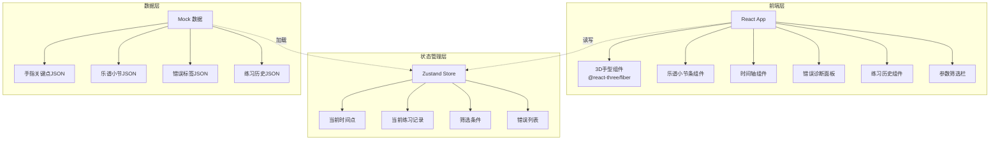
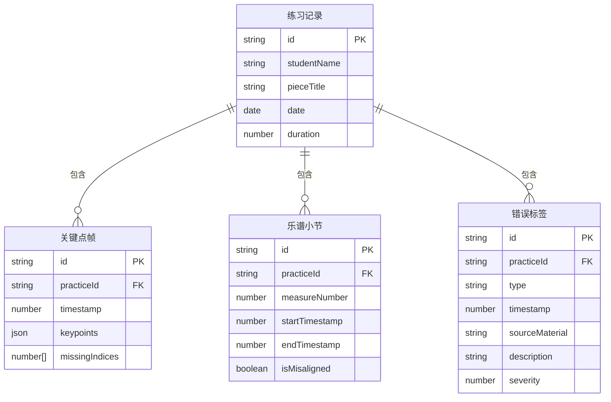

## 1. 架构设计



## 2. 技术说明

- **前端框架**：React@18 + TypeScript + Vite
- **初始化工具**：vite-init（react-ts模板）
- **3D渲染**：three + @react-three/fiber + @react-three/drei
- **样式方案**：Tailwind CSS@3
- **状态管理**：Zustand
- **后端**：无（纯前端，使用Mock数据）
- **字体**：JetBrains Mono + Noto Sans SC（通过Google Fonts CDN加载）
- **图标**：lucide-react

## 3. 路由定义

| 路由 | 用途 |
|------|------|
| / | 回放主页面（3D手型+乐谱+时间轴+错误面板+历史） |

## 4. 数据模型

### 4.1 数据模型定义



### 4.2 数据定义

**关键点帧（KeypointFrame）**：

```typescript
interface KeypointFrame {
  id: string
  practiceId: string
  timestamp: number
  keypoints: [number, number, number][] // 21个3D坐标
  missingIndices: number[] // 丢失的关键点索引
}
```

**乐谱小节（Measure）**：

```typescript
interface Measure {
  id: string
  practiceId: string
  measureNumber: number
  startTimestamp: number
  endTimestamp: number
  isMisaligned: boolean
}
```

**错误标签（ErrorLabel）**：

```typescript
interface ErrorLabel {
  id: string
  practiceId: string
  type: 'KEYPOINT_LOSS' | 'MEASURE_MISALIGN' | 'OTHER'
  timestamp: number
  sourceMaterial: '关键点数据' | '乐谱数据' | '视频数据'
  description: string
  severity: 'critical' | 'warning' | 'info'
}
```

**练习记录（PracticeRecord）**：

```typescript
interface PracticeRecord {
  id: string
  studentName: string
  pieceTitle: string
  date: string
  duration: number
}
```

## 5. 关键交互逻辑

### 5.1 联动机制

所有面板通过 Zustand Store 中的 `currentTimestamp` 和 `filterConditions` 驱动：

- **时间轴拖动/播放** → 更新 `currentTimestamp` → 3D手型渲染对应帧 → 乐谱小节高亮对应小节 → 错误面板滚动到当前时间附近的错误
- **点击错误项** → 更新 `currentTimestamp` 为错误时间点 → 全面板联动
- **筛选条件变更** → 过滤错误列表 → 过滤练习历史 → 重新计算时间轴标记点 → 3D手型定位到筛选后首个错误

### 5.2 错误诊断逻辑

- **关键点丢失**：检查 `KeypointFrame.missingIndices`，非空则生成 `KEYPOINT_LOSS` 类型错误标签，`sourceMaterial` 标记为"关键点数据"
- **小节错位**：检查 `Measure.isMisaligned`，为 true 则生成 `MEASURE_MISALIGN` 类型错误标签，`sourceMaterial` 标记为"乐谱数据"
- 错误卡片上醒目显示来源材料标签，让教师一眼看出问题出在哪份数据
