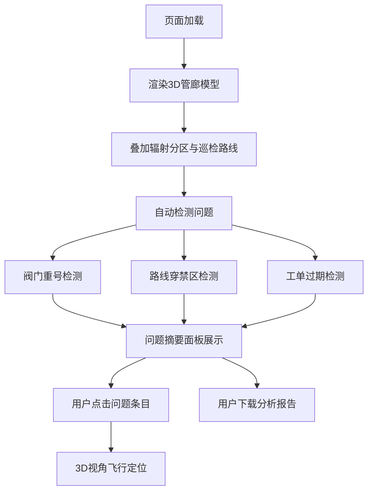

## 1. 产品概述

核电站管廊巡检智能分析平台——面向核电运维工程师的单页演示工具，将3D管廊模型、辐射分区、工单记录三大数据源整合在一个界面，自动检测阀门重号、路线穿禁区、工单过期等运维"尴尬"问题，生成可截图汇报、可下载报告的分析结果。

- 目标用户：核电运维工程师、安全审查人员、培训讲师
- 核心价值：把分散在不同系统的信息对齐到同一画面，让"阀门重号在哪""路线是否穿越禁区""哪些工单已过期"一目了然，截图即可沟通

## 2. 核心功能

### 2.1 用户角色

| 角色 | 核心权限 |
|------|----------|
| 运维工程师 | 查看管廊模型、巡检路线、辐射分区、工单记录；下载分析报告 |
| 培训/审查人员 | 同上，侧重截图演示与报告下载 |

### 2.2 功能模块

1. **管廊总览页**：3D管廊模型 + 辐射分区叠加 + 巡检路线标注 + 阀门标记 + 问题摘要面板

### 2.3 页面详情

| 页面名称 | 模块名称 | 功能描述 |
|----------|----------|----------|
| 管廊总览页 | 3D管廊场景 | Three.js渲染管廊几何体，阀门带编号标签，辐射分区以半透明区域+边界文字标注，巡检路线以虚线+箭头+节点编号绘制；支持旋转/缩放/平移；点击阀门弹出详情 |
| 管廊总览页 | 问题摘要面板 | 左侧固定面板，分三组列出：阀门重号（列出重号编号及位置）、路线穿禁区（列出哪段路线穿越哪个辐射区）、工单过期（列出工单号、截止日期、超期天数）；每组可展开/折叠，点击条目跳转3D场景对应位置 |
| 管廊总览页 | 工单记录表 | 底部抽屉面板，表格展示所有工单，含编号、关联阀门、状态、截止日期、超期天数；过期工单高亮红色行；点击行跳转3D对应阀门 |
| 管廊总览页 | 报告下载 | 右上角按钮，点击生成JSON报告文件下载，报告内阀门重号结论与界面摘要一致 |

## 3. 核心流程

用户打开页面 → 3D管廊模型自动加载并标注阀门编号、辐射分区、巡检路线 → 系统自动检测三大问题（阀门重号、路线穿禁区、工单过期）→ 问题摘要面板实时展示检测结果 → 用户点击问题条目，3D视角飞行到对应位置 → 用户可截图用于汇报 → 用户点击下载报告，获得与界面结论一致的文件

## 4. 用户界面设计

### 4.1 设计风格

- 主色调：深钢蓝 (#1B2A4A) —— 工业感、核电场景
- 辅助色：警示橙 (#FF6B35)、辐射黄 (#FFD700)、安全绿 (#2ECC71)
- 按钮风格：圆角矩形，微阴影，工业风图标
- 字体：Source Han Sans (思源黑体) 作为正文，Orbitron 作为数据/编号展示字体
- 布局风格：左侧固定问题面板 + 中央3D场景 + 底部可抽拉工单表 + 右上角操作区
- 图标风格：线性图标，Stroke 1.5px

### 4.2 页面设计概览

| 页面名称 | 模块名称 | UI元素 |
|----------|----------|--------|
| 管廊总览页 | 3D管廊场景 | 深色背景，管廊灰色几何体，阀门白色标签+编号，辐射区分区半透明覆盖+边界文字，路线虚线+箭头+节点编号 |
| 管廊总览页 | 问题摘要面板 | 左侧320px固定面板，深色卡片，三组折叠列表，重号橙、穿禁区黄、过期红 |
| 管廊总览页 | 工单记录表 | 底部抽屉，深色表格，过期行红色背景，正常行深灰，列：工单号/阀门/状态/截止/超期 |
| 管廊总览页 | 报告下载按钮 | 右上角，橙色按钮，下载图标 |

### 4.3 响应式

- 桌面优先设计（1920×1080演示标准）
- 3D场景自适应容器，最小宽度1024px

### 4.4 3D场景指导

- 环境：深色工业风，微弱环境光 + 局部聚光灯
- 灯光：顶部冷白方向光 + 侧面暖色点光源模拟管廊照明
- 相机：透视相机，初始俯视角45°，OrbitControls交互
- 构图：管廊纵向延伸，辐射分区横向切分，路线沿管廊走向
- 交互：点击阀门高亮+弹出标签，点击问题条目相机飞行；阀门标签始终面向相机（Billboard）
- 后处理：边缘发光（Bloom）用于问题阀门高亮

## 5. 样例数据设计

### 5.1 管廊段

| 段编号 | 起点坐标 | 终点坐标 | 辐射分区 |
|--------|----------|----------|----------|
| GL-A | (0,0,0) | (20,0,0) | 绿区 |
| GL-B | (20,0,0) | (40,0,0) | 黄区 |
| GL-C | (40,0,0) | (60,0,0) | 红区 |
| GL-D | (0,0,-8) | (60,0,-8) | 绿区 |

### 5.2 阀门（含2组重号）

| 阀门编号 | 位置坐标 | 所属管廊段 |
|----------|----------|------------|
| V-001 | (5,0,0) | GL-A |
| V-002 | (15,0,0) | GL-A |
| V-002 | (35,0,0) | GL-B ← 重号 |
| V-003 | (45,0,0) | GL-C |
| V-004 | (10,0,-8) | GL-D |
| V-005 | (50,0,-8) | GL-D |
| V-005 | (55,0,-8) | GL-D ← 重号 |

### 5.3 巡检路线

| 路线编号 | 途经阀门顺序 |
|----------|-------------|
| R-01 | V-001 → V-002 → V-002(重) → V-003 |
| R-02 | V-004 → V-005 → V-005(重) |

说明：R-01从绿区穿越黄区进入红区，存在穿禁区问题。

### 5.4 工单记录

| 工单号 | 关联阀门 | 状态 | 截止日期 | 备注 |
|--------|----------|------|----------|------|
| WO-2026-001 | V-001 | 已完成 | 2026-05-15 | 正常 |
| WO-2026-002 | V-002 | 已过期 | 2026-05-20 | 过期10天 |
| WO-2026-003 | V-003 | 已过期 | 2026-05-18 | 过期12天 |
| WO-2026-004 | V-004 | 进行中 | 2026-06-15 | 正常 |
| WO-2026-005 | V-005 | 已过期 | 2026-05-25 | 过期5天 |
