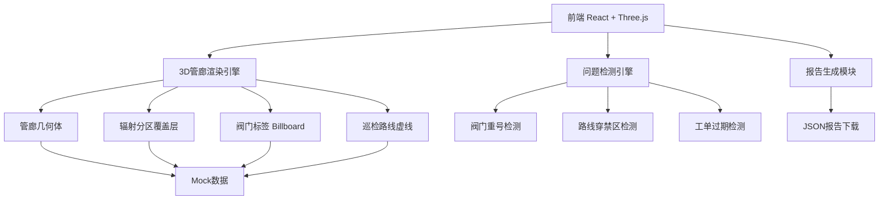
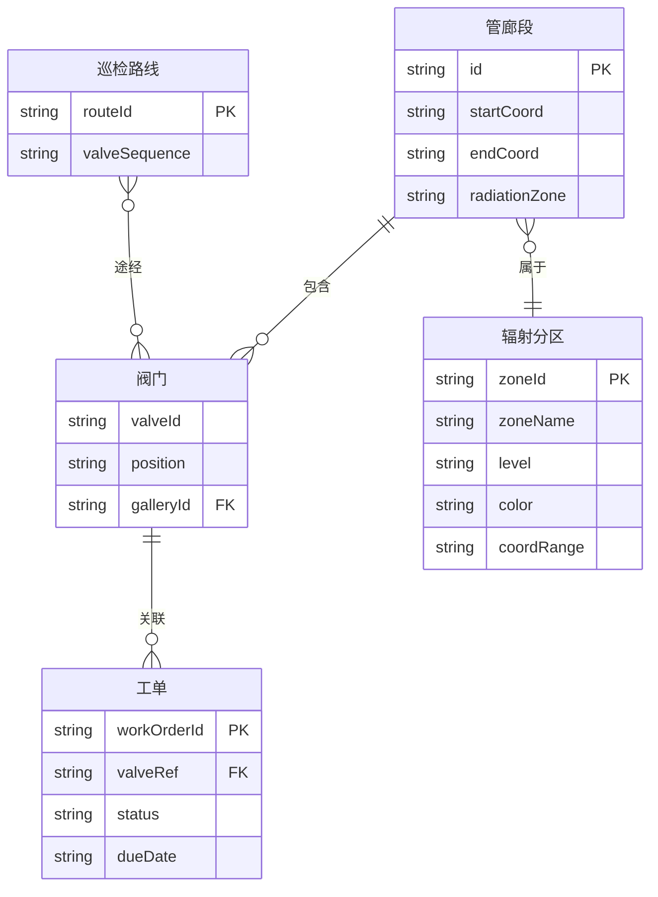

## 1. 架构设计



纯前端架构，无需后端服务，所有数据为内嵌Mock数据。

## 2. 技术说明

- 前端：React@18 + TypeScript + tailwindcss@3 + vite
- 初始化工具：vite-init (react-ts template)
- 3D渲染：three + @react-three/fiber + @react-three/drei + @react-three/postprocessing
- 后端：无
- 数据库：无，使用内嵌Mock数据

## 3. 路由定义

| 路由 | 用途 |
|------|------|
| / | 管廊总览页，包含3D场景、问题面板、工单表、报告下载 |

单页应用，无需多路由。

## 4. API定义

无后端API，所有数据内嵌前端。

## 5. 数据模型

### 5.1 数据模型定义



### 5.2 核心TypeScript类型

```typescript
interface GallerySegment {
  id: string;
  start: [number, number, number];
  end: [number, number, number];
  radiationZone: 'green' | 'yellow' | 'red';
}

interface Valve {
  valveId: string;
  position: [number, number, number];
  galleryId: string;
}

interface InspectionRoute {
  routeId: string;
  valveSequence: string[];
}

interface WorkOrder {
  workOrderId: string;
  valveRef: string;
  status: 'completed' | 'in_progress' | 'overdue';
  dueDate: string;
}

interface RadiationZone {
  zoneId: string;
  zoneName: string;
  level: 'green' | 'yellow' | 'red';
  color: string;
  bounds: { min: [number, number, number]; max: [number, number, number] };
}
```

### 5.3 检测算法说明

1. **阀门重号检测**：遍历所有阀门，按valveId分组，group长度>1即为重号
2. **路线穿禁区检测**：对每条路线的阀门序列，检查相邻阀门是否跨越不同辐射分区，特别是绿→红或任意→红区穿越
3. **工单过期检测**：对比工单dueDate与当前日期，status为非completed且已过截止日即为过期

## 6. 关键技术决策

| 决策项 | 选择 | 理由 |
|--------|------|------|
| 3D标签渲染 | drei Html组件 | 阀门编号标签需清晰可读，HTML文字比3D Text更清晰 |
| 路线渲染 | drei Line组件 + dashSize | 虚线+箭头表示巡检方向 |
| 辐射分区渲染 | 半透明Mesh + 边界文字 | 分区可视化需同时看到管廊结构 |
| 问题定位飞行 | lerp相机动画 | 点击问题条目平滑飞行到目标位置 |
| 报告格式 | JSON文件下载 | 结构化数据，阀门结论与界面一致 |
| 样式方案 | Tailwind CSS | 快速构建工业风暗色UI |
