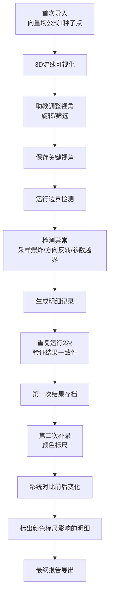

## 1. 产品概述

"数学向量场风洞"是一款面向大学助教的3D向量场可视化与边界检测工具，解决月底或上课前手工判断采样爆炸等异常的痛点。通过Three.js Web3D技术直观展示向量场流线，自动检测采样爆炸、方向反转、参数越界等边界情况，确保结果可重复。

- 核心价值：将抽象的向量场异常检测转化为直观的3D可视化，自动化边界检测，提升教学评估效率
- 目标用户：大学理工科助教、数学/物理教师、科研人员

## 2. 核心特征

### 2.1 用户角色
| 角色 | 注册方式 | 核心权限 |
|------|----------|----------|
| 助教用户 | 本地应用，无需注册 | 导入向量场公式、配置种子点、运行检测、查看明细、保存视角、补录颜色标尺 |

### 2.2 功能模块
1. **3D主视图模块**：流线可视化、视角控制、筛选过滤、异常高亮
2. **侧边栏模块**：公式切换、读数标注、明细记录、边界检测结果
3. **数据导入模块**：向量场公式导入、种子点配置
4. **边界检测模块**：采样爆炸检测、方向反转检测、参数越界检测
5. **视角管理模块**：保存当前视角、加载已存视角
6. **变更追踪模块**：记录补录前后变化、标出颜色标尺影响的明细
7. **结果验证模块**：可重复性验证、运行历史对比

### 2.3 页面详情
| 页面名称 | 模块名称 | 功能描述 |
|----------|----------|----------|
| 主工作台 | 3D视图区 | Three.js渲染3D流线，支持鼠标旋转、缩放、平移；异常区域高亮显示 |
| 主工作台 | 顶部工具栏 | 视角保存/加载、运行检测、数据导入、筛选条件设置 |
| 主工作台 | 左侧边栏 | 公式列表切换、当前参数读数标注、种子点管理 |
| 主工作台 | 右侧边栏 | 检测明细列表、边界异常记录、变更历史对比 |
| 主工作台 | 底部状态栏 | 当前检测状态、运行次数、可重复性验证结果 |

## 3. 核心流程

用户操作流程：
1. 助教首次使用时，导入向量场公式和种子点数据
2. 系统在3D视图中渲染流线，助教可自由旋转、缩放、筛选
3. 保存典型视角，便于后续对比
4. 运行边界检测，系统自动识别采样爆炸、方向反转、参数越界
5. 重复运行2次，验证结果一致性（通过/失败状态稳定）
6. 完成第一次检测后存档
7. 第二次补录颜色标尺，系统自动对比并标出受影响的明细
8. 导出最终报告用于教学评估

## 4. 界面设计

### 4.1 设计风格
- **设计方向**：科技感科研工具风格，深色主题，适合长时间数据观察
- **主色调**：深空蓝 `#0a1628` 作为背景，科技蓝 `#3b82f6` 作为主色
- **强调色**：采样爆炸红 `#ef4444`、方向反转橙 `#f59e0b`、参数越界紫 `#8b5cf6`、正常绿 `#10b981`
- **字体**：Display字体用 `Space Grotesk` 彰显科技感，Body字体用 `JetBrains Mono` 适合代码和数据展示
- **按钮风格**：微立体、圆角8px、悬停有发光效果
- **布局**：三栏布局（左侧公式面板 + 中央3D视图 + 右侧明细面板），顶部工具栏，底部状态栏
- **视觉细节**：网格背景、扫描线动效、数据面板毛玻璃效果、异常脉冲动画

### 4.2 页面设计概要
| 页面名称 | 模块名称 | UI元素 |
|----------|----------|--------|
| 主工作台 | 3D视图区 | 深色星空背景、半透明网格地面、彩色流线、异常点发光标记、相机控制手柄、视角切换按钮 |
| 主工作台 | 顶部工具栏 | 渐变按钮组、下拉筛选器、视角保存下拉框、运行状态指示灯 |
| 主工作台 | 左侧边栏 | 公式卡片列表（选中高亮）、参数读数仪表、种子点坐标表格、折叠面板 |
| 主工作台 | 右侧边栏 | 明细记录时间线、异常类型标签、可重复性验证徽章、变更对比diff视图 |
| 主工作台 | 底部状态栏 | 进度条、运行计数器、状态文字、版本标识 |

### 4.3 响应式设计
- 桌面端优先（≥1280px）：完整三栏布局
- 平板端（768px-1279px）：左右边栏可折叠，3D视图自适应
- 移动端（<768px）：单栏堆叠，重点保留3D视图和核心功能

### 4.4 3D场景指引
- **环境**：深空渐变背景 `#0a1628` → `#1e3a5f`，弱雾效 `FogExp2`，营造深邃感
- **光照**：环境光 `AmbientLight` 强度0.4，平行光 `DirectionalLight` 2盏（主光+补光），点光源用于异常点发光
- **相机**：透视相机 `PerspectiveCamera`，初始位置 (10, 10, 10)，fov 60，启用轨道控制器 `OrbitControls`
- **流线渲染**：使用 `TubeGeometry` 或自定义 `Line` 着色器，根据向量场属性着色，支持透明度渐变
- **交互**：鼠标悬停显示流线信息，点击异常点跳转到对应明细，框选筛选区域
- **动画**：流线粒子流动动画、异常点脉冲动画、视角切换缓动动画
- **性能**：流线数量控制在200条以内，使用 `BufferGeometry`，支持LOD，目标帧率60fps
