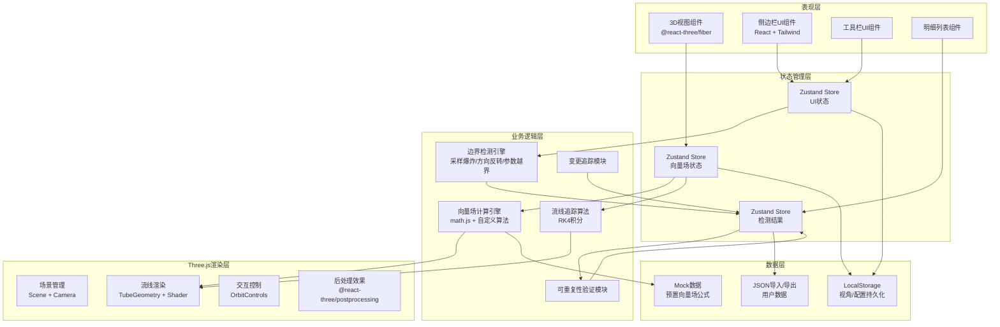

## 1. 架构设计



## 2. 技术描述

- **前端框架**：React@18 + TypeScript + Vite@5
- **3D引擎**：Three.js@0.160 + @react-three/fiber@8 + @react-three/drei@9
- **后处理**：@react-three/postprocessing@2
- **样式方案**：TailwindCSS@3 + 自定义CSS变量
- **状态管理**：Zustand@4（轻量级，避免Redux过度设计）
- **数学计算**：math.js@11（公式解析、向量运算）
- **图标**：@phosphor-icons/react
- **数据持久化**：LocalStorage + JSON文件导入导出
- **初始化工具**：pnpm create vite

## 3. 路由定义

| 路由 | 用途 |
|------|------|
| / | 主工作台，包含3D视图、侧边栏、工具栏、明细列表 |

## 4. 核心数据类型定义

```typescript
// 向量场公式
interface VectorFieldFormula {
  id: string;
  name: string;
  description: string;
  // 分量公式：x, y, z方向的数学表达式
  fx: string;
  fy: string;
  fz: string;
  // 参数范围
  params: {
    xRange: [number, number];
    yRange: [number, number];
    zRange: [number, number];
    // 其他可调参数
    customParams?: Record<string, [number, number]>;
  };
  // 检测阈值
  thresholds: {
    explosion: number;      // 采样爆炸阈值（速度模长）
    directionFlip: number;  // 方向反转阈值（角度变化）
    outOfBounds: number;    // 参数越界阈值
  };
  createdAt: string;
}

// 种子点
interface SeedPoint {
  id: string;
  x: number;
  y: number;
  z: number;
  label?: string;
}

// 流线数据点
interface StreamlinePoint {
  position: [number, number, number];
  velocity: [number, number, number];
  speed: number;
  curvature: number;
  timestamp: number;
}

// 单条流线
interface Streamline {
  id: string;
  seedPointId: string;
  points: StreamlinePoint[];
  status: 'normal' | 'explosion' | 'direction_flip' | 'out_of_bounds';
  anomalies: AnomalyRecord[];
}

// 异常记录
interface AnomalyRecord {
  id: string;
  streamlineId: string;
  type: 'explosion' | 'direction_flip' | 'out_of_bounds';
  position: [number, number, number];
  value: number;
  threshold: number;
  description: string;
  pointIndex: number;
}

// 检测结果
interface DetectionResult {
  id: string;
  formulaId: string;
  seedPoints: SeedPoint[];
  streamlines: Streamline[];
  anomalies: AnomalyRecord[];
  statistics: {
    totalStreamlines: number;
    normalCount: number;
    explosionCount: number;
    directionFlipCount: number;
    outOfBoundsCount: number;
  };
  runNumber: number;
  timestamp: string;
  isConsistent: boolean;  // 与前一次运行结果是否一致
  hasColorScale: boolean; // 是否已补录颜色标尺
}

// 视角配置
interface Viewpoint {
  id: string;
  name: string;
  cameraPosition: [number, number, number];
  cameraTarget: [number, number, number];
  createdAt: string;
}

// 筛选条件
interface FilterConditions {
  anomalyTypes: ('explosion' | 'direction_flip' | 'out_of_bounds')[];
  streamlineIds: string[];
  speedRange: [number, number];
  showOnlyAnomalies: boolean;
}

// 颜色标尺（第二次补录）
interface ColorScale {
  id: string;
  name: string;
  type: 'speed' | 'curvature' | 'vorticity';
  minValue: number;
  maxValue: number;
  colorStops: { position: number; color: string }[];
  affectedStreamlineIds: string[];
  createdAt: string;
}

// 变更记录
interface ChangeRecord {
  id: string;
  type: 'import' | 'detection' | 'color_scale' | 'viewpoint';
  description: string;
  before: Record<string, unknown> | null;
  after: Record<string, unknown> | null;
  affectedIds: string[];
  timestamp: string;
}
```

## 5. 核心算法说明

### 5.1 流线追踪算法（RK4四阶龙格-库塔）
```
输入：种子点 P0，向量场函数 F(x,y,z)，步长 h，最大步数 N
输出：流线上的点序列 [P0, P1, P2, ..., Pn]

1. 初始化 P = P0，点序列 = [P0]
2. 对于 i = 1 到 N：
   a. 计算 k1 = F(P)
   b. 计算 k2 = F(P + h/2 * k1)
   c. 计算 k3 = F(P + h/2 * k2)
   d. 计算 k4 = F(P + h * k3)
   e. 更新 P = P + h/6 * (k1 + 2*k2 + 2*k3 + k4)
   f. 边界检测（见5.2），如果异常则终止
   g. 将 P 加入点序列
3. 返回点序列
```

### 5.2 边界检测算法
| 异常类型 | 检测条件 | 说明 |
|----------|----------|------|
| 采样爆炸 | `|v| > threshold_explosion` | 速度模长超过阈值，数值不稳定 |
| 方向反转 | `angle(v_i, v_{i+1}) > threshold_flip` | 连续两点速度方向夹角超过阈值 |
| 参数越界 | `P ∉ [x_min,x_max]×[y_min,y_max]×[z_min,z_max]` | 点超出参数范围 |

### 5.3 可重复性验证
```
1. 使用固定随机种子生成种子点
2. 相同公式、相同种子点、相同参数运行检测
3. 计算两次运行的异常记录哈希值对比
4. 若完全一致则标记为可重复，否则标记为不一致
5. 连续运行2次，确保结果稳定
```

## 6. 目录结构

```
src/
├── components/
│   ├── View3D/              # 3D视图组件
│   │   ├── Scene.tsx        # 场景主组件
│   │   ├── Streamline.tsx   # 流线渲染组件
│   │   ├── AnomalyPoint.tsx # 异常点标记
│   │   └── GridGround.tsx   # 网格地面
│   ├── SidebarLeft/         # 左侧边栏
│   │   ├── FormulaList.tsx  # 公式列表
│   │   ├── ParamsPanel.tsx  # 参数读数
│   │   └── SeedPoints.tsx   # 种子点管理
│   ├── SidebarRight/        # 右侧边栏
│   │   ├── DetailList.tsx   # 明细列表
│   │   ├── AnomalyTabs.tsx  # 异常分类标签
│   │   └── ChangeHistory.tsx # 变更历史
│   ├── Toolbar/             # 顶部工具栏
│   │   ├── ViewpointMenu.tsx # 视角菜单
│   │   ├── FilterPanel.tsx  # 筛选面板
│   │   └── ActionButtons.tsx # 操作按钮
│   └── StatusBar/           # 底部状态栏
│       └── index.tsx
├── store/                   # Zustand状态管理
│   ├── vectorFieldStore.ts  # 向量场状态
│   ├── uiStore.ts           # UI状态
│   └── detectionStore.ts    # 检测结果状态
├── engine/                  # 核心算法引擎
│   ├── vectorField.ts       # 向量场计算
│   ├── streamline.ts        # 流线追踪
│   ├── detection.ts         # 边界检测
│   └── consistency.ts       # 可重复性验证
├── data/                    # 数据和Mock
│   ├── formulas.ts          # 预置公式
│   ├── seedPoints.ts        # 预置种子点
│   └── thresholds.ts        # 检测阈值
├── types/                   # TypeScript类型定义
│   └── index.ts
├── utils/                   # 工具函数
│   ├── math.ts              # 数学工具
│   ├── color.ts             # 颜色工具
│   └── storage.ts           # 存储工具
├── hooks/                   # 自定义Hooks
│   ├── useStreamline.ts
│   ├── useDetection.ts
│   └── useViewpoint.ts
├── App.tsx
├── main.tsx
└── index.css
```

## 7. 关键技术点

1. **流线渲染性能优化**
   - 使用 `BufferGeometry` 批量渲染
   - 自定义 `ShaderMaterial` 实现流线渐变色
   - 根据距离动态调整流线细分程度

2. **公式解析安全**
   - math.js 配置严格模式
   - 表达式白名单过滤
   - 计算超时保护

3. **状态同步机制**
   - Zustand selectors 实现细粒度更新
   - 筛选条件变化时同时更新3D视图和明细列表
   - 使用 `useSyncExternalStore` 确保状态一致性

4. **颜色标尺预留接口**
   - 颜色映射逻辑独立模块
   - 流线颜色支持动态切换
   - 受影响明细标记字段预留

5. **可重复性保障**
   - 所有随机操作使用固定种子（mulberry32算法）
   - 计算参数序列化存储
   - 运行结果哈希对比
