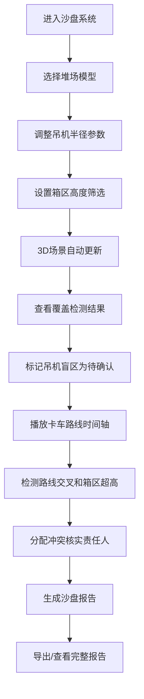

## 1. 产品概述

港口堆场吊装沙盘系统是一款面向港口工程师的3D可视化分析工具，通过交互式3D场景展示堆场布局、吊机作业半径、集装箱堆叠高度以及卡车运输路线，帮助工程师直观地检测作业冲突并生成专业的沙盘报告。

- **核心目标**：将抽象的堆场作业参数转化为直观的3D可视化，提供冲突检测和路线验证功能
- **目标用户**：港口工程师、堆场规划人员、物流分析师
- **核心价值**：减少人工判断误差，提高堆场规划效率，生成可追溯的决策依据

## 2. 核心功能

### 2.1 用户角色
| 角色 | 注册方式 | 核心权限 |
|------|----------|----------|
| 港口工程师 | 本地使用 | 调整参数、查看3D场景、导出报告 |
| 规划人员 | 本地使用 | 筛选数据、播放时间轴、标记待确认项 |

### 2.2 功能模块
1. **3D堆场主场景**：堆场模型可视化、吊机半径展示、箱区高度渲染
2. **参数控制面板**：堆场布局切换、吊机参数调整、箱区高度筛选
3. **覆盖检测面板**：吊机覆盖范围分析、盲区标记、待确认分支
4. **冲突检测模块**：路线交叉高亮、箱区超高预警、责任人分配
5. **时间轴播放器**：卡车路线动态播放、作业时序可视化
6. **沙盘报告生成**：参数变更记录、冲突检测结果、3D场景说明

### 2.3 页面详情
| 页面名称 | 模块名称 | 功能描述 |
|----------|----------|----------|
| 主界面 | 3D堆场场景 | 实时渲染堆场、吊机、集装箱、卡车模型，支持视角切换 |
| 主界面 | 左侧参数面板 | 堆场模型选择、吊机半径滑块、箱区高度筛选器 |
| 主界面 | 右侧检测面板 | 覆盖检测结果、冲突高亮列表、待确认分支标记 |
| 主界面 | 底部时间轴 | 播放/暂停、进度拖拽、时间点跳转 |
| 报告弹窗 | 沙盘报告 | 参数变更历史、冲突统计、3D场景来源说明、导出功能 |

## 3. 核心流程

## 4. 用户界面设计

### 4.1 设计风格
- **主色调**：工业蓝 (#165DFF) 作为主色，代表专业和技术感
- **辅助色**：警示橙 (#FF7D00) 用于冲突高亮，确认绿 (#00B42A) 用于正常状态，待确认灰 (#86909C) 用于待处理项
- **背景色**：深灰 (#1D2129) 背景，突出3D场景的工业质感
- **字体**：使用 Roboto Mono 等宽字体显示参数，Inter 用于正文
- **按钮风格**：直角矩形，细微边框，点击反馈明显
- **布局风格**：三栏布局（左参数-中3D-右检测），底部时间轴贯穿

### 4.2 页面设计概述
| 页面名称 | 模块名称 | UI元素 |
|----------|----------|----------|
| 主界面 | 3D堆场场景 | 半透明集装箱、发光吊机半径线、动态卡车、冲突高亮红色闪烁 |
| 主界面 | 参数面板 | 分组卡片、滑块控件、下拉选择、实时数值显示 |
| 主界面 | 检测面板 | 冲突列表、状态标签、责任人选择、备注输入 |
| 主界面 | 时间轴 | 进度条、播放按钮、时间刻度、关键帧标记 |
| 报告弹窗 | 沙盘报告 | 分章节布局、参数变更表格、冲突统计图表、3D场景快照 |

### 4.3 响应式
- **桌面优先**：针对1920×1080及以上分辨率优化
- **平板适配**：参数面板和检测面板可折叠收起
- **触控优化**：3D场景支持手势旋转缩放，滑块支持触摸拖动

### 4.4 3D场景指导
- **环境**：工业风格，HDRI使用工厂/港口环境贴图，整体偏冷色调
- **光照设置**：主方向光模拟日光，环境光提供基础照明，点光源用于吊机效果
- **相机设置**：初始为45度俯视视角，支持轨道控制，限制俯仰角度避免穿模
- **构图焦点**：堆场中心区域为视觉焦点，吊机和主要箱区位于黄金分割点
- **交互动画**：参数调整时模型平滑过渡，冲突检测时红色脉冲动画，卡车沿路径移动
- **后处理**：轻微泛光效果增强科技感，边缘抗锯齿，颜色分级统一色调
- **性能控制**：模型面数控制在合理范围，使用实例化渲染处理大量集装箱
