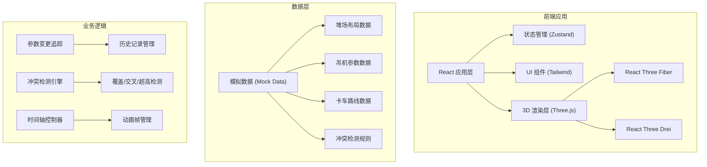

## 1. 架构设计



## 2. 技术描述

- **前端框架**: React@18 + TypeScript
- **构建工具**: Vite@5
- **样式方案**: TailwindCSS@3
- **3D渲染**: Three.js + @react-three/fiber + @react-three/drei
- **状态管理**: Zustand (轻量级状态管理)
- **后处理效果**: @react-three/postprocessing
- **图标**: Lucide React
- **数据**: 本地Mock数据，无需后端

## 3. 路由定义

| 路由 | 用途 |
|-------|---------|
| / | 沙盘主界面 - 3D场景 + 参数面板 + 检测面板 + 时间轴 |

## 4. 数据模型

### 4.1 堆场数据模型
```typescript
interface Yard {
  id: string;
  name: string;
  width: number;
  depth: number;
  blocks: Block[];
}

interface Block {
  id: string;
  name: string;
  position: { x: number; z: number };
  size: { width: number; depth: number };
  containers: Container[];
}

interface Container {
  id: string;
  position: { x: number; y: number; z: number };
  height: number;
  status: 'normal' | 'overheight' | 'warning';
}
```

### 4.2 吊机数据模型
```typescript
interface Crane {
  id: string;
  name: string;
  position: { x: number; y: number; z: number };
  radius: number;
  maxHeight: number;
  blindAreas: BlindArea[];
}

interface BlindArea {
  id: string;
  position: { x: number; z: number };
  radius: number;
  status: 'pending' | 'confirmed' | 'resolved';
  assignee?: string;
}
```

### 4.3 卡车路线数据模型
```typescript
interface TruckRoute {
  id: string;
  truckId: string;
  points: { x: number; z: number; time: number }[];
  color: string;
}

interface Conflict {
  id: string;
  type: 'crossing' | 'overheight' | 'blind';
  position: { x: number; y: number; z: number };
  description: string;
  status: 'pending' | 'confirmed' | 'resolved';
  assignee?: string;
  affectedRoutes?: string[];
}
```

### 4.4 参数变更历史
```typescript
interface ParamChange {
  id: string;
  timestamp: number;
  paramName: string;
  oldValue: any;
  newValue: any;
  user: string;
  description: string;
}
```

## 5. 核心组件结构

```
src/
├── components/
│   ├── Scene3D/
│   │   ├── index.tsx          # 3D场景主组件
│   │   ├── Yard.tsx           # 堆场模型
│   │   ├── Crane.tsx          # 吊机模型
│   │   ├── Container.tsx      # 集装箱模型
│   │   ├── Truck.tsx          # 卡车模型
│   │   ├── RadiusCircle.tsx   # 吊机半径显示
│   │   └── ConflictMarker.tsx # 冲突标记
│   ├── ControlPanel/
│   │   ├── index.tsx          # 参数面板主组件
│   │   ├── YardSelector.tsx   # 堆场选择
│   │   ├── CraneSlider.tsx    # 吊机参数滑块
│   │   └── HeightFilter.tsx   # 高度筛选器
│   ├── DetectionPanel/
│   │   ├── index.tsx          # 检测面板主组件
│   │   ├── CoverageInfo.tsx   # 覆盖检测
│   │   ├── ConflictList.tsx   # 冲突列表
│   │   └── AssigneeSelect.tsx # 责任人选择
│   ├── Timeline/
│   │   ├── index.tsx          # 时间轴主组件
│   │   ├── ProgressBar.tsx    # 进度条
│   │   └── PlayControls.tsx   # 播放控制
│   └── Report/
│       ├── index.tsx          # 报告弹窗
│       ├── ChangeHistory.tsx  # 变更历史
│       └── ConflictSummary.tsx # 冲突汇总
├── store/
│   └── useSandboxStore.ts     # 全局状态管理
├── data/
│   ├── yards.ts               # 堆场模拟数据
│   ├── cranes.ts              # 吊机模拟数据
│   └── routes.ts              # 路线模拟数据
├── utils/
│   ├── conflictDetector.ts    # 冲突检测算法
│   └── routeInterpolator.ts   # 路线插值
└── App.tsx                    # 主应用
```

## 6. 状态管理设计

```typescript
interface SandboxState {
  // 当前选中的堆场
  currentYardId: string;
  setCurrentYardId: (id: string) => void;
  
  // 吊机参数
  craneRadius: number;
  setCraneRadius: (radius: number) => void;
  
  // 高度筛选
  minHeightFilter: number;
  maxHeightFilter: number;
  setHeightFilter: (min: number, max: number) => void;
  
  // 时间轴
  currentTime: number;
  isPlaying: boolean;
  setCurrentTime: (time: number) => void;
  togglePlay: () => void;
  
  // 冲突列表
  conflicts: Conflict[];
  updateConflictStatus: (id: string, status: Conflict['status']) => void;
  assignConflict: (id: string, assignee: string) => void;
  
  // 参数变更历史
  changeHistory: ParamChange[];
  recordChange: (change: Omit<ParamChange, 'id' | 'timestamp'>) => void;
  
  // 计算属性
  detectedConflicts: Conflict[];
  coverageRate: number;
}
```
