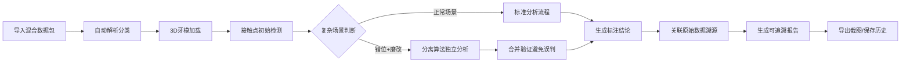

## 1. 产品概述

牙科咬合接触图智能分析系统，专为牙科技师设计，解决上下颌错位与磨改过量复杂场景下的精准分析问题。系统支持3D牙模可视化、接触点智能标注、数据溯源管理，可直接用于会议演示和教学培训。

- 核心目标：解决复杂咬合场景（错位+磨改）的误判问题
- 目标用户：牙科技师、牙科医生、培训讲师
- 核心价值：每一条分析结论都可追溯，每一张截图都能清晰说明问题

## 2. 核心功能

### 2.1 用户角色
| 角色 | 注册方式 | 核心权限 |
|------|----------|----------|
| 牙科技师 | 本地账号 | 导入数据包、分析咬合、导出报告、管理历史 |
| 培训讲师 | 本地账号 | 使用演示模式、创建教学案例 |

### 2.2 功能模块
1. **工作台主页**：数据包导入、历史记录列表、快速分析入口
2. **3D咬合分析**：牙模渲染、接触点标注、错位检测、磨改分析
3. **数据溯源面板**：原始数据包浏览、结论来源追踪、证据链展示
4. **演示模式**：全屏展示、截图导出、标注说明编辑
5. **样例测试库**：脏样例测试、结果验证、对比分析

### 2.3 页面详情
| 页面名称 | 模块名称 | 功能描述 |
|----------|----------|----------|
| 工作台 | 数据包管理 | 拖拽上传混合数据包（牙模+记录+报告），自动解析分类 |
| 工作台 | 历史记录 | 持久化存储分析记录，去重机制防止重复结论 |
| 3D分析视图 | 牙模渲染 | 上下颌3D模型独立/叠加展示，支持旋转缩放 |
| 3D分析视图 | 接触点分析 | 智能识别接触点，区分正常接触、错位接触、磨改区域 |
| 3D分析视图 | 错位标注 | 箭头+文字标注错位方向和距离，不依赖颜色识别 |
| 3D分析视图 | 磨改检测 | 高亮磨改过量区域，显示磨改深度数值 |
| 溯源面板 | 来源追踪 | 每条判断关联原始数据（模型切片/报告原文/记录条目） |
| 演示模式 | 截图导出 | 带标注的高清截图，自动生成说明文字 |
| 测试库 | 脏样例测试 | 预置错位+磨改复杂案例，一键验证分析准确性 |

## 3. 核心流程

## 4. 用户界面设计

### 4.1 设计风格
- **主色调**：专业医疗蓝 (#165DFF)，代表精准与信任
- **辅助色**：警示橙 (#FF7D00) 用于磨改过量，警示红 (#F53F3F) 用于严重错位
- **中性色**：深灰背景 (#1D2129)，减少视觉疲劳，突出3D模型
- **按钮风格**：圆角8px，微悬浮效果，清晰的主次层级
- **字体**：标题使用 Noto Sans SC Bold，正文使用 Noto Sans SC Regular
- **布局风格**：三栏布局（左侧数据包+溯源，中间3D视图，右侧分析面板）
- **图标风格**：线性图标，医疗专业感，避免过度装饰

### 4.2 页面设计概述
| 页面名称 | 模块名称 | UI元素 |
|----------|----------|--------|
| 工作台 | 数据包区 | 卡片式布局，上传进度条，文件类型图标 |
| 工作台 | 历史列表 | 时间轴样式，缩略图预览，状态标签 |
| 3D分析视图 | 主视图区 | 深色背景，模型高光，浮动工具条 |
| 3D分析视图 | 标注层 | 白色箭头+黑色描边，半透明标注框，数值标签 |
| 溯源面板 | 证据链 | 折叠面板，原文高亮，关联线连接 |
| 演示模式 | 全屏视图 | 隐藏多余UI，底部标注说明栏，截图按钮 |

### 4.3 响应式设计
- 桌面优先设计（1920×1080起步）
- 平板端：左右面板可折叠收起
- 触控优化：3D视图支持手势操作，按钮最小触控区域48px

### 4.4 3D场景指导
- **环境**：深色渐变背景，柔和环境光，避免 distracting reflections
- **光照设置**：主光源45°角，辅助光填充阴影，材质偏哑光质感
- **相机设置**：默认正交视角，可切换透视，支持围绕咬合面旋转
- **交互**：悬停接触点显示详细信息，点击标注跳转溯源
- **后处理**：轻微抗锯齿，轮廓边缘高亮，提升专业感
- **性能**：模型面数控制在50万以内，保持60fps流畅度
