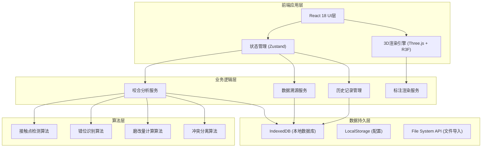
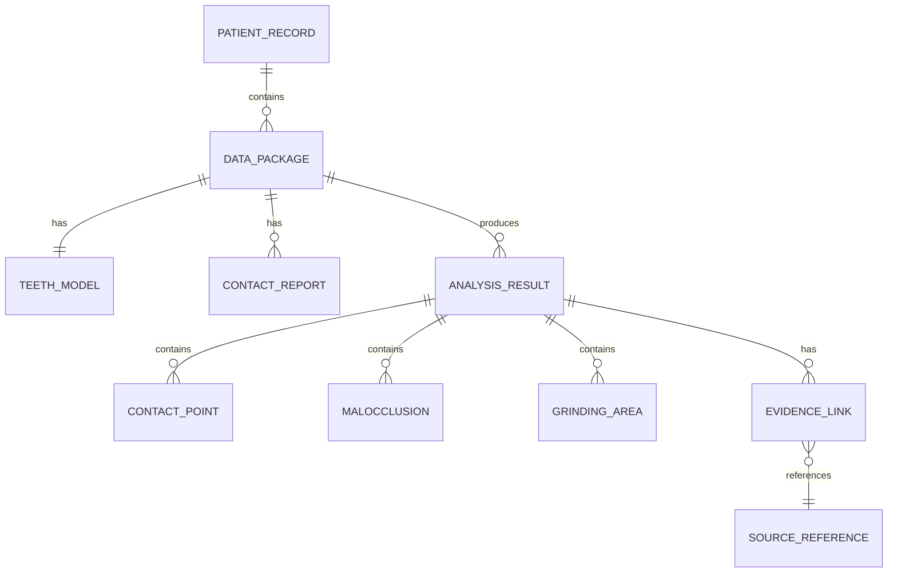

## 1. 架构设计



## 2. 技术描述

- **前端框架**: React@18 + TypeScript@5 + Vite@5
- **3D渲染**: Three.js@0.160 + @react-three/fiber@8 + @react-three/drei@9
- **状态管理**: Zustand@4 (轻量级，支持中间件持久化)
- **样式方案**: TailwindCSS@3 + CSS Modules
- **本地数据库**: IndexedDB (通过 Dexie.js 封装)
- **截图导出**: html2canvas + dom-to-image-more
- **图表可视化**: @antv/g2@5 (用于接触压力分布图)
- **初始化工具**: npm create vite@latest

## 3. 路由定义

| 路由路径 | 页面用途 |
|----------|----------|
| /dashboard | 工作台 - 数据包管理 + 历史记录 |
| /analysis/:id | 3D咬合分析主视图 |
| /trace/:id | 数据溯源详情页 |
| /demo/:id | 演示模式 (全屏) |
| /test-lab | 脏样例测试实验室 |

## 4. 核心数据模型

### 4.1 数据模型定义



### 4.2 TypeScript 类型定义

```typescript
// 数据包
interface DataPackage {
  id: string;
  name: string;
  patientId: string;
  createdAt: number;
  updatedAt: number;
  files: PackageFile[];
  status: 'pending' | 'analyzing' | 'completed' | 'error';
}

// 分析结果
interface AnalysisResult {
  id: string;
  packageId: string;
  createdAt: number;
  hash: string; // 用于去重校验
  contactPoints: ContactPoint[];
  malocclusions: Malocclusion[];
  grindingAreas: GrindingArea[];
  confidence: number;
  isComplexCase: boolean;
  evidenceLinks: EvidenceLink[];
}

// 接触点
interface ContactPoint {
  id: string;
  position: Vector3;
  normal: Vector3;
  pressure: number;
  area: number;
  type: 'normal' | 'misaligned' | 'grinding' | 'conflict';
  annotation?: Annotation;
}

// 错位标注
interface Malocclusion {
  id: string;
  type: 'horizontal' | 'vertical' | 'rotational';
  direction: Vector3;
  distance: number; // mm
  affectedTeeth: number[];
  annotation: Annotation;
  severity: 'mild' | 'moderate' | 'severe';
}

// 磨改区域
interface GrindingArea {
  id: string;
  center: Vector3;
  depth: number; // mm
  area: number; // mm²
  isExcessive: boolean;
  annotation: Annotation;
}

// 标注信息 (用于截图清晰展示)
interface Annotation {
  id: string;
  position: Vector3;
  label: string;
  description: string;
  arrowFrom?: Vector3;
  color: string;
}

// 证据溯源链接
interface EvidenceLink {
  id: string;
  resultItemId: string;
  sourceType: 'model' | 'report' | 'record';
  sourceFile: string;
  sourceLocation: string; // 页码/行号/切片索引
  sourceContent: string; // 原文快照
}
```

## 5. 核心算法模块

### 5.1 冲突分离算法 (解决错位+磨改误判问题)

```typescript
// 算法流程：
// 1. 独立检测接触点、错位、磨改
// 2. 计算特征空间重叠度
// 3. 低于阈值则合并，高于阈值则分离标注
// 4. 生成双重证据链
```

### 5.2 历史记录去重机制

- 基于数据包内容哈希 + 分析参数哈希
- 相同输入产生相同输出时自动关联已有记录
- 避免重复计算和重复存储

## 6. 性能优化策略

- 3D模型使用 Draco 压缩 + LOD 层级
- IndexedDB 索引优化查询速度
- Web Worker 执行计算密集型分析算法
- 虚拟列表渲染历史记录
