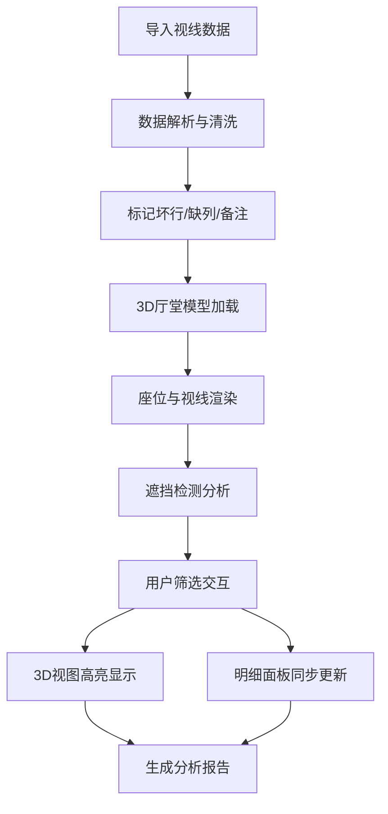

## 1. 产品概述

剧场观众视线分析3D可视化系统，解决加装字幕屏后后排和侧座视线遮挡争议问题。通过Three.js Web3D技术将厅堂模型、座位布局、视线分析结果直观呈现，帮助剧场设计师快速定位遮挡问题并进行方案复核。

- 核心价值：将抽象的视线数据转化为可交互的3D场景，让遮挡争议可视化、可量化、可追溯
- 目标用户：剧场设计师、建筑声学工程师、剧场运营方

## 2. 核心功能

### 2.1 用户角色
| 角色 | 注册方式 | 核心权限 |
|------|----------|----------|
| 剧场设计师 | 无需注册 | 导入数据、3D交互、筛选分析、导出报告 |

### 2.2 功能模块
1. **3D主视图**：厅堂模型渲染、座位3D展示、视线路径可视化、视角控制
2. **数据导入与解析**：CSV/Excel数据导入、空行/备注/缺列处理、坏行单独标记
3. **遮挡检测面板**：字幕屏遮挡、遮挡物穿透、视线穿墙、屏幕高度错误检测
4. **座位筛选系统**：按区域/排号/座号筛选、按遮挡类型筛选、状态同步
5. **视角管理**：保存视角、加载视角、视角列表管理
6. **明细记录面板**：具体座位记录展示、遮挡原因说明、关联3D定位
7. **报告生成**：从厅堂模型到遮挡明细的完整分析链路报告

### 2.3 页面详情
| 页面名称 | 模块名称 | 功能描述 |
|----------|----------|----------|
| 主分析页面 | 3D视图区 | Three.js渲染厅堂、座位、视线，支持旋转/缩放/平移，视角保存/恢复 |
| 主分析页面 | 左侧筛选面板 | 遮挡类型筛选、座位属性筛选、筛选状态实时同步到3D视图 |
| 主分析页面 | 右侧明细面板 | 遮挡记录列表、坏行列表、点击定位到3D座位、详细数据展示 |
| 主分析页面 | 顶部工具栏 | 数据导入、视角管理、报告导出、视图切换 |

## 3. 核心流程

### 3.1 数据分析流程
用户导入座位/视线数据 → 系统解析数据并标记坏行 → 3D场景渲染厅堂和座位 → 执行遮挡检测算法 → 用户交互筛选 → 生成分析报告

## 4. 用户界面设计

### 4.1 设计风格
- **主色调**：深蓝科技感 (#0F172A)，体现专业建筑设计领域
- **强调色**：青色高亮 (#06B6D4) 用于正常视线，红色警示 (#EF4444) 用于遮挡
- **按钮风格**：圆角矩形，微妙阴影，悬停微动效
- **字体**：标题使用思源黑体（现代几何感），正文使用系统等宽字体便于数据阅读
- **布局风格**：三栏式专业工作台布局，左侧筛选面板、中间3D视图、右侧明细面板
- **图标风格**：线性简约图标，统一24px尺寸

### 4.2 页面设计概览
| 页面名称 | 模块名称 | UI元素 |
|----------|----------|--------|
| 主分析页面 | 3D视图区 | 深色背景、轨道控制器、视角指示器、坐标轴、选中高亮 |
| 主分析页面 | 左侧筛选面板 | 折叠式筛选组、复选框、滑块、颜色编码标签 |
| 主分析页面 | 右侧明细面板 | 分页表格、行高亮、点击跳转、坏行醒目标记 |
| 主分析页面 | 顶部工具栏 | 文件上传按钮、视角下拉、导出按钮、帮助图标 |

### 4.3 响应式
- 桌面端：三栏式固定布局，最小支持1440px宽度
- 小屏桌面：面板可折叠收起，3D视图自适应扩展
- 不强制移动端适配，以桌面端专业体验为核心

### 4.4 3D场景指引
- **环境**：深灰色渐变背景，模拟专业设计软件氛围
- **光照**：三光源系统（主方向光+环境光+补光），确保模型立体感
- **摄像机**：PerspectiveCamera，初始45度俯视厅堂整体
- **交互**：OrbitControls，阻尼效果，限制最小最大距离
- **动画**：筛选结果渐显动画、选中座位浮动高亮效果、视线路径动画
- **后处理**：FXAA抗锯齿，轻微Bloom效果增强科技感
- **性能**：座位使用InstancedMesh批量渲染，视线按需加载

## 5. 数据处理规范

### 5.1 异常数据处理
- **空行**：自动跳过，计入坏行统计
- **备注行**：以#开头的行作为备注单独保存
- **缺列**：关键列缺失标记为坏行，非关键列填充默认值
- **格式错误**：坐标数值异常、座位号非法等标记为坏行

### 5.2 遮挡检测规则
- **字幕屏遮挡**：视线与字幕屏平面相交且交点在有效范围内
- **遮挡物穿透**：视线与其他座位/墙体发生碰撞
- **视线穿墙**：视线终点位于厅堂边界之外
- **屏幕高度错误**：字幕屏高度参数超出设计阈值范围
