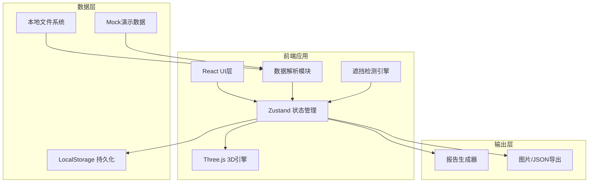
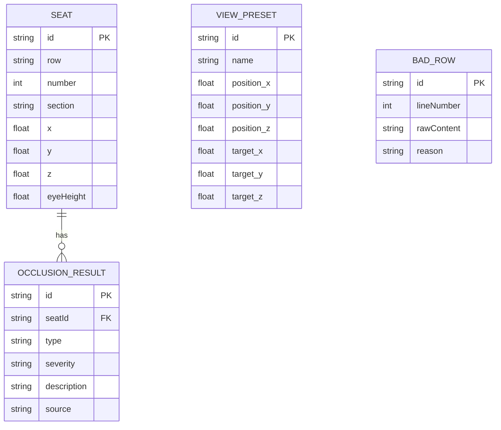

## 1. 架构设计



## 2. 技术选型说明

- **前端框架**: React@18 + TypeScript
- **构建工具**: Vite@5
- **样式方案**: TailwindCSS@3
- **3D引擎**: Three.js + @react-three/fiber + @react-three/drei
- **状态管理**: Zustand（轻量级，支持跨组件同步筛选状态）
- **数据处理**: PapaParse（CSV解析）
- **图标库**: Lucide React
- **后端**: 无，纯前端应用，数据本地处理
- **数据库**: LocalStorage 存储视角配置和用户偏好

## 3. 目录结构

```
src/
├── components/
│   ├── layout/           # 布局组件
│   │   ├── TopToolbar.tsx
│   │   ├── LeftPanel.tsx
│   │   └── RightPanel.tsx
│   ├── three/            # 3D场景组件
│   │   ├── Scene3D.tsx
│   │   ├── Auditorium.tsx
│   │   ├── Seats.tsx
│   │   ├── SightLines.tsx
│   │   └── SubtitleScreen.tsx
│   ├── filter/           # 筛选组件
│   │   ├── OcclusionFilter.tsx
│   │   └── SeatFilter.tsx
│   └── detail/           # 明细组件
│       ├── RecordTable.tsx
│       └── BadRowsList.tsx
├── store/                # 状态管理
│   ├── useSceneStore.ts
│   ├── useFilterStore.ts
│   └── useDataStore.ts
├── engine/               # 核心引擎
│   ├── DataParser.ts     # 数据解析与清洗
│   ├── OcclusionDetector.ts  # 遮挡检测
│   └── ViewManager.ts    # 视角管理
├── types/                # 类型定义
│   ├── seat.ts
│   ├── occlusion.ts
│   └── camera.ts
├── data/                 # 演示数据
│   └── mockData.csv
└── utils/                # 工具函数
    ├── math.ts
    └── export.ts
```

## 4. 核心类型定义

### 4.1 座位数据类型
```typescript
interface Seat {
  id: string;
  row: string;
  number: number;
  section: string;
  x: number;
  y: number;
  z: number;
  eyeHeight: number;
  targetPoint: { x: number; y: number; z: number };
  isBadRow?: boolean;
  badRowReason?: string;
}
```

### 4.2 遮挡检测类型
```typescript
interface OcclusionResult {
  seatId: string;
  type: 'subtitle_screen' | 'obstacle' | 'wall_penetration' | 'screen_height_error' | 'normal';
  severity: 'warning' | 'error' | 'info';
  description: string;
  intersectionPoint?: { x: number; y: number; z: number };
  source: 'subtitle_screen' | 'other_seat' | 'wall' | 'parameter_error';
}
```

### 4.3 视角配置类型
```typescript
interface ViewPreset {
  id: string;
  name: string;
  position: { x: number; y: number; z: number };
  target: { x: number; y: number; z: number };
  fov: number;
  createdAt: number;
}
```

## 5. 数据模型



## 6. 状态同步机制

### 6.1 筛选状态同步链路
```
左侧面板筛选变更 → Zustand store更新 → 3D场景重新计算可见性 → 右侧明细面板重新过滤
```

### 6.2 座位选中同步
```
3D场景点击座位 → store选中状态更新 → 左侧面板定位到对应筛选条件 → 右侧面板滚动到对应记录
```

### 6.3 明细点击同步
```
右侧面板点击记录 → store选中状态更新 → 3D场景相机聚焦到对应座位 → 视线路径高亮显示
```

## 7. 关键技术实现点

### 7.1 遮挡检测算法
1. **视线-平面相交检测**: 使用Three.js Raycaster实现字幕屏碰撞检测
2. **空间边界检测**: AABB包围盒检测视线是否穿出厅堂边界
3. **参数校验**: 字幕屏高度阈值校验，标记异常参数行

### 7.2 性能优化策略
1. **座位批量渲染**: 使用InstancedMesh渲染大量座位，降低Draw Call
2. **视锥体裁剪**: 仅渲染相机可见范围内的视线路径
3. **LOD策略**: 远距离座位使用简化模型

### 7.3 数据链路可追溯
1. 每条遮挡记录包含原始数据行号
2. 报告生成时串联：原始数据 → 解析结果 → 检测过程 → 结论说明
3. 支持点击记录回溯到原始数据行内容
