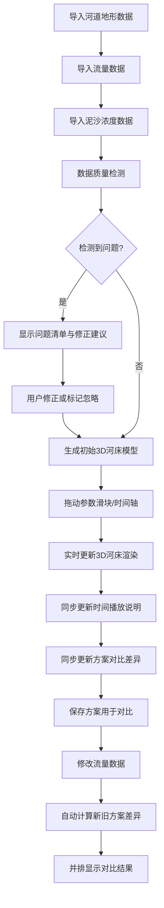

## 1. 产品概述

河道泥沙冲淤模型是面向水利工程师的专业可视化分析工具，解决河道地形、流量数据和泥沙浓度数据融合分析中的断面缺失、数据不完整等痛点。通过3D河床可视化、时间轴播放和方案对比功能，帮助工程师直观理解泥沙冲淤变化规律。

- **核心价值**：将零散、不完整的水文数据转化为可交互的3D可视化模型，提供数据质量检测和可操作的修正建议
- **目标用户**：水利工程师、水文分析人员、河道治理专家
- **关键特性**：数据完整性校验、3D河床实时渲染、多方案对比、时间序列动态播放

## 2. 核心功能

### 2.1 用户角色

| 角色 | 注册方式 | 核心权限 |
|------|----------|----------|
| 水利工程师 | 无需注册，本地应用 | 数据导入、参数调节、3D可视化、方案对比、报告导出 |

### 2.2 功能模块

1. **数据管理面板**：河道地形数据导入、流量数据管理、泥沙浓度数据配置
2. **3D河床可视化**：交互式3D河道模型、冲淤热力图、断面标注
3. **时间播放控制**：时间轴拖动、播放/暂停、速度调节、关键帧标记
4. **参数调节面板**：流量参数、泥沙参数、地形参数的滑块调节
5. **数据质量检测**：断面缺失检测、流量突变检测、坐标错位检测
6. **方案对比**：新旧方案并排对比、差异高亮、结果保存与加载

### 2.3 页面详情

| 页面名称 | 模块名称 | 功能描述 |
|---------|---------|----------|
| 主工作台 | 3D视口 | 显示3D河床模型，支持旋转、缩放、平移，实时响应参数变化 |
| 主工作台 | 左侧面板 | 数据管理、参数调节滑块、数据质量检测报告 |
| 主工作台 | 底部控制栏 | 时间轴播放控制、时间点选择、播放速度调节 |
| 主工作台 | 右侧面板 | 方案对比、断面选择、冲淤数据图表 |
| 主工作台 | 顶部工具栏 | 数据导入、方案保存、视图重置、导出功能 |

## 3. 核心流程

## 4. 用户界面设计

### 4.1 设计风格
- **主色调**：深蓝 #0F172A（专业科技感）配合水蓝 #0EA5E9（水文主题）
- **辅助色**：橙色 #F97316（冲淤警示）、绿色 #10B981（正常状态）、红色 #EF4444（严重问题）
- **按钮风格**：扁平化直角按钮，2px边框，hover时背景色加深
- **字体**：使用 JetBrains Mono 作为等宽数据字体，Noto Sans SC 作为界面字体
- **布局风格**：三栏式专业工作台布局，固定边栏，中心3D视口
- **图标风格**：使用 lucide-react 线性图标，统一16px尺寸

### 4.2 页面设计概览

| 页面名称 | 模块名称 | UI元素 |
|---------|---------|--------|
| 主工作台 | 3D视口 | 深色背景、雾化效果、河床网格材质、冲淤颜色渐变、断面悬浮标注 |
| 主工作台 | 左侧面板 | 卡片式分组、滑块控件、状态徽章、问题列表带修正按钮 |
| 主工作台 | 底部控制栏 | 时间轴轨道、播放按钮组、时间刻度、关键帧标记点 |
| 主工作台 | 右侧面板 | 分屏对比视图、数据图表、差异高亮标注 |
| 主工作台 | 顶部工具栏 | 面包屑导航、操作按钮组、方案名称输入 |

### 4.3 响应式
- 桌面端优先设计，最小支持1440px宽度
- 侧边栏可折叠，折叠后仅显示图标
- 3D视口自适应剩余空间
- 触控设备支持手势缩放旋转

### 4.4 3D场景指导
- **环境**：深色背景配合雾化效果，模拟水下环境氛围
- **光照**：主光源45°俯角照射，环境光提供基础照明，河床表面使用高光材质突出地形起伏
- **相机**：初始俯视角45°，支持轨道控制，限制最小最大缩放距离
- **交互**：鼠标悬停显示断面信息，点击选择断面，滚轮缩放，拖动旋转
- **动画**：参数变化时河床网格平滑过渡，时间播放时水位和泥沙浓度动态变化
- **后处理**：轻微泛光效果增强科技感，色彩分级突出冲淤颜色对比
- **性能**：使用LOD技术，河床网格控制在1万面以内，确保60fps流畅运行
