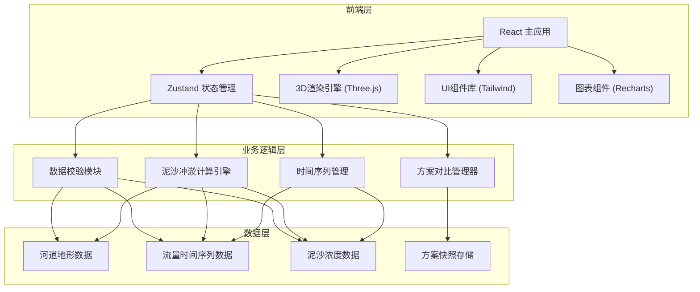

## 1. 架构设计



## 2. 技术描述

- **前端框架**: React@18 + TypeScript + Vite
- **样式方案**: TailwindCSS@3
- **3D渲染**: three@^0.160.0 + @react-three/fiber@^8.15.0 + @react-three/drei@^9.92.0 + @react-three/postprocessing@^2.15.0
- **状态管理**: zustand@^4.4.0
- **图表库**: recharts@^2.10.0
- **图标库**: lucide-react@^0.294.0
- **数据处理**: 纯前端计算，使用 Web Workers 处理复杂冲淤算法
- **初始化工具**: vite-init (react-ts 模板)

## 3. 路由定义

| 路由 | 用途 |
|------|------|
| / | 主工作台 - 3D可视化与参数调节 |
| /compare | 方案对比页面 - 新旧方案并排对比 |

## 4. 数据模型

### 4.1 数据模型定义

```mermaid
erDiagram
    RIVER_SECTION ||--o{ FLOW_DATA : has
    RIVER_SECTION ||--o{ SEDIMENT_DATA : has
    RIVER_SECTION {
        string id
        string name
        number chainage 桩号
        number[] coordinates 坐标点数组
        string notes 备注
        number elevation 高程
    }
    
    FLOW_DATA {
        string id
        string sectionId
        datetime timestamp
        number flow 流量 m³/s
        number waterLevel 水位
        string source
    }
    
    SEDIMENT_DATA {
        string id
        string sectionId
        datetime timestamp
        number concentration 含沙量 kg/m³
        number particleSize 粒径
        number delayHours 延迟小时数
    }
    
    PLAN_SNAPSHOT {
        string id
        string name
        datetime createdAt
        object parameters 参数快照
        object resultData 计算结果
        string parentId 父方案ID
    }
    
    DATA_QUALITY_ISSUE {
        string id
        string type 问题类型
        string sectionId
        string description
        string suggestion 修正建议
        number severity 严重程度
        boolean ignored
    }
```

### 4.2 TypeScript 类型定义

```typescript
// 河道断面
interface RiverSection {
  id: string;
  name: string;
  chainage: number;
  coordinates: [number, number, number][];
  notes?: string;
  elevation: number;
}

// 流量数据
interface FlowData {
  id: string;
  sectionId: string;
  timestamp: number;
  flow: number;
  waterLevel: number;
  source?: string;
}

// 泥沙浓度数据
interface SedimentData {
  id: string;
  sectionId: string;
  timestamp: number;
  concentration: number;
  particleSize: number;
  delayHours: number;
}

// 方案快照
interface PlanSnapshot {
  id: string;
  name: string;
  createdAt: number;
  parameters: CalculationParams;
  resultData: CalculationResult;
  parentId?: string;
}

// 计算参数
interface CalculationParams {
  flowMultiplier: number;
  sedimentMultiplier: number;
  erosionCoefficient: number;
  depositionCoefficient: number;
  timeStep: number;
}

// 计算结果
interface CalculationResult {
  sectionElevations: Record<string, number[]>;
  erosionVolume: number;
  depositionVolume: number;
  sedimentTransport: number[];
  timestamps: number[];
}

// 数据质量问题
interface DataQualityIssue {
  id: string;
  type: 'missing_section' | 'flow_mutation' | 'coordinate_misalignment' | 'missing_field' | 'delayed_data';
  sectionId?: string;
  description: string;
  suggestion: string;
  severity: 'low' | 'medium' | 'high';
  ignored: boolean;
}
```

## 5. 核心模块设计

### 5.1 状态管理 (Zustand Store)

```typescript
// store.ts
interface AppState {
  // 数据
  sections: RiverSection[];
  flowData: FlowData[];
  sedimentData: SedimentData[];
  issues: DataQualityIssue[];
  
  // 时间控制
  currentTime: number;
  startTime: number;
  endTime: number;
  isPlaying: boolean;
  playbackSpeed: number;
  
  // 参数
  params: CalculationParams;
  
  // 方案
  currentPlan: PlanSnapshot | null;
  comparePlan: PlanSnapshot | null;
  planHistory: PlanSnapshot[];
  
  // 视图
  selectedSectionId: string | null;
  viewMode: '3d' | 'compare' | 'chart';
  
  // Actions
  setParams: (params: Partial<CalculationParams>) => void;
  setCurrentTime: (time: number) => void;
  togglePlayback: () => void;
  validateData: () => void;
  savePlan: (name: string) => void;
  loadPlan: (planId: string, forCompare?: boolean) => void;
  ignoreIssue: (issueId: string) => void;
  fixIssue: (issueId: string, fixData: any) => void;
}
```

### 5.2 数据校验模块

```typescript
// utils/dataValidator.ts
export function validateDataQuality(
  sections: RiverSection[],
  flowData: FlowData[],
  sedimentData: SedimentData[]
): DataQualityIssue[] {
  const issues: DataQualityIssue[] = [];
  
  // 1. 检测断面缺失
  issues.push(...detectMissingSections(sections));
  
  // 2. 检测流量突变
  issues.push(...detectFlowMutations(flowData));
  
  // 3. 检测坐标错位
  issues.push(...detectCoordinateMisalignment(sections));
  
  // 4. 检测缺失字段
  issues.push(...detectMissingFields(sections, flowData, sedimentData));
  
  // 5. 检测延迟数据
  issues.push(...detectDelayedData(sedimentData, flowData));
  
  return issues;
}
```

### 5.3 冲淤计算引擎

```typescript
// utils/erosionEngine.ts
export function calculateErosionDeposition(
  sections: RiverSection[],
  flowData: FlowData[],
  sedimentData: SedimentData[],
  params: CalculationParams,
  timeRange: [number, number]
): CalculationResult {
  // 基于水沙动力学方程计算
  // 简化的冲淤模型实现
  // ...
}
```

## 6. 项目目录结构

```
src/
├── components/
│   ├── 3d/
│   │   ├── RiverbedViewer.tsx      # 3D河床主组件
│   │   ├── RiverbedMesh.tsx        # 河床网格
│   │   ├── SectionMarker.tsx       # 断面标记
│   │   └── WaterSurface.tsx        # 水面效果
│   ├── panels/
│   │   ├── LeftPanel.tsx           # 左侧参数面板
│   │   ├── RightPanel.tsx          # 右侧对比面板
│   │   └── DataQualityPanel.tsx    # 数据质量面板
│   ├── controls/
│   │   ├── Timeline.tsx            # 时间轴
│   │   ├── PlaybackControls.tsx    # 播放控制
│   │   └── ParameterSlider.tsx     # 参数滑块
│   └── charts/
│       ├── ErosionChart.tsx        # 冲淤图表
│       └── FlowChart.tsx           # 流量图表
├── hooks/
│   ├── useErosionCalculation.ts    # 冲淤计算Hook
│   ├── useDataValidation.ts        # 数据校验Hook
│   └── usePlayback.ts              # 播放控制Hook
├── store/
│   └── useAppStore.ts              # Zustand状态管理
├── utils/
│   ├── dataValidator.ts            # 数据校验工具
│   ├── erosionEngine.ts            # 冲淤计算引擎
│   └── planManager.ts              # 方案管理工具
├── types/
│   └── index.ts                    # 类型定义
├── data/
│   └── mockData.ts                 # 模拟数据
├── App.tsx
└── main.tsx
```
