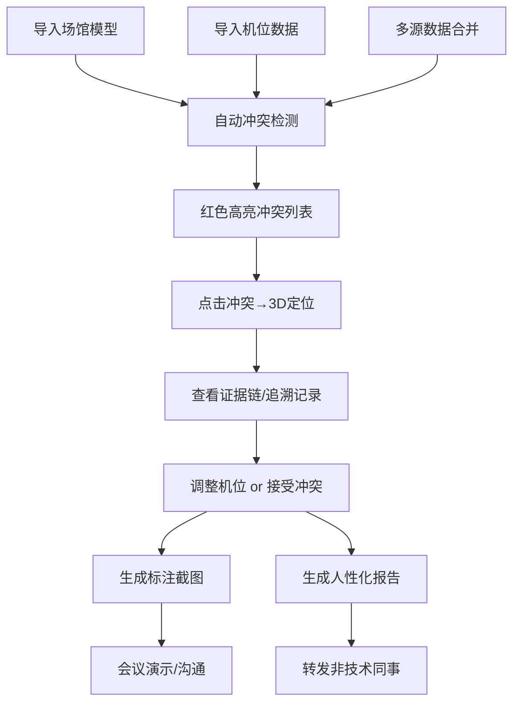

## 1. 产品概述
赛事转播机位预排系统是一款专为体育转播导演设计的专业工具，解决机位冲突检测、场馆模型与机位点数据合并、3D可视化标注、冲突追溯及报告生成等核心痛点。系统目标是让导演在开会或上课演示时，通过清晰的截图和标注就能准确说明机位冲突问题，避免因漏检冲突导致后期返工。

- **核心价值**：将机位冲突从"凭经验判断"变为"可视化可追溯"，降低转播事故率
- **目标用户**：体育转播导演、技术协调员、场馆技术团队
- **市场定位**：专业体育赛事转播制作的预演与审核工具

## 2. 核心 Features

### 2.1 用户角色
| 角色 | 注册方式 | 核心权限 |
|------|----------|----------|
| 转播导演 | 本地账号/无需注册 | 机位规划、冲突审核、报告导出、截图演示 |
| 技术协调员 | 本地账号/无需注册 | 数据导入、机位参数调整、合并裁决 |
| 场馆技术 | 本地账号/无需注册 | 场馆模型维护、禁摄区域标注 |

### 2.2 功能模块
1. **数据合并工作台**：导入多源机位数据，显式展示冲突项，支持人工逐条裁决
2. **冲突检测引擎**：自动检测位置冲突、视线遮挡、镜头越界三类核心问题
3. **3D可视化场景**：场馆模型+机位+路线全景展示，机位带编号标签，镜头视锥可见
4. **冲突追溯面板**：每个冲突问题关联具体机位、具体参数、修改历史记录
5. **报告生成器**：导出非技术友好的冲突报告，用自然语言说明问题
6. **截图演示工具**：一键生成带标注的截图，标注箭头+文字说明，适合会议演示

### 2.3 页面详情
| 页面名称 | 模块名称 | 功能描述 |
|----------|----------|----------|
| 主工作台 | 3D场景视图 | 可旋转缩放的场馆3D模型，机位带编号标签，点击机位显示详细参数 |
| 主工作台 | 冲突列表面板 | 按严重程度排序的冲突列表，红色高亮未解决项，点击定位到3D场景 |
| 主工作台 | 机位详情侧边栏 | 显示机位参数、负责人、来源、修改历史 |
| 数据合并页 | 源数据对比 | 左右分栏展示两路源数据，冲突行红色标记，支持逐项选择保留 |
| 数据合并页 | 合并裁决记录 | 记录每次人工裁决，保留选择痕迹，可追溯 |
| 冲突详情页 | 冲突证据链 | 展示冲突类型、涉事机位、坐标计算过程、遮挡物信息 |
| 冲突详情页 | 追溯时间线 | 显示该机位的历次修改、负责人、时间戳 |
| 报告预览页 | 报告生成 | 生成带摘要、问题列表、整改建议的中文报告，可导出PDF/图片 |
| 演示截图页 | 截图标注工具 | 支持在3D场景上添加箭头、文字框、高亮圈，一键复制到剪贴板 |

## 3. 核心流程

用户导入场馆模型和机位数据 → 系统自动检测冲突 → 红色高亮展示所有问题 → 用户点击冲突项 → 3D场景自动定位并高亮 → 查看冲突详情和证据链 → 如需合并多源数据则进入合并工作台人工裁决 → 调整机位参数或接受冲突 → 生成冲突报告或带标注截图 → 用于会议演示或分享给非技术同事

## 4. 用户界面设计

### 4.1 设计风格
- **设计基调**：专业工业风，深色主题（#0a0e14 背景），适合长时间工作
- **主色调**：信号蓝 #1e6bff（安全/正常）、警示红 #ff3b30（严重冲突）、注意橙 #ff9500（中等冲突）、通过绿 #30d158（已解决）
- **字体**：展示字体使用 Inter（标题）+ JetBrains Mono（参数/坐标），确保数字清晰可读
- **按钮风格**：直角切角设计，2px 描边，悬停时发光效果，体现专业转播设备感
- **布局**：三栏布局 - 左侧机位树/冲突列表、中间3D场景（占60%宽度）、右侧参数详情
- **图标风格**：线性图标，2px 描边，使用 lucide-react，颜色与状态对应

### 4.2 页面设计概述
| 页面名称 | 模块名称 | UI Elements |
|----------|----------|-------------|
| 主工作台 | 3D场景视图 | 深色场馆模型，机位用发光锥体+白色编号标签，镜头视锥半透明蓝色，冲突机位红色脉冲闪烁，鼠标悬停显示机位名称气泡 |
| 主工作台 | 冲突列表面板 | 卡片式列表，严重程度用左侧色条标识，每条显示冲突类型+涉事机位编号，悬停显示冲突摘要 |
| 主工作台 | 机位详情侧边栏 | 分区显示：基本信息（名称/编号/负责人）、位置参数（3D坐标）、镜头参数（焦距/FOV）、来源信息（导入时间/源文件）、修改历史时间线 |
| 数据合并页 | 源数据对比 | 左右表格分栏，相同字段对齐，冲突单元格红底高亮，每行有"选择左""选择右""保留两者"三个按钮 |
| 数据合并页 | 合并裁决记录 | 时间线展示每次裁决，显示裁决人、时间、选择结果，支持撤销 |
| 冲突详情页 | 冲突证据链 | 步骤化展示：①冲突类型说明 ②涉事机位参数对比 ③计算过程（坐标/距离/角度） ④遮挡物/越界区域信息 ⑤建议解决方案 |
| 报告预览页 | 报告生成 | 大号摘要数字（总机位/冲突数/已解决）、问题列表用人话描述（如"3号机位与5号机位相距仅0.8米，小于安全距离1.5米，操作空间不足"）、整改建议逐条列出 |
| 演示截图页 | 截图标注工具 | 工具栏提供箭头、文字框、矩形高亮、圆形圈注，标注可拖动调整，一键导出PNG或复制到剪贴板 |

### 4.3 响应式
- Desktop-first 设计，主工作台最小支持 1440px 宽度
- 侧边栏可折叠，折叠后只显示图标
- 3D场景自适应容器大小，触控设备支持双指缩放旋转
- 冲突列表在小屏下可切换为底部抽屉模式

### 4.4 3D场景指导
- **环境/HDRI**：纯深色环境（#0a0e14），无需HDRI，使用程序化光照，突出专业感
- **光照设置**：主光源冷白色（5000K）从右上方45度照射，补光从左下方，机位自发光材质，冲突机位红色脉冲发光
- **相机设置**：默认透视相机，初始角度为场馆斜上方45度俯瞰，支持轨道控制器，可保存常用视角
- **构图与焦点元素**：场馆模型低饱和度灰色，机位和路线为高饱和色，冲突区域红色闪烁自动吸引注意力
- **交互与动画**：机位选中时弹跳+放大动画，冲突检测进度条，视角切换平滑过渡，路线播放时相机沿路径移动
- **后处理效果**：轻微Bloom效果让发光元素更突出，冲突区域增加色差闪烁效果
- **性能预算**：场馆模型面数控制在5万面以内，机位用简单几何体，确保60fps流畅运行
