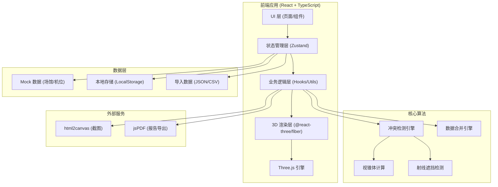
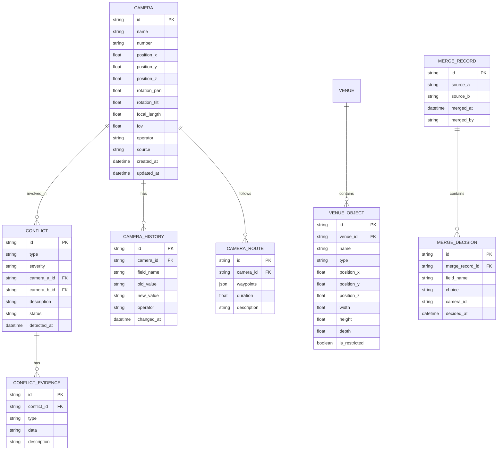

## 1. 架构设计



## 2. 技术描述

- **前端框架**: React@18 + TypeScript + Vite
- **状态管理**: Zustand (轻量级，适合专业工具类应用)
- **3D 渲染**: three@^0.160.0 + @react-three/fiber@^8.15.0 + @react-three/drei@^9.92.0 + @react-three/postprocessing@^2.15.0
- **UI 样式**: TailwindCSS@3 + CSS 变量 (主题切换)
- **路由**: react-router-dom@^6.20.0
- **图标**: lucide-react@^0.294.0
- **截图/导出**: html2canvas@^1.4.1 + jspdf@^2.5.1
- **数据**: Mock 数据 + LocalStorage 持久化，无需后端
- **初始化工具**: vite-init，使用 react-ts 模板

## 3. 路由定义

| 路由 | 页面 | 用途 |
|------|------|------|
| `/` | 主工作台 | 3D场景+冲突列表+机位详情，核心工作区 |
| `/merge` | 数据合并页 | 多源数据对比与人工裁决 |
| `/conflict/:id` | 冲突详情页 | 证据链展示与追溯时间线 |
| `/report` | 报告预览页 | 人性化冲突报告生成与导出 |
| `/screenshot` | 演示截图页 | 3D场景标注与截图导出 |

## 4. 数据模型

### 4.1 数据模型 ER 图



### 4.2 TypeScript 类型定义

```typescript
// 机位
interface Camera {
  id: string;
  name: string;
  number: string;
  position: { x: number; y: number; z: number };
  rotation: { pan: number; tilt: number; roll: number };
  lens: { focalLength: number; fov: number; near: number; far: number };
  operator: string;
  source: string;
  createdAt: string;
  updatedAt: string;
}

// 场馆物体
interface VenueObject {
  id: string;
  name: string;
  type: 'wall' | 'pillar' | 'restricted' | 'field' | 'stand';
  position: { x: number; y: number; z: number };
  size: { width: number; height: number; depth: number };
  isRestricted: boolean;
}

// 冲突类型
type ConflictType = 'position' | 'occlusion' | 'boundary';
type ConflictSeverity = 'critical' | 'warning' | 'info';
type ConflictStatus = 'pending' | 'resolved' | 'accepted';

// 冲突
interface Conflict {
  id: string;
  type: ConflictType;
  severity: ConflictSeverity;
  cameraAId: string;
  cameraBId?: string;
  venueObjectId?: string;
  description: string;
  humanDescription: string;
  status: ConflictStatus;
  detectedAt: string;
  evidence: ConflictEvidence[];
}

// 冲突证据
interface ConflictEvidence {
  id: string;
  type: 'distance' | 'raycast' | 'frustum' | 'history';
  data: Record<string, any>;
  description: string;
}

// 机位修改历史
interface CameraHistory {
  id: string;
  cameraId: string;
  fieldName: string;
  oldValue: string;
  newValue: string;
  operator: string;
  changedAt: string;
}

// 合并记录
interface MergeRecord {
  id: string;
  sourceA: string;
  sourceB: string;
  mergedAt: string;
  mergedBy: string;
  decisions: MergeDecision[];
}

interface MergeDecision {
  id: string;
  cameraId: string;
  fieldName: string;
  choice: 'a' | 'b' | 'both';
  valueA: string;
  valueB: string;
  decidedAt: string;
}

// 机位路线
interface CameraRoute {
  id: string;
  cameraId: string;
  waypoints: { position: { x: number; y: number; z: number }; time: number; label?: string }[];
  duration: number;
  description: string;
}
```

## 5. 核心模块结构

```
src/
├── components/
│   ├── three/              # 3D 相关组件
│   │   ├── Scene3D.tsx     # 3D 场景容器
│   │   ├── CameraNode.tsx  # 机位节点（带标签）
│   │   ├── Frustum.tsx     # 镜头视锥体
│   │   ├── VenueModel.tsx  # 场馆模型
│   │   ├── RoutePath.tsx   # 运动路线
│   │   └── ConflictHighlight.tsx  # 冲突高亮
│   ├── ui/                 # 通用 UI 组件
│   │   ├── Sidebar.tsx
│   │   ├── ConflictCard.tsx
│   │   ├── Timeline.tsx
│   │   └── StatusBadge.tsx
│   └── annotation/         # 标注组件
│       ├── Arrow.tsx
│       ├── TextBox.tsx
│       └── Highlight.tsx
├── pages/
│   ├── MainWorkspace.tsx   # 主工作台
│   ├── DataMerge.tsx       # 数据合并
│   ├── ConflictDetail.tsx  # 冲突详情
│   ├── ReportPreview.tsx   # 报告预览
│   └── ScreenshotTool.tsx  # 截图工具
├── hooks/
│   ├── useConflictDetection.ts   # 冲突检测 Hook
│   ├── useDataMerge.ts          # 数据合并 Hook
│   ├── useCameraStore.ts        # 机位状态管理
│   └── useScreenshot.ts         # 截图 Hook
├── utils/
│   ├── conflict/          # 冲突检测算法
│   │   ├── position.ts    # 位置冲突检测
│   │   ├── occlusion.ts   # 遮挡检测（射线）
│   │   └── boundary.ts    # 越界检测（视锥体）
│   ├── frustum.ts         # 视锥体计算
│   ├── raycast.ts         # 射线检测
│   ├── reportGenerator.ts # 报告生成
│   └── humanize.ts        # 自然语言转换
├── store/
│   └── index.ts          # Zustand Store
├── data/
│   ├── mockVenue.ts      # 场馆 Mock 数据
│   ├── mockCameras.ts    # 机位 Mock 数据
│   └── mockConflicts.ts  # 冲突 Mock 数据
├── types/
│   └── index.ts          # 类型定义
└── App.tsx               # 路由入口
```

## 6. 核心算法说明

### 6.1 位置冲突检测
- 计算两机位之间的欧氏距离
- 若距离 < 安全阈值（默认 1.5 米），标记为位置冲突
- 同时计算机位操作空间（±0.8 米范围）是否重叠

### 6.2 视线遮挡检测
- 从机位位置向目标区域（场地中心）发射射线
- 检测射线是否与场馆物体（墙、柱等）相交
- 记录遮挡物 ID、交点坐标、遮挡比例

### 6.3 镜头越界检测
- 根据机位位置、朝向、FOV、焦距计算视锥体
- 检测视锥体是否与禁摄区域（restricted）相交
- 检测视锥体是否超出场馆边界
- 输出越界的顶点坐标和越界距离

### 6.4 数据合并策略
- 同 ID 机位按字段对比
- 字段值差异 > 阈值（坐标 > 0.1 米，角度 > 5°）标记为冲突
- 不自动选择，必须人工裁决
- 所有裁决记录留痕，可追溯可撤销
