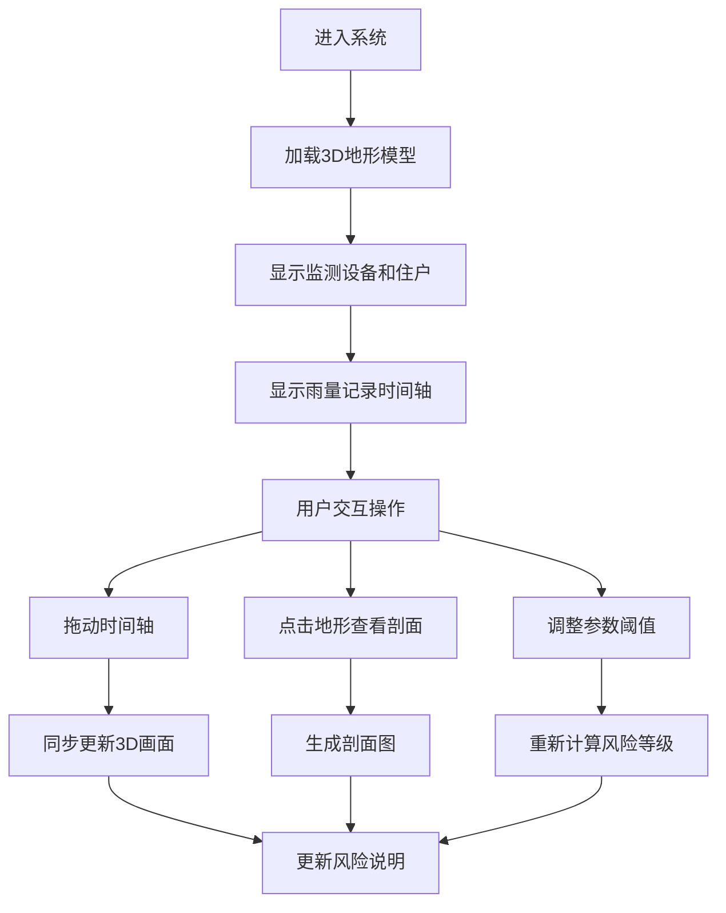

## 1. 产品概述
山地滑坡风险剖面3D可视化系统，帮助地质灾害工程师直观分析村庄边坡排查数据，解决坡度、雨量、裂缝点在二维图上难以判断风险的问题。核心价值是通过交互式3D场景，清晰展示裂缝重复、雨量缺测、住户坐标错等实际工作中的常见问题。

## 2. 核心功能

### 2.1 用户角色
| 角色 | 注册方式 | 核心权限 |
|------|----------|----------|
| 地质灾害工程师 | 无需注册 | 查看3D地形、调整参数、播放时间轴、查看风险说明 |

### 2.2 功能模块
1. **3D地形主视图**：村庄边坡地形模型、监测设备、住户定位
2. **剖面查看器**：任意位置的地形剖面图，显示坡度和裂缝
3. **雨量记录面板**：时间轴雨量数据，标记缺测点
4. **参数控制面板**：坡度阈值、雨量阈值、裂缝筛选
5. **风险说明面板**：实时显示当前场景的问题分析

### 2.3 页面详情
| 页面名称 | 模块名称 | 功能描述 |
|-----------|-------------|---------------------|
| 主页面 | 3D地形视图 | 可旋转、缩放、平移的3D地形模型，显示裂缝点、监测设备、住户位置 |
| 主页面 | 剖面查看器 | 点击地形生成剖面图，显示坡度曲线和裂缝位置 |
| 主页面 | 时间轴控制器 | 拖动时间滑块或播放，查看雨量变化和风险演变 |
| 主页面 | 参数控制面板 | 调整坡度阈值、雨量阈值，筛选裂缝类型 |
| 主页面 | 风险说明面板 | 实时解释裂缝重复、雨量缺测、住户坐标错等问题 |

## 3. 核心流程
用户进入系统后，默认显示完整3D地形和所有监测数据。可以通过拖动时间轴查看不同时间点的风险状态，点击地形查看剖面分析，调整参数阈值观察风险等级变化，系统同步更新3D画面、剖面视图和风险说明。

## 4. 用户界面设计

### 4.1 设计风格
- **主色调**：深蓝色系（#0f172a, #1e3a5f）配合地质橙（#f97316）作为风险警示色
- **按钮风格**：极简圆角按钮，悬停时有微妙的深度效果
- **字体**：使用Geist Sans作为主要字体，配合等宽字体显示数据
- **布局风格**：左右分栏，左侧3D主场景，右侧控制面板和说明
- **图标风格**：简约线性图标，使用地质相关符号

### 4.2 页面设计概述
| 页面名称 | 模块名称 | UI元素 |
|-----------|-------------|-------------|
| 主页面 | 3D地形视图 | 深色背景、地形网格线、彩色风险热区、悬浮信息卡片 |
| 主页面 | 剖面查看器 | 半透明弹出面板、坡度曲线图、裂缝标记点 |
| 主页面 | 时间轴控制器 | 底部横向时间轴、播放/暂停按钮、雨量柱状图 |
| 主页面 | 参数控制面板 | 滑块控件、开关按钮、下拉选择器 |
| 主页面 | 风险说明面板 | 卡片式布局、问题类型标签、详细说明文本 |

### 4.3 响应性
- 桌面端优先设计，主场景占60%宽度，控制面板占40%
- 平板端自动调整为上下布局
- 支持触摸手势旋转和缩放3D场景

### 4.4 3D场景指导
- **环境**：深色背景，模拟专业GIS系统风格，添加微妙的雾气效果
- **光照**：主方向光+环境光，突出地形起伏，裂缝点使用自发光材质
- **相机设置**：默认45度俯视视角，支持轨道控制
- **交互**：点击地形点显示剖面，悬停显示设备信息
- **动画**：时间轴播放时平滑过渡，风险区域有脉冲动画提示
- **后处理**：轻微泛光效果，突出高风险区域
