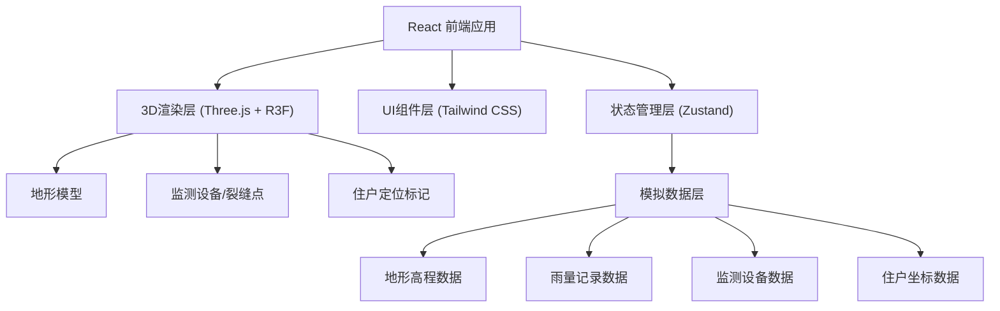
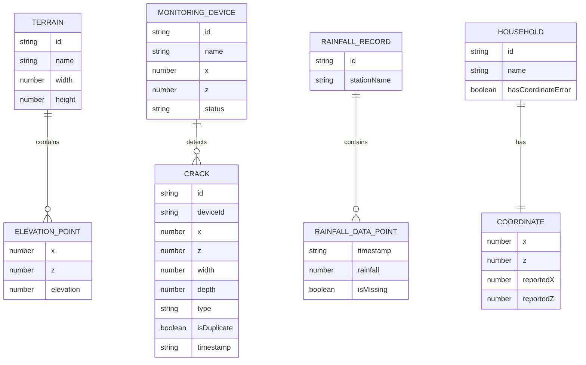

## 1. 架构设计



## 2. 技术描述
- **前端**：React@18 + TypeScript + Vite
- **3D渲染**：three.js + @react-three/fiber + @react-three/drei
- **样式**：tailwindcss@3
- **状态管理**：zustand
- **图表**：recharts（用于剖面图和雨量图）
- **数据**：内置模拟数据，包含正常情况和异常情况（裂缝重复、雨量缺测、住户坐标错）

## 3. 路由定义
| 路由 | 用途 |
|-------|---------|
| / | 主页面，包含3D场景和所有控制面板 |

## 4. 数据模型

### 4.1 数据模型定义



### 4.2 TypeScript 类型定义

```typescript
interface TerrainData {
  width: number;
  height: number;
  elevation: number[][];
}

interface MonitoringDevice {
  id: string;
  name: string;
  position: [number, number, number];
  status: 'normal' | 'warning' | 'error';
}

interface CrackPoint {
  id: string;
  deviceId: string;
  position: [number, number, number];
  width: number;
  depth: number;
  type: 'tensile' | 'shear' | 'compression';
  isDuplicate: boolean;
  timestamp: string;
}

interface RainfallData {
  timestamp: string;
  rainfall: number;
  isMissing: boolean;
}

interface Household {
  id: string;
  name: string;
  actualPosition: [number, number, number];
  reportedPosition: [number, number, number];
  hasCoordinateError: boolean;
}

interface AppState {
  currentTimeIndex: number;
  isPlaying: boolean;
  slopeThreshold: number;
  rainfallThreshold: number;
  showDuplicateCracks: boolean;
  showMissingRainfall: boolean;
  showCoordinateErrors: boolean;
  selectedProfilePoint: [number, number] | null;
}
```
