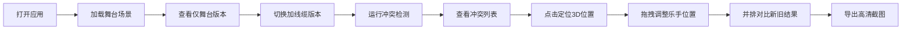

## 1. 产品概述

乐队舞台走位沙盘是一款专业的舞台设计与冲突检测工具，专为演出制作人设计，解决舞台模型、线缆布局和乐手走位的可视化沟通问题。系统通过3D可视化技术清晰展示线缆穿越位置、设备遮挡和走位冲突，支持版本对比和手动修正。

- 核心价值：将抽象的舞台布局转化为可交互、可标注的3D沙盘，便于会议沟通和教学演示
- 目标用户：演出制作人、舞台导演、音响工程师、技术总监

## 2. 核心功能

### 2.1 用户角色
| 角色 | 注册方式 | 核心权限 |
|------|----------|----------|
| 演出制作人 | 无需注册，本地使用 | 完整的3D沙盘操作、冲突检测、版本对比、导出截图 |

### 2.2 功能模块
1. **3D舞台沙盘**：舞台模型可视化、乐手位置展示、线缆连接渲染
2. **冲突检测系统**：线缆穿越检测、设备遮挡检测、走位冲突检测
3. **版本管理**：两次导入对比（仅舞台vs加线缆）、新旧结果并排展示
4. **手动修正**：乐手位置拖拽调整、实时重新检测
5. **标注系统**：冲突文字标注、引线指示、图例说明
6. **导出功能**：高清截图导出、便于会议沟通

### 2.3 页面详情
| 页面名称 | 模块名称 | 功能描述 |
|---------|----------|----------|
| 主沙盘页面 | 3D视口 | 可旋转缩放的3D舞台场景，支持多视角切换 |
| 主沙盘页面 | 版本切换 | 在"仅舞台"和"加线缆"两个版本间切换或并排对比 |
| 主沙盘页面 | 冲突面板 | 列出所有检测到的冲突，点击可定位到3D场景 |
| 主沙盘页面 | 乐手编辑 | 拖拽调整乐手位置，实时更新冲突状态 |
| 主沙盘页面 | 标注层 | 冲突位置显示文字标签和引线，不靠颜色区分 |
| 主沙盘页面 | 导出控制 | 一键导出高清截图，包含所有标注信息 |

## 3. 核心流程

用户打开应用 → 加载预设舞台场景（包含边界冲突样例）→ 查看"仅舞台"版本（乐手位置）→ 切换到"加线缆"版本 → 查看冲突检测结果 → 点击冲突项定位3D位置 → 手动拖拽调整乐手位置 → 查看新旧对比 → 导出截图用于沟通

## 4. 用户界面设计

### 4.1 设计风格
- **主色调**：深炭黑(#1a1a2e) + 工业蓝(#16213e) + 警示橙(#e94560) + 安全绿(#0f4c5c)
- **按钮风格**：直角矩形、轻微浮雕效果、点击有明显反馈
- **字体**：标题使用 Orbitron（科技感），正文使用 JetBrains Mono（等宽易读）
- **布局风格**：左右分栏布局，左侧3D视口占70%，右侧控制面板占30%
- **图标风格**：线性图标，技术感强，统一2px线宽

### 4.2 页面设计概述
| 页面名称 | 模块名称 | UI元素 |
|---------|----------|--------|
| 主沙盘页面 | 3D视口 | 深色背景、网格地面、半透明舞台、发光线缆、冲突高亮球体 |
| 主沙盘页面 | 版本切换 | 三态切换按钮：仅舞台 / 加线缆 / 并排对比 |
| 主沙盘页面 | 冲突面板 | 卡片式列表，冲突类型图标、位置描述、严重程度标签 |
| 主沙盘页面 | 标注层 | 半透明白色背景标签、黑色文字、红色引线指向冲突点 |
| 主沙盘页面 | 底部工具栏 | 视角预设按钮、导出按钮、重新检测按钮 |

### 4.3 响应式
- 桌面端优先（1920×1080），左右分栏布局
- 平板端：上下布局，3D视口在上，控制面板在下
- 移动端：简化功能，单视口滚动浏览

### 4.4 3D场景指导
- **环境**：深色科技感环境，微弱泛光，地面网格辅助定位
- **灯光**：主光源 + 环境光 + 冲突点自发光效果
- **相机**：轨道控制器，支持平移、旋转、缩放，预设顶视图/正视图/透视图
- **交互**：乐手模型可拖拽，线缆高亮显示穿越点
- **后期效果**：轻微泛光增强科技感，冲突点闪烁提示
- **性能**：控制多边形数量，确保60fps流畅运行
