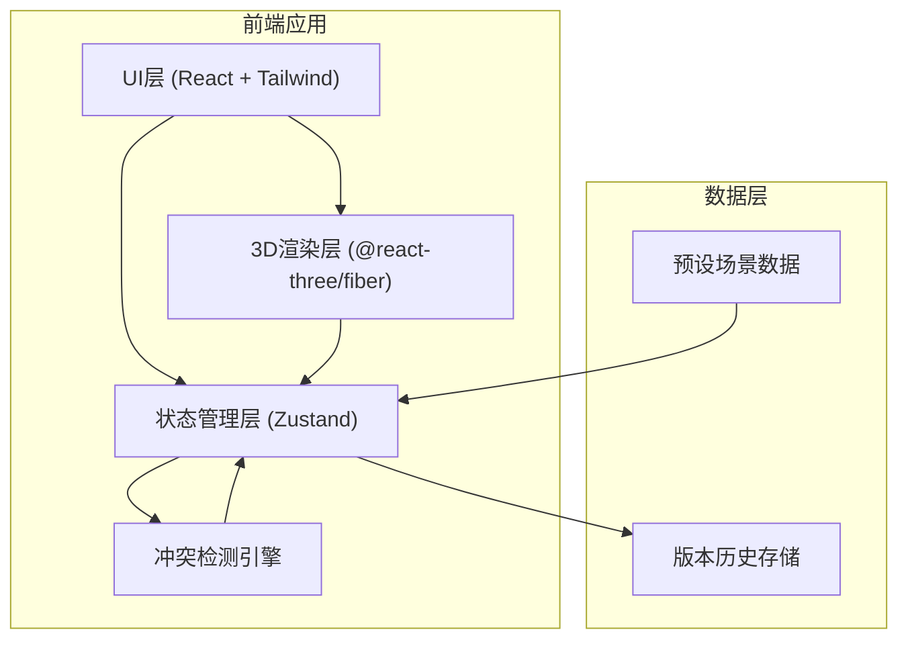
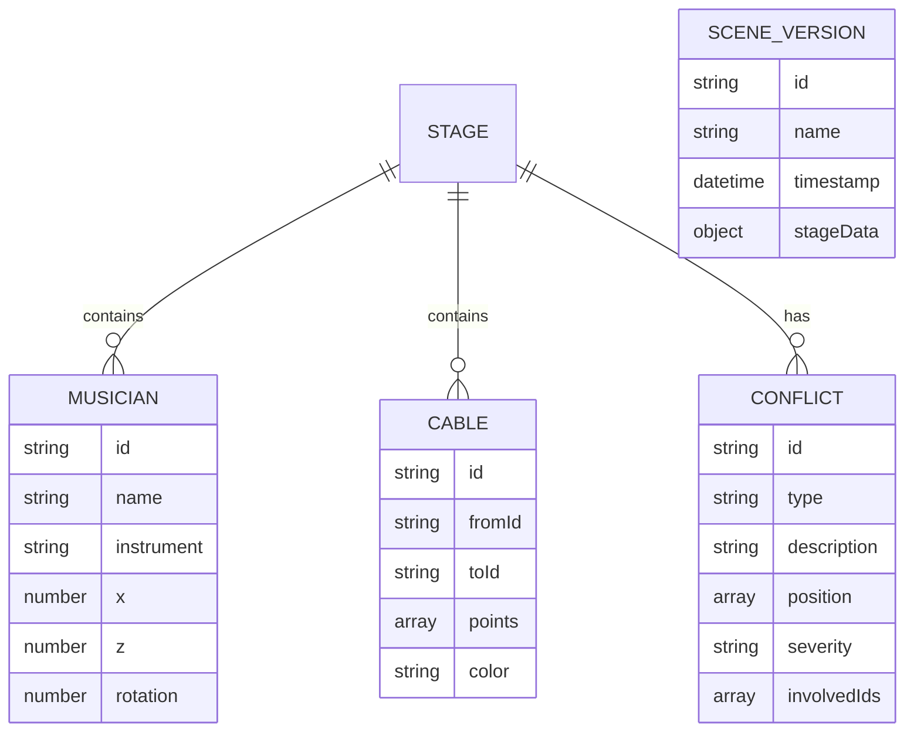

## 1. 架构设计



## 2. 技术描述

- **前端框架**: React@18 + TypeScript
- **构建工具**: Vite@5
- **样式方案**: TailwindCSS@3
- **3D引擎**: three@0.160 + @react-three/fiber@8 + @react-three/drei@9
- **状态管理**: Zustand@4
- **图标库**: Lucide React
- **后端**: 无（纯前端应用）
- **数据库**: 无（本地存储 + 预设Mock数据）

## 3. 路由定义

| 路由 | 用途 |
|------|------|
| / | 主沙盘页面（唯一页面） |

## 4. 数据模型

### 4.1 数据模型定义



### 4.2 TypeScript 类型定义

```typescript
// 乐手数据
interface Musician {
  id: string;
  name: string;
  instrument: string;
  x: number;
  z: number;
  rotation: number;
  color: string;
}

// 线缆数据
interface Cable {
  id: string;
  fromId: string;
  toId: string;
  points: [number, number, number][];
  color: string;
  thickness: number;
}

// 舞台数据
interface Stage {
  width: number;
  depth: number;
  height: number;
  musicians: Musician[];
  cables: Cable[];
}

// 冲突类型
type ConflictType = 'cable_crossing' | 'equipment_blocking' | 'movement_collision';
type Severity = 'warning' | 'error' | 'critical';

interface Conflict {
  id: string;
  type: ConflictType;
  description: string;
  position: [number, number, number];
  severity: Severity;
  involvedIds: string[];
}

// 场景版本
interface SceneVersion {
  id: string;
  name: string;
  timestamp: number;
  stage: Stage;
  conflicts: Conflict[];
}

// 应用状态
interface AppState {
  currentVersion: SceneVersion | null;
  compareVersion: SceneVersion | null;
  viewMode: 'single' | 'compare';
  showCables: boolean;
  selectedMusician: string | null;
  highlightedConflict: string | null;
}
```

## 5. 核心模块结构

```
src/
├── components/
│   ├── Stage3D/           # 3D舞台组件
│   │   ├── index.tsx
│   │   ├── StageFloor.tsx
│   │   ├── Musician3D.tsx
│   │   ├── Cable3D.tsx
│   │   └── ConflictMarker.tsx
│   ├── ControlPanel/       # 右侧控制面板
│   │   ├── index.tsx
│   │   ├── VersionSwitcher.tsx
│   │   ├── ConflictList.tsx
│   │   └── MusicianEditor.tsx
│   ├── AnnotationLayer/    # 2D标注层
│   │   ├── index.tsx
│   │   └── ConflictLabel.tsx
│   └── Toolbar/            # 底部工具栏
│       ├── index.tsx
│       └── ViewPresets.tsx
├── store/                  # 状态管理
│   └── useStageStore.ts
├── detectors/              # 冲突检测引擎
│   ├── index.ts
│   ├── cableDetector.ts
│   ├── blockingDetector.ts
│   └── movementDetector.ts
├── data/                   # 预设数据
│   └── demoScene.ts
├── types/                  # 类型定义
│   └── index.ts
└── utils/                  # 工具函数
    ├── exportScreenshot.ts
    └── math.ts
```
