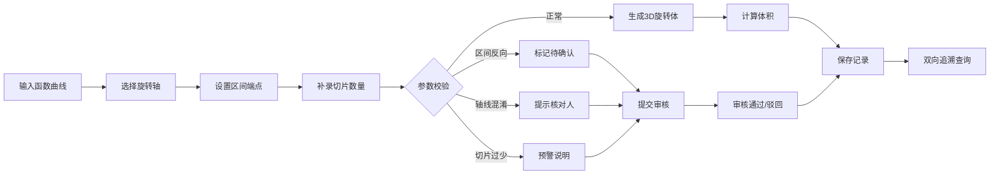

## 1. 产品概述

微积分旋转体教具是一个基于Three.js的Web3D交互式教学工具，专为数学老师设计，用于直观展示函数曲线绕轴旋转形成的3D旋转体及其体积计算过程。解决传统教学中抽象概念难以可视化、区间端点补录滞后、审核流程不清晰等痛点。

- 核心目标：将抽象的微积分旋转体概念转化为可交互的3D可视化教具
- 目标用户：高中/大学数学教师、微积分学习者
- 市场价值：提升教学效率，降低理解门槛，建立规范的教学资料审核流程

## 2. 核心功能

### 2.1 用户角色

| 角色 | 权限说明 | 核心操作 |
|------|----------|----------|
| 教师用户 | 完整操作权限 | 创建记录、调整参数、保存视角、提交审核 |
| 审核人员 | 审核权限 | 核对区间反向、轴线混淆、切片过少等问题 |

### 2.2 功能模块

1. **3D主视图**：旋转体可视化、视角控制（旋转/缩放/平移）、视角保存与恢复、筛选同步
2. **侧边栏参数面板**：函数曲线输入、旋转轴选择、区间端点设置、切片数量滑块、体积实时计算说明
3. **明细记录面板**：历史记录列表、修改痕迹展示、审核状态标记、双向追溯（函数→结果→旋转轴）
4. **审核流程引擎**：区间反向待确认分支、轴线混淆提示、切片过少预警、责任人指派

### 2.3 页面详情

| 页面名称 | 模块名称 | 功能描述 |
|-----------|-------------|---------------------|
| 主工作台 | 3D视图区 | 实时渲染旋转体，支持鼠标拖拽旋转、滚轮缩放、右键平移 |
| 主工作台 | 顶部工具栏 | 保存当前视角、恢复默认视角、筛选条件设置、视图切换 |
| 主工作台 | 左侧参数栏 | 函数表达式输入框、旋转轴单选（X轴/Y轴/自定义）、区间端点[a,b]输入、切片数量滑块 |
| 主工作台 | 右侧记录栏 | 记录列表、修改历史对比、审核状态标签、快速定位到3D视图 |
| 主工作台 | 体积说明区 | 积分公式展示、分步计算过程、圆盘法/壳层法切换 |
| 审核弹窗 | 异常处理 | 区间反向确认、轴线混淆核对人选择、切片过少提醒 |

## 3. 核心流程

### 3.1 主工作流程

### 3.2 数据流转

1. 教师从函数曲线开始录入，依次补全旋转轴、区间端点、切片数量
2. 系统实时校验参数，异常情况自动标记并进入审核分支
3. 3D视图与侧边栏筛选条件双向同步
4. 所有修改自动留痕，支持从函数反查到结果，从结果反查到旋转轴

## 4. 用户界面设计

### 4.1 设计风格

- **主色调**：深蓝学术风（#0F172A 背景，#1E40AF 主色，#3B82F6 强调色）
- **辅助色**：橙红警示（#EF4444）、绿色通过（#10B981）、黄色待确认（#F59E0B）
- **按钮风格**：微立体圆角按钮，hover时有微妙的上浮和阴影变化
- **字体**：Crimson Pro（数学公式）+ JetBrains Mono（代码/参数）+ Noto Sans SC（中文）
- **布局**：三栏式布局，中间3D视图占主导，左右侧边栏可折叠
- **视觉层次**：高斯模糊毛玻璃面板、微妙的网格背景、数学公式装饰元素

### 4.2 页面设计概述

| 区域 | 模块 | UI元素 |
|-----------|-------------|-------------|
| 顶部 | 工具栏 | 渐变背景、图标按钮、面包屑导航、用户头像 |
| 左侧 | 参数面板 | 分组卡片、滑块带刻度、输入框带单位标签、实时公式预览 |
| 中间 | 3D视图 | 深色背景、网格地面、坐标轴标识、操作提示浮层 |
| 右侧 | 记录列表 | 时间线布局、状态色标、修改diff高亮、展开/收起动画 |
| 底部 | 状态栏 | 坐标显示、FPS信息、快捷操作提示 |

### 4.3 3D场景设计

- **环境**：深色学术背景，带细微网格线和坐标轴，HDR环境光营造科技感
- **光照**：主光+补光+轮廓光，突出旋转体的立体感和曲面质感
- **材质**：半透明蓝色材质带边缘发光，切片用不同透明度区分
- **相机**：透视相机，默认45度俯视角，支持轨道控制器
- **动画**：切片生成动画、体积计算可视化、参数变化时平滑过渡
- **交互**：点击切片显示该层面积、hover显示坐标、双击重置视角

### 4.4 响应式设计

- 桌面端优先（1280px+）：三栏完整布局
- 平板端（768-1279px）：侧边栏改为抽屉式，可滑动呼出
- 移动端（<768px）：单栏流式布局，3D视图全屏，参数面板底部弹出
