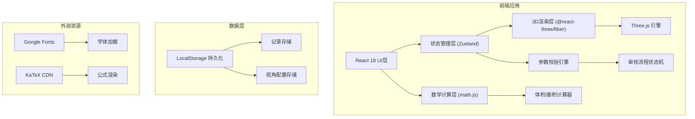

## 1. 架构设计



## 2. 技术描述

### 2.1 核心技术栈

| 层级 | 技术选择 | 版本 | 用途说明 |
|------|----------|------|----------|
| 构建工具 | Vite | ^5.0.0 | 快速开发构建，支持HMR |
| 前端框架 | React | ^18.2.0 | 组件化UI开发 |
| 语言 | TypeScript | ^5.3.0 | 类型安全保障 |
| 样式 | Tailwind CSS | ^3.4.0 | 原子化CSS，响应式布局 |
| 3D引擎 | Three.js | ^0.160.0 | WebGL 3D渲染核心 |
| React-Three | @react-three/fiber | ^8.15.0 | Three.js的React声明式封装 |
| 3D辅助库 | @react-three/drei | ^9.92.0 | 常用3D组件封装（控制器等） |
| 状态管理 | Zustand | ^4.4.0 | 轻量级状态管理，支持跨组件同步 |
| 数学计算 | mathjs | ^12.1.0 | 函数表达式解析与数值计算 |
| 公式渲染 | KaTeX | ^0.29.0 | 数学公式渲染 |
| 图标 | lucide-react | ^0.294.0 | 轻量级图标库 |

### 2.2 项目结构

```
src/
├── components/
│   ├── ThreeDView/           # 3D视图组件
│   │   ├── SolidOfRevolution.tsx   # 旋转体生成器
│   │   ├── Axis.tsx                # 坐标轴
│   │   ├── Grid.tsx                # 网格地面
│   │   └── SliceLayer.tsx          # 切片层
│   ├── Sidebar/               # 侧边栏组件
│   │   ├── ParameterPanel.tsx      # 参数面板
│   │   ├── VolumeInfo.tsx          # 体积计算说明
│   │   └── FilterBar.tsx           # 筛选栏
│   ├── Records/               # 记录面板
│   │   ├── RecordList.tsx          # 记录列表
│   │   ├── RecordItem.tsx          # 记录条目
│   │   └── ReviewModal.tsx         # 审核弹窗
│   └── common/                # 公共组件
│       ├── Toolbar.tsx             # 顶部工具栏
│       └── StatusBar.tsx           # 底部状态栏
├── store/                   # 状态管理
│   ├── useParamStore.ts           # 参数状态
│   ├── useRecordStore.ts          # 记录状态
│   └── useViewStore.ts            # 视角状态
├── utils/                   # 工具函数
│   ├── math/                   # 数学计算
│   │   ├── functionParser.ts       # 函数解析
│   │   ├── volumeCalculator.ts     # 体积计算
│   │   └── solidGenerator.ts       # 旋转体几何生成
│   └── validation/             # 参数校验
│       ├── paramValidator.ts       # 参数合法性校验
│       └── reviewEngine.ts         # 审核规则引擎
├── types/                   # TypeScript类型定义
│   ├── params.ts                 # 参数类型
│   ├── records.ts                # 记录类型
│   └── three.d.ts                # Three.js扩展类型
├── data/                    # 示例数据
│   └── samples.ts                # 预置样例
├── hooks/                   # 自定义Hooks
│   ├── useCameraControls.ts       # 相机控制
│   └── useSyncFilter.ts           # 筛选同步
├── App.tsx
├── main.tsx
└── index.css
```

## 3. 状态管理设计

### 3.1 参数状态 (useParamStore)

```typescript
interface ParamState {
  functionExpr: string;      // 函数表达式，如 "x^2"
  rotationAxis: 'x' | 'y' | 'custom';  // 旋转轴
  axisOffset: number;        // 自定义轴偏移量
  intervalA: number;         // 区间左端点
  intervalB: number;         // 区间右端点
  sliceCount: number;        // 切片数量
  showSlices: boolean;       // 是否显示切片
  method: 'disk' | 'shell';  // 计算方法：圆盘法/壳层法
  
  // 校验状态
  validation: {
    isIntervalReversed: boolean;   // 区间反向 (a > b)
    isAxisAmbiguous: boolean;      // 轴线混淆
    isSliceInsufficient: boolean;  // 切片过少 (<10)
    reviewStatus: 'pending' | 'approved' | 'rejected' | 'needs_review';
    assignedReviewer: string | null;
  };
  
  // 操作方法
  setParam: (key: keyof ParamState, value: any) => void;
  validateParams: () => void;
  submitForReview: (reviewer: string) => void;
}
```

### 3.2 记录状态 (useRecordStore)

```typescript
interface RecordState {
  records: CalculationRecord[];
  activeRecordId: string | null;
  filter: {
    functionSearch: string;
    axisFilter: 'all' | 'x' | 'y' | 'custom';
    statusFilter: 'all' | 'approved' | 'pending' | 'rejected';
  };
  
  createRecord: (params: ParamState) => string;
  updateRecord: (id: string, changes: Partial<ParamState>) => void;
  loadRecord: (id: string) => void;
  setFilter: (key: keyof RecordState['filter'], value: any) => void;
  getFilteredRecords: () => CalculationRecord[];
  
  // 追溯功能
  findByFunction: (expr: string) => CalculationRecord[];
  findByAxis: (axis: string) => CalculationRecord[];
  findByResult: (volume: number, tolerance: number) => CalculationRecord[];
}

interface CalculationRecord {
  id: string;
  createdAt: string;
  updatedAt: string;
  params: ParamState;
  result: {
    volume: number;
    method: string;
    steps: CalculationStep[];
  };
  modificationHistory: ModificationEntry[];
  reviewStatus: 'pending' | 'approved' | 'rejected';
}
```

### 3.3 视角状态 (useViewStore)

```typescript
interface ViewState {
  cameraPosition: [number, number, number];
  cameraTarget: [number, number, number];
  savedViews: SavedView[];
  
  saveCurrentView: (name: string) => void;
  restoreView: (viewId: string) => void;
  resetToDefault: () => void;
  syncWithFilter: (filter: RecordState['filter']) => void;
}

interface SavedView {
  id: string;
  name: string;
  position: [number, number, number];
  target: [number, number, number];
  createdAt: string;
}
```

## 4. 核心算法

### 4.1 旋转体几何生成

```typescript
// 圆盘法生成旋转体几何
function generateSolidOfRevolution(
  func: (x: number) => number,
  a: number,
  b: number,
  axis: 'x' | 'y',
  slices: number
): BufferGeometry {
  const points: Vector2[] = [];
  const step = (b - a) / slices;
  
  for (let i = 0; i <= slices; i++) {
    const x = a + i * step;
    const y = func(x);
    if (axis === 'x') {
      points.push(new Vector2(x, y));
    } else {
      points.push(new Vector2(y, x));
    }
  }
  
  // 使用LatheGeometry生成旋转体
  return new LatheGeometry(points, 64);
}
```

### 4.2 体积计算（圆盘法）

```typescript
function calculateVolumeDisk(
  func: (x: number) => number,
  a: number,
  b: number,
  n: number = 1000
): { volume: number; steps: CalculationStep[] } {
  const dx = (b - a) / n;
  let volume = 0;
  
  for (let i = 0; i < n; i++) {
    const x = a + i * dx;
    const radius = func(x);
    volume += Math.PI * radius * radius * dx;
  }
  
  return {
    volume,
    steps: [
      { description: '确定积分区间', formula: `[${a}, ${b}]` },
      { description: '选择圆盘法', formula: `V = π∫[a→b] f(x)² dx` },
      { description: '数值积分计算', formula: `V ≈ ${volume.toFixed(6)}` }
    ]
  };
}
```

## 5. 数据持久化

使用 LocalStorage 存储：
- `rotation_solid_records`: 所有计算记录
- `rotation_solid_views`: 保存的视角配置
- `rotation_solid_params`: 最后一次使用的参数

## 6. 审核规则引擎

```typescript
function validateParameters(params: ParamState): ValidationResult {
  const issues: ValidationIssue[] = [];
  
  // 1. 区间反向检查
  if (params.intervalA > params.intervalB) {
    issues.push({
      type: 'interval_reversed',
      severity: 'warning',
      message: '区间端点顺序反向，需要审核确认',
      nextAction: '请提交给教研组长李老师核对',
      autoReview: true
    });
  }
  
  // 2. 轴线混淆检查
  if (params.functionExpr.includes('x') && params.functionExpr.includes('y') 
      && params.rotationAxis === 'custom') {
    issues.push({
      type: 'axis_ambiguous',
      severity: 'error',
      message: '函数同时包含x和y，旋转轴可能混淆',
      nextAction: '请咨询王教授确认旋转轴定义',
      autoReview: false
    });
  }
  
  // 3. 切片过少检查
  if (params.sliceCount < 10) {
    issues.push({
      type: 'slice_insufficient',
      severity: 'warning',
      message: '切片数量过少，计算精度可能不足',
      nextAction: '建议增加到20片以上，或联系实验员确认',
      autoReview: true
    });
  }
  
  return { issues, requiresReview: issues.length > 0 };
}
```
