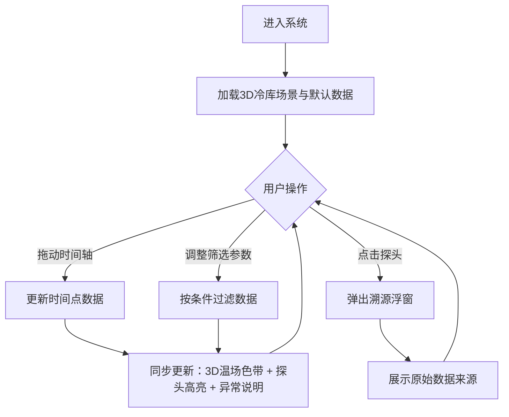

## 1. 产品概述

冷库温场立体巡检系统——为冷链工程师提供三维可视化的冷库温度场实时巡检工具，解决平面温度图无法呈现上层热区、多源数据（货架模型/风机状态/温场报告）混合后判断难以溯源、探头离线等脏数据处理缺失等痛点。

- 目标用户：冷链工程师、仓储管理人员
- 核心价值：将多层数据源整合为可交互的3D温场视图，拖动/筛选/时间轴操作后3D温场、探头高亮与异常说明同步更新，每条判断可追溯到原始数据来源

## 2. 核心功能

### 2.1 用户角色

| 角色 | 使用方式 | 核心权限 |
|------|----------|----------|
| 冷链工程师 | 直接使用 | 查看3D温场、操作时间轴、筛选参数、溯源数据来源 |
| 仓储管理员 | 只读查看 | 查看温场概览与异常摘要 |

### 2.2 功能模块

1. **3D温场巡检主界面**：3D冷库场景（多层货架+探头+风机）、温度色带渲染、探头高亮与异常标注、数据溯源面板、时间轴播放器
2. **参数筛选面板**：按层/区域/探头状态/风机状态筛选，筛选后3D视图与说明同步更新

### 2.3 页面详情

| 页面名称 | 模块名称 | 功能描述 |
|----------|----------|----------|
| 3D温场巡检主界面 | 3D冷库场景 | Three.js渲染多层货架几何体、风机模型、探头球体；可旋转/缩放/平移；点击探头弹出溯源浮窗 |
| 3D温场巡检主界面 | 温度色带渲染 | 根据探头数据插值生成3D温度色带覆盖货架层；冷→暖色阶映射；拖动/筛选/时间轴变更后实时重绘 |
| 3D温场巡检主界面 | 探头高亮与异常标注 | 在线探头正常色、离线探头红色闪烁、超温探头橙色脉冲；悬浮显示温度与来源标签 |
| 3D温场巡检主界面 | 数据溯源面板 | 右侧面板展示当前选中探头/区域的原始数据来源：货架模型文件名、风机状态记录ID、温场报告编号，点击可跳转 |
| 3D温场巡检主界面 | 时间轴播放器 | 底部时间轴可拖动/播放/暂停；切换时间点后3D温场+探头高亮+异常说明同步刷新 |
| 3D温场巡检主界面 | 参数筛选面板 | 左侧面板：按层号、区域、探头状态（在线/离线/超温）、风机状态（运行/停转）筛选；筛选后3D视图与说明同步更新 |
| 3D温场巡检主界面 | 异常说明栏 | 底部信息栏展示当前筛选条件下的异常事件列表（探头离线、风机停转、货品遮挡），每条事件标注数据来源 |

## 3. 核心流程

用户进入系统后，3D冷库场景加载默认时间点数据，温度色带渲染在货架上，探头按状态高亮。用户可：

1. 拖动时间轴 → 3D温场色带+探头高亮+异常说明同步更新
2. 调整筛选参数 → 3D视图仅显示符合条件的数据，异常说明同步过滤
3. 点击探头 → 弹出溯源浮窗，展示该探头的原始数据来源（货架模型/风机状态/温场报告）
4. 识别异常 → 系统自动区分"探头离线"与"风机停转"，不会错误合并

## 4. 用户界面设计

### 4.1 设计风格

- **主色调**：深色工业风底色（深蓝灰 #0f1729），冷蓝色调为主（#3b82f6），异常用警示橙（#f97316）和告警红（#ef4444）
- **辅助色**：冰蓝色（#67e8f9）表示正常低温，暖黄色（#fbbf24）表示临界温度
- **字体**：数据显示用等宽字体 JetBrains Mono，界面文字用 Noto Sans SC
- **布局**：左侧筛选面板 + 中央3D视图 + 右侧溯源面板 + 底部时间轴与异常说明
- **按钮风格**：圆角矩形，微透明玻璃质感，hover时亮度提升
- **图标**：lucide-react 图标库

### 4.2 页面设计概览

| 页面名称 | 模块名称 | UI元素 |
|----------|----------|--------|
| 3D温场巡检主界面 | 3D冷库场景 | 深色背景，Three.js Canvas全屏，货架为半透明线框，温度色带为半透明渐变覆盖层，探头为发光球体 |
| 3D温场巡检主界面 | 参数筛选面板 | 左侧240px宽半透明深色面板，分组折叠式筛选项：层号（复选框）、区域（下拉）、探头状态（标签切换）、风机状态（标签切换） |
| 3D温场巡检主界面 | 数据溯源面板 | 右侧300px宽半透明深色面板，当前选中探头的来源链列表，每条来源带图标+文件名/ID+时间戳 |
| 3D温场巡检主界面 | 时间轴播放器 | 底部64px高面板，播放/暂停按钮+进度条+时间刻度，进度条上标注异常事件点 |
| 3D温场巡检主界面 | 异常说明栏 | 时间轴上方，异常事件卡片横向滚动，每张卡片：事件类型图标+简述+来源标签 |

### 4.3 响应式设计

- 桌面端优先（1920×1080及以上），3D视图占据主要空间
- 1280px以下：左右面板可折叠，3D视图自适应
- 不支持移动端（冷链工程师主要在桌面端使用）

### 4.4 3D场景指引

- **环境**：冷库内部环境，深色空间，冷光照明
- **灯光**：冷白环境光（0xe0f0ff, 0.4）+ 探头点光源（蓝/橙色）+ 顶部风机位置冷白聚光灯
- **相机**：透视相机，初始俯视45°角，可OrbitControls自由旋转
- **构图**：多层货架居中，风机在顶部，探头分布在货架各层
- **交互**：OrbitControls旋转缩放，Raycaster点击探头，hover高亮
- **后处理**：Bloom效果用于探头发光，Vignette增加冷库纵深感
- **性能预算**：货架用InstancedMesh，探头点光源数量≤20，目标60fps

## 5. 样例数据要求

必须包含以下三种场景的样例数据，冷链工程师无需读代码即可确认分支生效：

1. **正常记录**：所有探头在线、温度在-18°C±2°C范围内，风机正常运行
2. **风机停转**：某台风机状态为"停转"，对应区域温度升高，异常说明显示"风机停转"事件及来源
3. **探头离线（脏样本）**：某探头状态为"离线"，该位置无温度数据，3D中显示红色闪烁球体，异常说明显示"探头离线"而非"温度异常"
