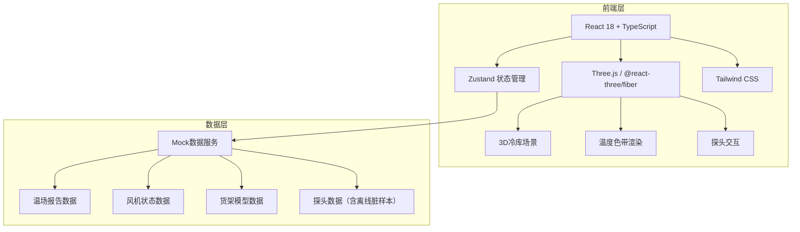
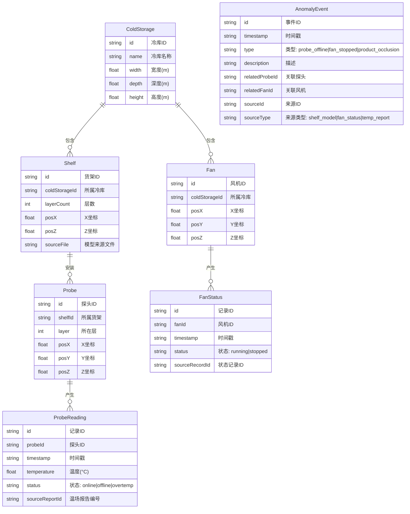

## 1. 架构设计



## 2. 技术说明

- **前端框架**：React@18 + TypeScript + Vite
- **初始化工具**：vite-init（react-ts 模板）
- **3D渲染**：three + @react-three/fiber + @react-three/drei + @react-three/postprocessing
- **状态管理**：Zustand
- **样式方案**：Tailwind CSS@3
- **后端**：无（纯前端，Mock数据）
- **数据库**：无（前端内嵌JSON样例数据）

## 3. 路由定义

| 路由 | 用途 |
|------|------|
| / | 3D温场巡检主界面（唯一页面，所有功能集成） |

## 4. 数据模型

### 4.1 数据模型定义



### 4.2 核心TypeScript类型

```typescript
type ProbeStatus = 'online' | 'offline' | 'overtemp'
type FanStatus = 'running' | 'stopped'
type AnomalyType = 'probe_offline' | 'fan_stopped' | 'product_occlusion'
type SourceType = 'shelf_model' | 'fan_status' | 'temp_report'

interface ColdStorage {
  id: string
  name: string
  width: number
  depth: number
  height: number
}

interface Shelf {
  id: string
  coldStorageId: string
  layerCount: number
  posX: number
  posZ: number
  sourceFile: string
}

interface Probe {
  id: string
  shelfId: string
  layer: number
  posX: number
  posY: number
  posZ: number
}

interface ProbeReading {
  id: string
  probeId: string
  timestamp: string
  temperature: number
  status: ProbeStatus
  sourceReportId: string
}

interface Fan {
  id: string
  coldStorageId: string
  posX: number
  posY: number
  posZ: number
}

interface FanStatusRecord {
  id: string
  fanId: string
  timestamp: string
  status: FanStatus
  sourceRecordId: string
}

interface AnomalyEvent {
  id: string
  timestamp: string
  type: AnomalyType
  description: string
  relatedProbeId?: string
  relatedFanId?: string
  sourceId: string
  sourceType: SourceType
}
```

## 5. 状态管理设计（Zustand Store）

```typescript
interface AppStore {
  currentTimeIndex: number
  isPlaying: boolean
  filters: {
    layers: number[]
    areas: string[]
    probeStatuses: ProbeStatus[]
    fanStatuses: FanStatus[]
  }
  selectedProbeId: string | null
  setTimeIndex: (index: number) => void
  togglePlay: () => void
  setFilters: (filters: Partial<AppStore['filters']>) => void
  setSelectedProbe: (id: string | null) => void
}
```

## 6. 关键技术决策

| 决策点 | 选择 | 理由 |
|--------|------|------|
| 温度色带渲染 | 自定义ShaderMaterial在货架层平面上渲染 | 性能优于逐像素更新纹理，支持实时插值 |
| 探头交互 | @react-three/drei的Html组件 + Raycaster | 点击探头弹出溯源浮窗，hover高亮 |
| 时间轴 | 自定义React组件 | 需要在进度条上标注异常事件点 |
| 数据溯源 | 统一sourceId/sourceType字段 | 所有数据实体携带来源信息，保证可追溯 |
| 异常区分 | AnomalyEvent.type严格区分probe_offline/fan_stopped/product_occlusion | 防止错误合并不同类型异常 |
| 探头离线处理 | 离线探头无温度数据，3D中用红色闪烁球体 | 区别于超温探头（橙色脉冲），不伪造数据 |
